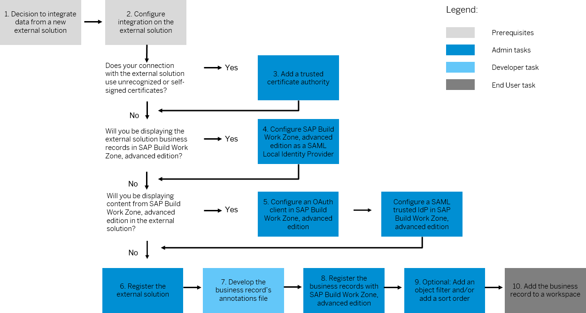

<!-- loiod51825b4796a47a3aed30b5c7a52710d -->

# External Solutions

You can set up and configure solutions to integrate with SAP Build Work Zone, advanced edition. In the *External Integrations* \> *External Solutions* screen, open the *Add Application* dropdown to see which types of external solutions are supported.

## Overall Procedure

For detailed information, see [External Solutions: Integrate New Business Records](external-solutions-integrate-new-business-records-4f75370.md)

<a name="loiod51825b4796a47a3aed30b5c7a52710d__section_wtw_zft_ymb"/>

## SAP SuccessFactors Platform Integration - SAP SuccessFactors Work Zone

SAP SuccessFactors Platform is integrated during onboarding. That is, you as a company administrator don't integrate SAP SuccessFactors platform separately.

When SAP Build Work Zone, advanced edition is integrated with the SAP SuccessFactors platform, the company administrator grants users access through the SAP SuccessFactors platform administration settings using role-based permissions \(RBP\).

The default configuration for the integration provides all users configured with access through the SAP SuccessFactors platform with access to SAP Build Work Zone, advanced edition. However, as a company administrator, you can override the default configuration and choose which roles, users, or groups of users can access SAP Build Work Zone, advanced edition.

