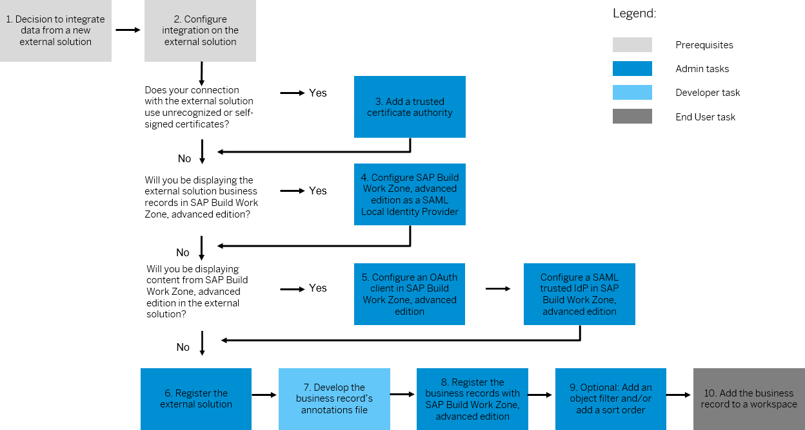

<!-- loio4f75370725064ab088433ab147f280f6 -->

# External Solutions: Integrate New Business Records

There are two types of major applications whose content can be integrated into SAP Build Work Zone, advanced edition. This is done in the *Administration Console* \> *External Integrations* \> *External Solutions* section:

-   **Document Repositories:**

    -   [Integrating Microsoft Office 365 SharePoint Sites](https://help.sap.com/docs/WZ/b03c84105ff74f809631e494bd612e83/cd4cefc4685f4fd2b3d915bac6b28737.html)
    -   [Integrating Google Drive](https://help.sap.com/docs/WZ/b03c84105ff74f809631e494bd612e83/8288cd29544f4fdca29a8ef6b367278e.html)

    .

-   **Business Records:** URLs for the external application's OData metadata files and annotation files are listed, and the annotations files are fully developed for the display of certain types of data from the external solution.

To integrate data from a new application, or data that is not currently accessible from a pre-packaged integration, you must work through the integration steps that are outlined in this section.

## Procedures for integrating new business records into SAP Build Work Zone, advanced edition

1.  Decide which "application type" you are going to use for your integration:
    -   **SAP BTP:** provides a cloud-based platform for your integration, and its services include the ability to add an OData API for applications that do not have one.
    -   **SAP NetWeaver Gateway:** provides a non-cloud \(on-premise network service\) platform for your integration, and its services also include the ability to add an OData API for applications that do not have one.

2.  [Prepare the External Application or Platform](prepare-the-external-application-or-platform-e289d1f.md), to allow SAP Build Work Zone, advanced edition to access the business application's data using secure authorization mechanisms.
3.  [Add a Trusted Certificate Authority](add-a-trusted-certificate-authority-f8d9305.md), if your organization's network requires the use of self-signed TLS \(SSL\) certificates.
4.  [Configure SAP Build Work Zone, advanced edition as a SAML Local Identity Provider](configure-sap-build-work-zone-advanced-edition-as-a-saml-local-identity-provider-39a4f6b.md) if you want to display the external application's business records in SAP Build Work Zone, advanced edition. This step ensures that users can view only the content from the external application that they have been authorized to view when that material is displayed.
5.  If you want to display SAP Build Work Zone, advanced edition content in the external application, you must:
    -   [Add an OAuth Client](add-an-oauth-client-5310092.md). This configuration provides the external application with authorized access to the SAP Build Work Zone, advanced edition API.
    -   [Add a SAML Trusted IDP](add-a-saml-trusted-idp-dad776e.md). This step ensures that users can view only the content from that they've been authorized to view when that material is displayed in the external application.

6.  [Register an External Application in SAP Build Work Zone, advanced edition](register-an-external-application-in-sap-build-work-zone-advanced-edition-0624873.md) in the *Administration Console* \> *External Integrations* \> *External Solutions* section. This involves setting the URLs to the application's OData $metadata file and configuring the appropriate authorization mechanisms between the two.
7.  [Develop an OData annotations file to display business records](develop-an-odata-annotations-file-to-display-business-records-2332e84.md). The annotation file is a file that maps the data from the external application to specified UI elements that can be viewed in SAP Build Work Zone, advanced edition using its "business record viewer".
8.  [Register the business records in SAP Build Work Zone, advanced edition](register-the-business-records-in-sap-build-work-zone-advanced-edition-fb6a7c0.md) that you developed in the previous step, and that you want to be able to view in SAP Build Work Zone, advanced edition.
9.  Optionally, you can modify how the business records information is displayed in SAP Build Work Zone, advanced edition by doing the following:
    -   [Configure a business record filter](configure-a-business-record-filter-fea324d.md) to show only a select subset of the data for a business record in each configured instance of the business record.
    -   [Configure a business record sort order](configure-a-business-record-sort-order-05e657e.md) to control the order in which the business records are displayed.

10. Finally, as a workspace administrator, [Configuring access to business records in SAP Build Work Zone, advanced edition](configuring-access-to-business-records-in-sap-build-work-zone-advanced-edition-0f029d3.md).

    Alternatively, you can [Manage "external objects" \(business records\) using the SAP Build Work Zone, advanced edition API](manage-external-objects-business-records-using-the-sap-build-work-zone-advanced-edition-a-808fe4c.md).

In this section of the guide we describe the configurations required on the external application, on any intermediary platform, and on SAP Build Work Zone, advanced edition. They will show sample OData annotations files and walk you through their development. Additional support is available from the [SAP Build Work Zone Community](https://community.sap.com/topics/work-zone).

> ### Note:  
> **Important:** Note that there are two sub-pages of the "Develop an OData annotations file to display business records" page that are important as prerequisites and debugging information in the development of your integration:
> 
> -   [OData Assumptions](odata-assumptions-9e66b96.md) describes the prerequisites for your external application's OData API, particularly for developing your annotations file.
> -   [External Application Error Messages](external-application-error-messages-7cf7ba0.md) describes the types of error messages that you may encounter at various stages of developing your external business records application integration, although again these error messages will largely be encountered when testing out your annotations file.

> ### Note:  
> **Next:** If you are ready to begin your new integration of an external business application with SAP Build Work Zone, advanced edition, and you have decided which application type you are going to use, you must [Prepare the External Application or Platform](prepare-the-external-application-or-platform-e289d1f.md).

