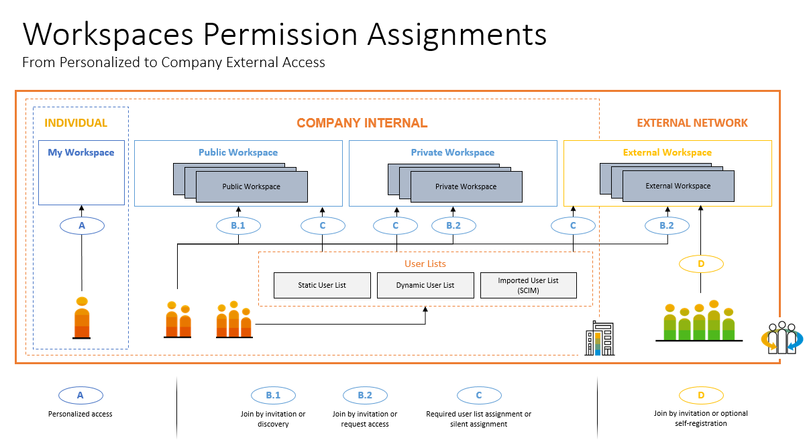
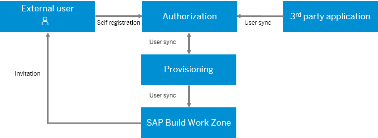

<!-- loio43782128ec724e10943efa74bfc63a47 -->

# External Users - Overview

This section explains all about external users, how to set them up in the system and what actions they can do.

<a name="loio43782128ec724e10943efa74bfc63a47__section_prw_gzr_mqb"/>

## Introduction

External users are the most restricted user type. They are guests of your organization and are given access to only the specific private external workspaces to which they have been invited, as well as to their dedicated home pages \(for external users\) and their user profile. They are allowed only limited information about, or interactions with, other users.

<a name="loio43782128ec724e10943efa74bfc63a47__section_wzl_yhf_mqb"/>

## Types of external users

External users can get access to SAP Build Work Zone, advanced edition in one of the following ways:

-   **Invitation-based self-registration**

    Users are invited to join an external workspace via an email. The email explains to them how to self-register in SAP Cloud Identity Services - Identity Authentication and how to gain access to SAP Build Work Zone, advanced edition.

    If the users don't yet exist in the Identity Authentication service, they are asked to register for a user account on the Identity Authentication side. If the users have already registered on the Identity Authentication side, they are prompted to login with their credentials directly.

-   **External source \(SAP or third party\)**

    These external users already exist in another SAP or 3rd party application and should be created or updated as external. SAP Cloud Identity Services - Identity Provisioning is used to provision these users. The Identity Authentication service is either used as the primary identity provider \(IdP\) or as a proxy IdP to another solution.

**External User Provisioning to SAP Build Work Zone, advanced edition**

Identity Authentication is configured to sync users to the Identity Provisioning service, and Identity Provisioning is configured to sync users with SAP Build Work Zone, advanced edition.

> ### Note:  
> External users can also be provisioned from SAP SuccessFactors Work Zone as the source system.

<a name="loio43782128ec724e10943efa74bfc63a47__section_mqw_hqh_nsb"/>

## External users vs. internal users

-   Dedicated external user homepages – shared with the other external users from SAP Cloud Identity Services - Identity Authentication/SAP Cloud Identity Services - Identity Provisioning.

-   No permissions to create workspaces nor to access *My Workspace*.

-   Search and collaboration scope restricted to external workspaces.

-   Contact information for external users can be hidden. In the *Administration Console*, go to *Feature Enablement* \> *Features* \> *Hide contact information for external users*.

    For a full comparison, see [User Privileges.](https://help.sap.com/viewer/fec5ca6e3229418f84a932c745cbe985/Cloud/en-US/b60b0fee153244dc9a8240a2cb095f89.html)

<a name="loio43782128ec724e10943efa74bfc63a47__section_qjn_mzr_mqb"/>

## More information

-   [Configuring External Users](configuring-external-users-df89bb3.md)
-   [Migrating SAP Jam External Users](migrating-sap-jam-external-users-9969e14.md)
-   [Managing External Users](managing-external-users-983b77d.md)
-   [User Privileges.](https://help.sap.com/viewer/fec5ca6e3229418f84a932c745cbe985/Cloud/en-US/b60b0fee153244dc9a8240a2cb095f89.html)
-   [Personal Data and Privacy.](https://help.sap.com/viewer/fec5ca6e3229418f84a932c745cbe985/Cloud/en-US/d6b35c55d91a4231b3f9b390ae89c0d8.html)

