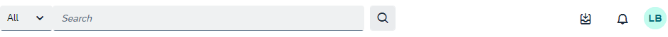

<!-- loio9f510de3f24241429628816d2de62bb2 -->

<link rel="stylesheet" type="text/css" href="css/sap-icons.css"/>

# First View of Your Site

This topic describes what you can expect to see when you launch SAP Build Work Zone, advanced edition.

<a name="loio9f510de3f24241429628816d2de62bb2__section_i1m_bgg_d4b"/>

## The header bar

The header bar in your site looks something like this \(depending on certain configurations that your administrator may have made\).

<table>
<tr>
<th valign="top">

Feature

</th>
<th valign="top">

Description

</th>
</tr>
<tr>
<td valign="top">

*Search*



</td>
<td valign="top">

Use the standard search mechanism to search for content in your site or for the applications assigned to your roles. Use Enterprise Search to search for SAP S/4HANA applications \(if they've been configured to work with enterprise search\).

> ### Note:  
> Searching for site content from the search bar, isn't available if enterprise search is enabled.

For more information, see [How to Search in Your Site](how-to-search-in-your-site-a3a83b4.md).

</td>
</tr>
<tr>
<td valign="top">

*My Inbox*



</td>
<td valign="top">

Displays all tasks from SAP and non-SAP workflows.

</td>
</tr>
<tr>
<td valign="top">

*Notifications*



</td>
<td valign="top">

Displays a list of notifications to inform you of important updates, invitations, and approval requests. You can see your current notifications as well as a record of your past notifications.

> ### Note:  
> If @@notify is enabled and sent via a workspace, you'll only receive a notification if you’re following the workspace.

For more information, see [About Notifications](about-notifications-fc1ef68.md).

</td>
</tr>
<tr>
<td valign="top">

*Avatar* 

</td>
<td valign="top">

Clicking on your profile picture, opens the User Actions menu.

> ### Note:  
> If you haven't yet added a photo, your profile image consists of a circle with your initials. To add a different image, select *User Profile* from the User Actions menu and click the camera icon to upload a new one.
> 
> For more information about the user actions menu, see [How to Set Up Your User Profile](how-to-set-up-your-user-profile-a80f406.md).

</td>
</tr>
<tr>
<td valign="top">

*Employment Switcher*



</td>
<td valign="top">

**For SAP SuccessFactors Work Zone only**.

Enables a user to easily switch between their different employments and see only content that is relevant to the selected employment. If a user only has a single employment, the *Employment Switcher* won't be visible in the shell header.

For more information, see [SAP SuccessFactors Work Zone with Multiple Employment.](https://help.sap.com/viewer/04877e17a5da4908a6fea94949e160b5/Cloud/en-US/a9fd7463fc5e44399ea3d07b84b07e8f.html)

</td>
</tr>
</table>

<a name="loio9f510de3f24241429628816d2de62bb2__section_p3l_fwy_p1c"/>

## The menu bar

The menu bar consists of some out of the box menu items. These are:

<table>
<tr>
<th valign="top">

Menu Item

</th>
<th valign="top">

Desription

</th>
</tr>
<tr>
<td valign="top">

*Home*

</td>
<td valign="top">

The *Home* page is the landing page when you first open your site. It is the first menu item in the top navigation bar. It displays information that is relevant to everyone in the company who has access to the site.

</td>
</tr>
<tr>
<td valign="top">

*My Workspace*

</td>
<td valign="top">

A personal workspace. All users can create their own workspace. This workspace can be used as a favorite page for frequently used content and applications.

</td>
</tr>
<tr>
<td valign="top">

*Workspaces*

</td>
<td valign="top">

A central place for you to create workspaces. These workspaces can become available to internal and external users.

</td>
</tr>
<tr>
<td valign="top">

*Applications*

</td>
<td valign="top">

Provides access to all business apps that the logged on user can access and that are configured for display.

</td>
</tr>
<tr>
<td valign="top">

*Tools*

</td>
<td valign="top">

Provides access to different tools like company knowledge base, calendar, and more.

</td>
</tr>
</table>

<a name="loio9f510de3f24241429628816d2de62bb2__section_qz3_jxy_p1c"/>

## Workpage settings

On the right hand side of the Home page, you'll see the following icons that will help you edit your workpage. Some of these settings also appear on workpages that you create in a workspace.

For more information about these settings, see [How to Use the Workpage Editor](how-to-use-the-workpage-editor-9164929.md).

