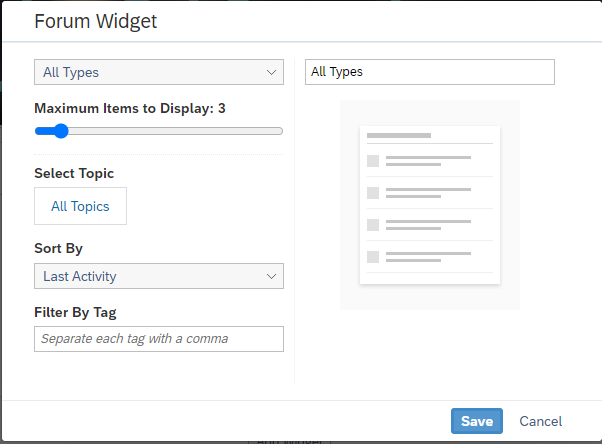

<!-- loio617530d16c8e4b6aae44b0dd66a4ea00 -->

# Forum Widget

Add a Forum widget so that workspace members can ask questions, give ideas, and open discussions.

When you add a Forum widget, you can change the following settings:

<table>
<tr>
<th valign="top">

Setting

</th>
<th valign="top">

More Information

</th>
</tr>
<tr>
<td valign="top">

Forum Type

</td>
<td valign="top">

Choose the type of forum to display \(e.g., questions, ideas, discussions, topics, or all types\).

</td>
</tr>
<tr>
<td valign="top">

Maximum number of items

</td>
<td valign="top">

Click and drag the scale slider to set a maximum between 1 and 25 forum items to display.

</td>
</tr>
<tr>
<td valign="top">

Select Topic

</td>
<td valign="top">

Select one of the topics in the forum - it can be a question, idea, or discussion.

</td>
</tr>
<tr>
<td valign="top">

Sort By

</td>
<td valign="top">

Choose how the forum will be organized \(e.g., last activity, most replies, most likes or votes, or most viewed\).

</td>
</tr>
<tr>
<td valign="top">

Filter by Tag

</td>
<td valign="top">

Enter text that refines what appears in the forum type; one or more tags are allowed, comma-separated.

</td>
</tr>
<tr>
<td valign="top">

Widget Name

</td>
<td valign="top">

Enter a name for the forum or accept the default name provided by the selection.

</td>
</tr>
</table>

