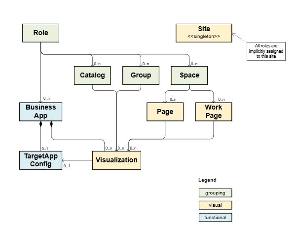

<!-- loio050c6f29f9504c26a4dc3b1803d4ec8d -->

# Guidelines for Creating a cdm.json

An overview of the Common Data Model entities.


## What is the Common Data Model?

The Common Data Model \(CDM\) serves as a standardized contract to integrate content channels into SAP Build Work Zone. It is the basis for interoperability and content federation of business content from various SAP products into a central entry point site, in a unified manner. Content providers expose a CDM document as a JSON document that follows a CDM schema, in which each CDM entity describes its attributes and behaviors.

The CDM is an evolving model. The latest schema version is 3.2. The version of the schema determines which business content can be included in it. The core business items - roles, catalogs, groups, can be used in any version. Spaces and pages can be used in version 3.1 and up, and the latest added items, workpages and site, can be used in version 3.2 and up.


### CDM Content Diagram

The following diagram depicts the CDM entities and the relationship between them.




## CDM Structure

The Common Data Model format is defined as a json schema. All CDM entities are contained within a top-level array, each having a common structure with the following properties:

****


<table>
<tr>
<th valign="top">

Property

</th>
<th valign="top">

Description

</th>
</tr>
<tr>
<td valign="top">

`_version`

</td>
<td valign="top">

Attribute, which defines the format version of this CDM entity.

</td>
</tr>
<tr>
<td valign="top">

`identification`

</td>
<td valign="top">

Section that contains the unique `id`, `entityType`, and an optional `title`.

</td>
</tr>
<tr>
<td valign="top">

`payload`

</td>
<td valign="top">

Section defines the content of the entity according to the schema defined for the `entity type`. Each entity type has a different format.

</td>
</tr>
<tr>
<td valign="top">

`texts`

</td>
<td valign="top">

Section contains localized text for the entity type. This section is optional. The locale should be specified according to [BCP 47 tag](https://www.ietf.org/rfc/bcp/bcp47.txt). An empty locale `"locale": ""` MUST be used to define a default representation. Localized texts are referenced in values of string-typed properties in the `payload` using double curly braces syntax, like `{{title}}` containing a key of the `textDictionary`.

</td>
</tr>
</table>

```

  [
    {
      "_version": "3.2",
      "identification": {
        "id": "app.example.id",
        "title": "{{title}}",
        "entityType": "businessapp"
      },
      "payload": {
        // structure depends on the entity type
      },
      "texts": [
        {
          "locale": "",
          "textDictionary": {
            "title": "A default locale"
          }
        },
        {
          "locale": "en",
          "textDictionary": {
            "title": "A localized title"
          }
        }
      ]
    }
  ]

```


## CDM Entities

The CDM entities define the design-time content of SAP Build Work Zone:


<table>
<tr>
<th valign="top">

Entity

</th>
<th valign="top">

Description

</th>
<th valign="top">

Schema Version

</th>
<th valign="top">

JSON Schema

</th>
</tr>
<tr>
<td valign="top">

Role

</td>
<td valign="top">

Defines the entities that a user with appropriate authorization can access, including apps, spaces, etc.

> ### Note:  
> The `cdm.json` **must** contain at least one role definition. Without defining roles, it won't be possible to consume the business solution.


</td>
<td valign="top">

3.0 and up

</td>
<td valign="top">

[role.json](https://github.com/SAP/common-data-model/blob/main/schema/role.json)

</td>
</tr>
<tr>
<td valign="top">

Group

</td>
<td valign="top">

Defines a grouping of app tiles in the site.

> ### Note:  
> Using groups isn't recommended. Please use spaces and pages instead.


</td>
<td valign="top">

3.0 and up

</td>
<td valign="top">

[group.json](https://github.com/SAP/common-data-model/blob/main/schema/group.json)

</td>
</tr>
<tr>
<td valign="top">

Space

</td>
<td valign="top">

Defines a grouping of pages. Spaces appear in the site menu.

</td>
<td valign="top">

3.1 and up

</td>
<td valign="top">

[space.json](https://github.com/SAP/common-data-model/blob/main/schema/space.json)

</td>
</tr>
<tr>
<td valign="top">

Page

</td>
<td valign="top">

Defines a grouping of app tiles in sections. A page is nested under a space.

</td>
<td valign="top">

3.1 and up

</td>
<td valign="top">

[page.json](https://github.com/SAP/common-data-model/blob/main/schema/page.json)

</td>
</tr>
<tr>
<td valign="top">

Workpage

</td>
<td valign="top">

Defines a grouping of app visualization in a grid-based layout \(rows, columns, cells\). Supports also cards as app visualization.

> ### Note:  
> The IDs of rows, columns, cells, and widgets must be unique and consistent throughout the entire lifecycle.


</td>
<td valign="top">

3.2

</td>
<td valign="top">

[workpage.json](https://github.com/SAP/common-data-model/blob/main/schema/workpage.json)

</td>
</tr>
<tr>
<td valign="top">

Business app

</td>
<td valign="top">

Defines the target, navigation, UI, and integration attributes of an application.

</td>
<td valign="top">

3.0 and up

</td>
<td valign="top">

[businessapp.json](https://github.com/SAP/common-data-model/blob/main/schema/businessapp.json)

</td>
</tr>
<tr>
<td valign="top">

Catalog

</td>
<td valign="top">

Defines the catalog in which the app belongs to in the AppFinder.

</td>
<td valign="top">

3.0 and up

</td>
<td valign="top">

[catalog.json](https://github.com/SAP/common-data-model/blob/main/schema/catalog.json)

</td>
</tr>
<tr>
<td valign="top">

Site

</td>
<td valign="top">

Defines the site that serves as an entry point, from which the end users can access the business content. Only the first site entity in the CDM document will be considered.

</td>
<td valign="top">

3.2

</td>
<td valign="top">

[site.json](https://github.com/SAP/common-data-model/blob/main/schema/site.json)

</td>
</tr>
<tr>
<td valign="top">

URL template

</td>
<td valign="top">

Allows the integration of remote apps across different technologies.

</td>
<td valign="top">

3.0 and up

</td>
<td valign="top">

[urltemplate.json](https://github.com/SAP/common-data-model/blob/main/schema/urltemplate.json)

</td>
</tr>
<tr>
<td valign="top">

CDM entities

</td>
<td valign="top">

An array of all CDM entities that can be adopted by content providers exposing CDM entities.

</td>
<td valign="top">

3.0 and up

</td>
<td valign="top">

[cdmentities.json](https://github.com/SAP/common-data-model/blob/main/schema/cdmentities.json)

</td>
</tr>
</table>


## CDM Entities in Different Site View Modes

The view mode settings of the site defines how the app tiles are grouped at runtime. The options are groups, spaces and pages, and spaces and pages - new experience.

When you define the CDM content, you can't be sure which view mode will be selected for the site, and therefore it is recommended to create CDM entities that will match all view modes. Note that when doing so, you might see duplicated content when using the Spaces and Pages view mode \(the app tiles you assigned to groups in the CDM content will appear in the *Home* space, while the app tiles that you assigned to pages will appear in the relevant page\).

The following table describes the relationship between the CDM display entities and the view modes.

****


<table>
<tr>
<th valign="top">

View Mode

/

CDM Definitions

</th>
<th valign="top">

Groups - **not recommended**

</th>
<th valign="top">

Spaces and Pages

</th>
<th valign="top">

Spaces and Pages - New Experience - **recommended**

</th>
</tr>
<tr>
<td valign="top">

Groups \(schema version 3.0\) - **not recommended**

</td>
<td valign="top">

The site displays the groups as defined in the CDM.

</td>
<td valign="top">

All groups are displayed in a dedicated space called *Home*.

</td>
<td valign="top">

Groups are hidden.

</td>
</tr>
<tr>
<td valign="top">

Spaces and Pages \(schema version 3.1\)

</td>
<td valign="top">

Spaces and pages are hidden

</td>
<td valign="top">

The site displays the spaces and pages as defined in the CDM.

</td>
<td valign="top">

Site displays the spaces and pages as defined in the CDM.

</td>
</tr>
<tr>
<td valign="top">

Spaces and Workpages \(schema version 3.2\) - **recommended**

</td>
<td valign="top">

Spaces and pages are hidden.

</td>
<td valign="top">

Spaces and Workpages are hidden.

</td>
<td valign="top">

The site displays the spaces and workpages as defined in the CDM.

</td>
</tr>
</table>

