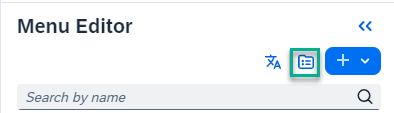

<!-- loio19bf8aa8e8aa4c3b9c5f0104b1bdc518 -->

<link rel="stylesheet" type="text/css" href="css/sap-icons.css"/>

# How to Add Content to Workspaces

In this section, we explain how to add various types of content to a workspace by adding the content from a widget gallery or creating and uploading your own content.

<a name="loio19bf8aa8e8aa4c3b9c5f0104b1bdc518__section_uv1_mnc_cqb"/>

## Using the workpage editor

You can add content to your workspace by adding widgets from a widget gallery. These widgets include app tiles, cards, and other widgets such as forums, events, feeds, video files, images and much more.

To add content to a workpage in your workspace, use a tool called the workpage editor, which you access on the right side of your workpage by clicking the :pencil2: icon.

When you open the workpage editor, add the following content as follows:

<table>
<tr>
<th valign="top">

Content type

</th>
<th valign="top">

Description

</th>
</tr>
<tr>
<td valign="top">

Apps

</td>
<td valign="top">

Click *Tiles* to display app tiles representing the apps that you can access. You can add a single app to a column or you can select multiple apps and add them side by side in a column. Here's an example of apps added one next to each other in a column:

-   

For more information, see [Add Applications to Your Workpage](add-applications-to-your-workpage-7bcef04.md).

</td>
</tr>
<tr>
<td valign="top">

Cards

</td>
<td valign="top">

Click *Cards* to display all cards that you can access. You can only add one card at a time.

Example of a card:

For more information, see [About Cards](about-cards-a202464.md).

</td>
</tr>
<tr>
<td valign="top">

Widgets

</td>
<td valign="top">

Select from a variety of widgets such as forums, events, images, and more.

Click :gear: on a widget to edit various widget settings.

For more information about the different widgets, see [About Widgets](about-widgets-5a73a41.md).

</td>
</tr>
</table>

<a name="loio19bf8aa8e8aa4c3b9c5f0104b1bdc518__section_d3j_t3m_xxb"/>

## Add content that you create or upload

Apart from content that you can add to your workpages from the widget gallery, you can create your own content or upload it from your system. Content items are workpages, blog posts, links, videos, wiki pages, documents \(PowerPoint, Word, Excel\), decision-making tools such as polls and comparison tables as well as planning tools such as agenda, tasks, and timelines.

When you create or upload content for a specific workspace, it's added to the workspace *Content* list.

You can create content for your workspace as follows:

<table>
<tr>
<th valign="top">

Where

</th>
<th valign="top">

How

</th>
</tr>
<tr>
<td valign="top">

In your workspace, click the  \(page navigator\) icon.

</td>
<td valign="top">

1.  From the dropdown list, select *Content*.

2.  Click *\+ Create* or *Upload File* to create or upload your content.

</td>
</tr>
<tr>
<td valign="top">

Add a dedicated *Content* navigation tab to your workspace

</td>
<td valign="top">

1.  Click the :heavy_plus_sign: in the workspace navigation bar.

2.  Select *Content*.

3.  Click the *Content* navigation tab to see your list of content.

4.  Click *\+ Create* or *Upload File* to create or upload your content.

> ### Note:  
> You can continue adding content items to the workspace navigation bar and then under these you can add more tabs thus creating a two-level menu in your workspace. Click the :gear: 

</td>
</tr>
<tr>
<td valign="top">

From the site menu

</td>
<td valign="top">

1.  Click :pencil2: to open the site menu.

2.  Click the  \(content\) icon.

    

3.  In the *Menu Content*screen, click *\+ Create* or *Upload File* to create our upload your content.

</td>
</tr>
</table>

