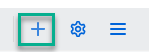
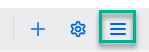
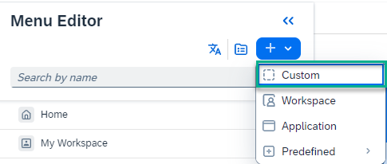

<!-- loioc3734dd8b29a4e8c93304ecb99bac6d6 -->

<link rel="stylesheet" type="text/css" href="css/sap-icons.css"/>

# How to Add Workpages to Your Site

This topic explains how you can add workpages to your site.

You can add workpages to your site as follows:

<table>
<tr>
<th valign="top">

Where

</th>
<th valign="top">

How

</th>
</tr>
<tr>
<td valign="top">

In the navigation bar of a workspace

</td>
<td valign="top">

1.  Open your workspace.

2.  Click :heavy_plus_sign: in the workspace navigation bar.

    

3.  Select *Workpage*.

This adds a new workpage to the navigation bar.

</td>
</tr>
<tr>
<td valign="top">

As a content type in your *Content* list or in a folder.

</td>
<td valign="top">

1.  Click the  in your workspace.

    

2.  Select *Content* to open the list of content in your workspace.

3.  Click *\+ Create* and select *Workpage*.

You will see that the workpage has been added to the list of content in your workspace.

</td>
</tr>
<tr>
<td valign="top">

From within the site menu

</td>
<td valign="top">

1.  In the top header bar of your site, click :pencil2: on the far right to open the menu editor.

2.  On the left side of the menu, click :heavy_plus_sign: and then select *Custom*.

    

3.  Select *Workpage*.

4.  Select an existing workpage from the dropdown list.

    > ### Note:  
    > You can also create a new workpage in the *Menu Content* screen as follows:
    > 
    > 1.  Click  to open the *Menu Content* screen.
    > 
    > 2.  Click *\+ Create* \> *Workpage*.
    > 
    > 3.  Go back to the menu editor and add the new workpage from the dropdown list.

</td>
</tr>
</table>

