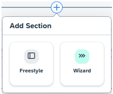
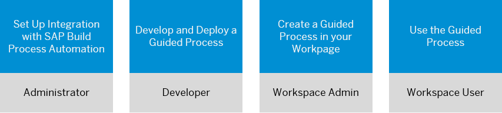
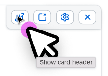
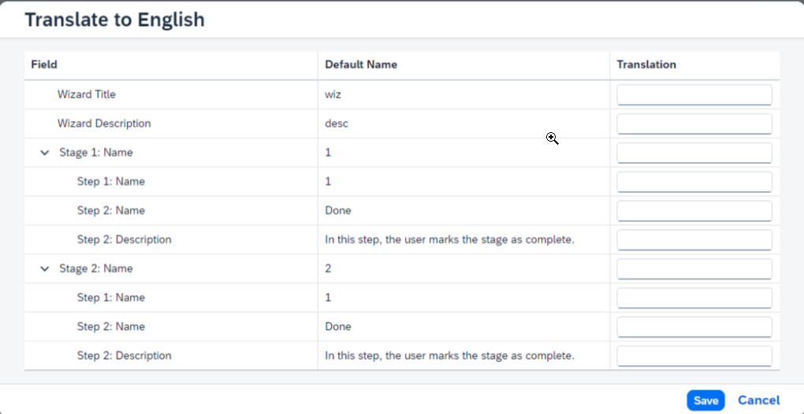

<!-- loio061fb6b420a3420fa9da3815e63740ec -->

<link rel="stylesheet" type="text/css" href="css/sap-icons.css"/>

# How to Create a Wizard

Add a wizard-like layout to a workpage in your workspace to help users complete a task or process.

## Overview

You can create a wizard to simplify complex workflows and processes by guiding your users through tasks in a clear and sequential way. Each wizard consists of one or more stages; each stage is composed of one or more steps.

> ### Note:  
> A stage is a high-level logical grouping of steps for a specific task.

In SAP Build Work Zone, advanced edition you have two choices when adding a wizard:

<table>
<tr>
<th valign="top">

Wizard Option

</th>
<th valign="top">

Use Case

</th>
<th valign="top">

Main Differences

</th>
</tr>
<tr>
<td valign="top">

Select a predefined guided process

</td>
<td valign="top">

> ### Note:  
> To use this option, your administrator needs to have set up integration with SAP Build Process Automation. For more information, see [Integration with SAP Build Process Automation](integration-with-sap-build-process-automation-af49b90.md) - see the section for creating a guided process.

Business users are sometimes required to carry out specific, complex processes, such as an onboarding process when they join a new company. You can assist them by embedding a wizard-like predefined process that will guide them through the required steps.

</td>
<td valign="top">

-   Stages and steps are not editable

-   *Title* is populated automatically and the *Description* field is grayed out.

-   You can't determine which steps are*Required* or those that are *Parallel*.

    > ### Note:  
    > Parallel steps are those that can be skipped and then completed at a later stage.

</td>
</tr>
<tr>
<td valign="top">

Create a wizard from scratch.

</td>
<td valign="top">

Create a wizard without predefined content.

</td>
<td valign="top">

-   Add your own stages and steps according to your scenario.

-   Enter a *Title* and add an optional *Description*.
-   You can determine which steps are*Required* or can be marked as *Parallel*.

</td>
</tr>
</table>

<a name="loio061fb6b420a3420fa9da3815e63740ec__section_kxx_s3r_5cc"/>

## How to add a wizard to your workpage

1.  From your workspace, click :pencil2:to open your workpage in edit mode.

2.  Click :heavy_plus_sign: to add a new section to the workpage.

3.  Select a *Wizard* section type.

    

<a name="loio061fb6b420a3420fa9da3815e63740ec__section_gwk_3dr_5cc"/>

## How to create a wizard using a guided process

The overall process of creating and using a SAP Build Process Automation guided process is as follows:

### Set up integration with SAP Build Process Automation

Before you can choose a guided process and add it to a workpage in your workspace, your administrator needs to have set up SAP Build Process Automation. For more information, see [Integration with SAP Build Process Automation](integration-with-sap-build-process-automation-af49b90.md).

### Develop and deploy a guided process

For instructions on how to develop a guided process, see [Create a Guided Process](https://help.sap.com/docs/build-process-automation/sap-build-process-automation-ship-internal/create-guided-process?state=DRAFT).

### Create a guided process in a workpage of your workspace

1.  Once you've added a wizard-type section to your workpage, an *Add Wizard* dialog box enables you to select a process. From the *Process* dropdown list, select one of the predefined guided processes provided by SAP Build Process Automation.

    > ### Note:  
    > Once you've selected the guided process, fields such as *Title*, *Description*, *Stages*, and *Steps* are automatically populated, as well as the *Wizard Cover*.

2.  If you don't like the default background of the wizard cover, you can select a different background by uploading an image from the top right corner of the cover preview.

    

3.  Select whether you want your wizard to be embedded in the workpage or if you prefer to open it as a dialog.

4.  Click *Save* to create the wizard.

5.  You now have the skeleton of the wizard. Click *Add Content* to add widgets and cards to the wizard.

6.  Once the wizard skeleton is created, you can add more widgets and cards to the wizard.

    > ### Note:  
    > It's possible to hide the card header when it's displayed inside a wizard. This capability is not available for cards that are added to workpages.
    > 
    > 

7.  Publish the wizard. If you intend to come back to the wizard to make more changes, you can also save it as a draft and publish later.

8.  Once you've published the wizard, users can navigate between the stages and steps.

### Use the guided process

As a user of the wizard you can:

-   View the title and description of the guided experience before you start it.

-   Navigate through the stages and steps.

-   Check out the widgets added to the wizard.

-   Exit the guided experience at any time and save your current progress.

<a name="loio061fb6b420a3420fa9da3815e63740ec__section_eqs_vxf_21c"/>

## How to create a wizard from scratch

1.  Once you've added the wizard to your workpage, define the wizard properties as follows:

    <table>
    <tr>
    <th valign="top">

    Property
    
    </th>
    <th valign="top">

    More Info
    
    </th>
    </tr>
    <tr>
    <td valign="top">
    
    Process
    
    </td>
    <td valign="top">
    
    Select *New Wizard*.
    
    </td>
    </tr>
    <tr>
    <td valign="top">
    
    Title
    
    </td>
    <td valign="top">
    
    Enter a title for your wizard.
    
    </td>
    </tr>
    <tr>
    <td valign="top">
    
    Description
    
    </td>
    <td valign="top">
    
    Enter a description that best describes your process.
    
    </td>
    </tr>
    <tr>
    <td valign="top">
    
    Display Options
    
    </td>
    <td valign="top">
    
    Choose whether to open the wizard embedded in a workpage or as a dialog.
    
    </td>
    </tr>
    <tr>
    <td valign="top">
    
    Wizard Cover Preview
    
    </td>
    <td valign="top">
    
    Click the right top corner of the background image and select an image. Alternatively, you can keep the default background image.
    
    </td>
    </tr>
    <tr>
    <td valign="top">
    
    Force users to start over when the wizard is updated
    
    </td>
    <td valign="top">
    
    This setting controls the behavior of the wizard when the wizard is updated:

    -   When this option is selected, all users will be forced to start over if the wizard is updated with a new version.
    -   When this option is not selected, the wizard behavior is as follows:
        -   New users will see the updated version of the wizard.
        -   Users who are currently working with the wizard will continue to see the version that they started with.
        -   Users who have completed the wizard won't be affected by the updates.

    
    </td>
    </tr>
    <tr>
    <td valign="top">
    
    Enable navigation between required steps/stages
    
    </td>
    <td valign="top">
    
    If you select this option, users can go back and forth between the wizard steps/stages without completing mandatory steps. When reaching the final wizard step, the user will be prompted to complete all incomplete steps before completing the wizard.
    
    </td>
    </tr>
    <tr>
    <td valign="top">
    
    Create a wizard with multiple stages
    
    </td>
    <td valign="top">
    
    If you select this option, the wizard is updated to allow you to create multiple stages, each one with nested steps.
    
    </td>
    </tr>
    <tr>
    <td valign="top">
    
    Collapsible wizard
    
    </td>
    <td valign="top">
    
    Define whether the wizard is collapsible, and if collapsible, what is the default mode – expanded or collapsed.
    
    </td>
    </tr>
    </table>
    
2.  Add stages and steps.
    -   Enter a name for the stage/step.

        > ### Note:  
        > If you delete a stage, all steps below the stage will also be deleted.

    -   Enter a description for the step.

    -   Choose if the step is required or optional.

    -   Choose if the step is visible or not. For example, you can choose to hide the *Done* step in stages that are not the final stage of the wizard.

    -   Click *Add*.

3.  Once the wizard skeleton is created, you can click *Add Content* to add widgets and cards to the wizard.

    > ### Note:  
    > It's possible to hide the card header when it's displayed inside a wizard. This capability is not available for cards that are added to workpages.
    > 
    > 

4.  Publish the wizard or save it as a draft and publish later.

    The end result can look like this:

    

<a name="loio061fb6b420a3420fa9da3815e63740ec__section_l11_231_c2c"/>

## Using a wizard multiple times

You can define whether a wizard can be executed multiple times, and if you enable this option, you can define whether the multiple executions can run in parallel \(before completing the previous runs\).

Enabling multiple execution makes sense in guided processes such as Purchase Order, when you can use the same wizard to purchase different items in parallel. On the other hand, it doesn't make sense to enable multiple execution for guided processes that are meant to be executed only once, such as onboarding of a new employee.

When the multiple execution option is enabled, you can click *Create* to start a new instance of the wizard. The wizard background image shows a progress bar for every instance of the wizard that is running, and you can click *View all instances* to view the details, rerun or cancel instances that are still not complete.

<a name="loio061fb6b420a3420fa9da3815e63740ec__section_ky2_ftr_5cc"/>

## Things to know when creating a wizard

**For workspace admins:**

-   If you edit the wizard by choosing a different process, when you publish it, users who are working with the wizard will lose their progress so far.

-   If you edit any of the wizard steps, it will force users to start over again.

-   When you edit the content of a wizard in a workpage, publishing that workpage will cause users working in the wizard to start over.

-   If you delete a wizard, users who are currently working with the wizard, won't be able to continue using it.

**For developers:**

When the wizard contains cards and widgets, the card developers can interact with the wizard events and context updates. For more information, see [Interacting with Wizard Events and Context Updates](interacting-with-wizard-events-and-context-updates-b669fe4.md).

<a name="loio061fb6b420a3420fa9da3815e63740ec__section_kpw_tds_21c"/>

## Translating the Wizard

You can translate the wizard text as follows:

1.  Open the workpage settings by clicking :magic_wand:.

2.  Click  to open the translation editor.

3.  At the top of the screen, select the language you want to translate to from the dropdown menu.

4.  Click the  icon on the right corner of the wizard header to enter the wizard translation editor.

5.  Enter the translated text. Repeat this for any additional language you need. Once you're done, you can publish the translation or save it as a draft.

