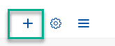

<!-- loio770f1b03d87d4be6974bc77df3c816a3 -->

<link rel="stylesheet" type="text/css" href="css/sap-icons.css"/>

# How to Create a Workspace

Create a workspace to share information and exchange ideas with your colleagues.

<a name="loio770f1b03d87d4be6974bc77df3c816a3__section_jsn_td3_5xb"/>

## Introduction

You can create a workspace from scratch \(as explained below\) and you can also copy an existing workspace and in this way save time and effort in designing the same workpages and uploading content and folder structure to a new workspace.

For more information about how to copy a workspace, see [How to Manage Workspaces](how-to-manage-workspaces-b861107.md).

<a name="loio770f1b03d87d4be6974bc77df3c816a3__section_r1b_srb_snb"/>

## Create a workspace

1.  Go to *Workspaces* in the top menu bar and choose *New Workspace*.

2.  Select a predefined template from the dropdown menu, or choose *No Template*.

3.  Enter a unique name for your workspace and a description.

    > ### Note:  
    > If the workspace is public, the description is visible to others when they carry out a search. When the workspace is private, the description is visible to your colleagues only after they’ve been invited to the workspace or join the workspace.

4.  Select the privacy level for your workspace:

    -   *Public* - every full-access user in the company can view and join. You can find the public workspaces in your company with the search tool or by browsing on the *Workspaces* screen.

    -   *Private* - you can only join and view if you've been invited to them. In general, private workspaces are hidden and can't be found with the search tool. If you're not invited to a private workspace, you can't see it on the *Workspaces* screen. The workspace administrators, however, can set a private workspace to *Allow others to discover this workspace*.

    -   *External* - you can work together with people from different companies who join the workspaces as external users. You can join and view external workspaces only if you've been invited to them. External workspaces are hidden and can't be found with the search tool. If you're not invited to an external workspace, you can't see it on the *Workspaces* screen.

5.  Click *Options* and define the following policies:
    -   Select a *Collaboration Level*:

        -   *Read-only*: Only workspace administrators can create, edit, and post items in the workspace. Other workspace members can view and download workspace content, but they can't comment, tag, post, or edit. Forums, polls, and tasks aren’t available. This level is suitable for broadcasting information.

        -   *Limited*: Only workspace administrators can create and upload new content. All members can edit, post, comment, like, and view workspace content.

        -   *Full*: Workspace administrators and members can create, edit, post, comment, like, tag, and view workspace content. Only the workspace administrator can customize the upload policy.

    -   Select *Set Invite Policy*:
        -   *All Members*: All members are allowed to invite new members.

            > ### Note:  
            > This option is available only for workspaces with the privacy level *Public*.

        -   *All Workspace Members*: All workspace members are allowed to invite new members.

        -   *Only Workspace Admins*: Only the workspace administrators are allowed to invite new members.

    -   Select the *Visibility Policy*:

        > ### Note:  
        > This setting is only available for workspaces with the privacy level *Private*.

        -   *Allow others to discover this workspace*: The workspace becomes searchable to non-members, and they can see the workspace name and description. They must submit a request to join the workspace and be accepted before they can access the workspace content. Selecting this option also automatically selects *Allow others to request to join this workspace*. You can disable either or both options as necessary.

        -   *Allow others to request to join this workspace*: Non-members can submit a request to become a member. Once accepted, they can access the workspace content.

    -   Select *Set Upload Policy*. If you choose the *Full* collaboration level, you can restrict the upload policy as follows:
        -   *All Members*: All users of your company can upload new content items.

            > ### Note:  
            > This option is available only for workspaces with a *Public* privacy level.

        -   *All Workspace Members*: All members of your workspace can upload new content items.

        -   *All Workspace Members from my company*: Only workspace members from your company can upload content items.

            > ### Note:  
            > This option is available only for workspaces with an *External* privacy level.

        -   *Only Workspace Admins*: Only workspace administrators can upload new content items. All workspace members are allowed to comment or edit content.

    -   Select *Set Task Policy*. If you choose the *Full* collaboration level, you can restrict the task policy as follows:
        -   *Full*: All members can edit the details of any task.

        -   *Limited*: All members can update the status of any task. Non-assignees can view, but not update, other task details.

        -   *Read-only*: Assignees can update their own task status. Non-assignees can view tasks only.

    -   Set the *Content Approval*:

        Under *Full* collaboration, when workspace members upload documents, photos, videos, wikis, or blogs, the workspace administrator must first review and approve this content before it’s visible in the workspace. This provides content publishing safeguards to ensure that content is appropriate for the business context within a workspace. For more information, see [Approve Content](approve-content-5d4b062.md).

6.  To confirm your settings, choose *Done*.

7.  Select or deselect the *Activate this workspace now* checkbox.

    > ### Note:  
    > The *Activate this workspace now* checkbox allows workspace creators to override the workspace activation default. The following defaults have been designed to support standard scenarios:
    > 
    > -   Private workspaces: *Activated*:
    > 
    >     -   Workspace is automatically enabled and visible.
    > 
    >     -   Workspace administrators or page designers prepare layout and content, and then invite users when ready.
    > 
    > 
    > -   Public workspace: *Inactive*
    >     -   Creators of public workspaces can prepare the layout and content before users see it.
    > 
    >     -   Users don’t have to be members to see content in active public workspaces.

8.  Click *Create*.

Once you’ve created a workspace, you’re the workspace administrator of the workspace and you can now add workpages and content to the workspace and invite members.

For more information, see: [How to Add Content to Workspaces](how-to-add-content-to-workspaces-19bf8aa.md).

> ### Note:  
> You can also add sub-workspaces in the same way. To add a sub-workspace, you first need to add a Sub-Workspace menu item to your workspace using the :heavy_plus_sign: icon in the workspace menu:
> 
> 

<a name="loio770f1b03d87d4be6974bc77df3c816a3__section_ypj_q22_4tb"/>

## Add a cover photo in the header of your workspace

1.  Hover over the header area of your workspace and click *Upload Cover Photo*.

2.  Upload the image you want as your workspace cover photo.

    > ### Note:  
    > The image must be smaller than 5 MB and must be in the correct format \(JPG or PNG\).

3.  Use the reposition and zoom control to arrange your image in the header area.

If you copy this workspace, save it as a template, or export and then import it again, the cover photo that you selected and your settings are kept as is.

<a name="loio770f1b03d87d4be6974bc77df3c816a3__section_eny_pyp_wxb"/>

## Make a workspace your favorite

You can add a workspace to your favorites by clicking the little star next to the workspace name.

<a name="loio770f1b03d87d4be6974bc77df3c816a3__section_ysl_1sb_5xb"/>

## Create a Terms of Use

When you invite members to a workspace, each member must accept the Terms of Use before they can access the workspace.

**Where to create a Terms of Use**:

1.  In the workspace, open the  menu and choose *Workspace Admin Settings* \> *Edit Workspace*.

2.  Open the *Setup* tab and you'll see *Terms of Use*.

**How to create a Terms of Use**

1.  Select a language.

2.  Enter the translated text into the text box.

3.  Set one of the languages as the default language. If there's no translation for a specific language, the user receives the terms of use in the default language that you set.
4.  *Save* the settings.

You can create terms of use in multiple languages by repeating the steps above for each language. In the dropdown list of languages, you'll see which languages have been translated since they’ll be marked as *Available*.

> ### Note:  
> If your workspace was created before the multi-language feature was supported, you'll get a dialog box where you need to select the language of your current terms of use. By doing this, you'll enable the multi-language feature in your workspace and you can translate it into other languages as explained above.

