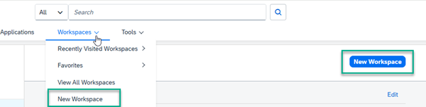
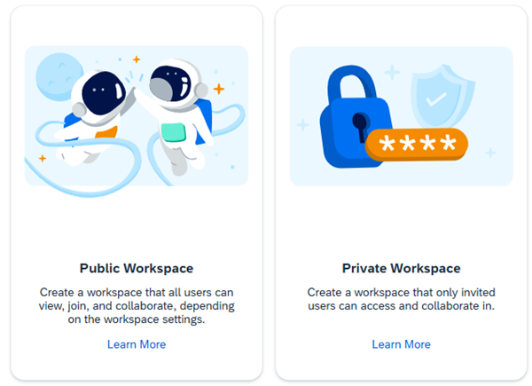
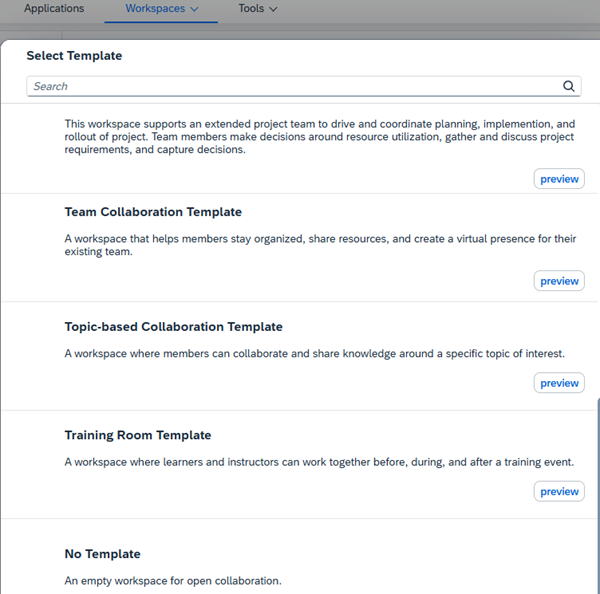
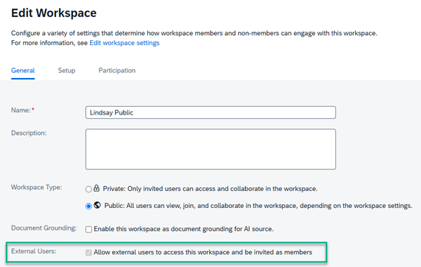
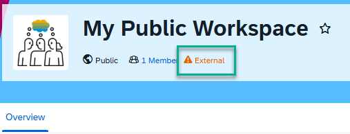
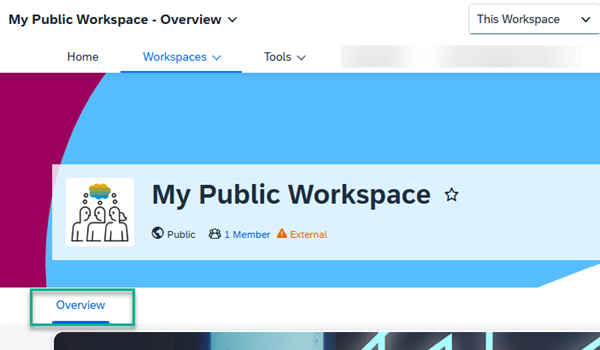

<!-- loio770f1b03d87d4be6974bc77df3c816a3 -->

# How to Create a Workspace

Create a workspace to share information and exchange ideas with your colleagues.

<a name="loio770f1b03d87d4be6974bc77df3c816a3__section_jsn_td3_5xb"/>

## Introduction

This topic takes you through the steps of how to create a new workspace using an out-of-the-box template or simply designing the workspace according your your use case.

> ### Note:  
> You can also copy an existing workspace and in this way save time and effort in designing the same workpages and uploading content and folder structure to a new workspace. For more information about how to copy a workspace, see [How to Optimally Set Up and Use a Workspace](how-to-optimally-set-up-and-use-a-workspace-b861107.md).

<a name="loio770f1b03d87d4be6974bc77df3c816a3__section_r1b_srb_snb"/>

## Create a workspace

1.  Go to *Workspaces* in the top menu bar and choose *New Workspace* from the dropdown list or you can click the *New Workspace* button on the right of your screen.

    

2.  Select the type of workspace you want to create - *Public* or *Private*.

    

    For more information about public and private workspaces, see [Types of Workspaces](https://help.sap.com/docs/build-work-zone-advanced-edition/sap-build-work-zone-advanced-edition/workspaces-8ff3df94802449f3877af5c380b22c4b?state=DRAFT#types-of-workspaces).

3.  Enter a unique name for your workspace and a description \(optional\).

    > ### Note:  
    > If the workspace is public, the description is visible to others when they search for the workspace. When the workspace is private, the description is visible to your colleagues only after they’ve been invited to the workspace or join the workspace.

4.  Select one of SAP's out-of-the box templates - note that you can preview any template to check if it's suitable for your use case. You can also scroll down to the bottom of the template list and select *No Template*. In this case you'll design your own layout for your content.

    

5.  *Activate workspace on creation* - this is a default setting that activates the workspace \(private or public\) as soon as it's created.

    -   In the case of a private workspace, even if the option to activate upon creation is enabled, the workspace won't be visible to workspace members until it's shared with them.

    -   In the case of a public workspace, workspace admins can choose whether to leave the default and activate the workspace immediately upon creation and make it visible to users even before it's ready to be shared, or they can create the workspace without activation, design it, and only when the workspace is ready to be shared, they can activate it.

6.  Define the following settings:
    -   *External users can access this workspace and be invited as members.*

        If the Company Admin has enabled this option, when creating the workspace, you can select this option. You can also select it later if you want from the workspace settings screen. If the company admin hasn't enabled this option, this setting won't be displayed here, and will be disabled in the workspace settings screen \(see screenshot below\).

        

        > ### Note:  
        > If external users are allowed to access your workspace, a warning appears under the workspace name to alert members that the workspace content is visible to external users and that they should be careful about sharing sensitive information.
        > 
        > 

    -   *Allow all members to invite users*. When not selected, only workspace admins can invite users.

    -   *Allow users to join this workspace* \(for public workspaces\) or *Allow users to request to join this workspace.* \(for private workspaces\).

7.  Click *Next* to open settings that you can define while creating the workspace. Note that you can define these settings at a later stage too by opening the workspace settings area.

    For more information about the different workspace settings, see [How to Edit Workspace Settings](how-to-edit-workspace-settings-98ae51c.md).

8.  Click *Finish*. Your workspace is created with a default *Overview* page that appears in the workspace navigation bar.

    

    > ### Note:  
    > This default *Overview* page is not created if you choose *No Template*.

Once you’ve created a workspace, you’re the workspace administrator of the workspace and you can now add workpages and content to the workspace and invite members.

<a name="loio770f1b03d87d4be6974bc77df3c816a3__section_qkl_kkb_4fc"/>

## About the Workspace Administrator

Anyone who creates a workspace, automatically becomes the administrator of that workspace.

There is also the option to assign other workspace members as administrators of a particular workspace. To do this, in the members list, select the member and from the *Actions* column, select *Make Workspace Admin*.

Members of a workspace can also request admin privileges. For more information, see [How to Request Workspace Admin Privileges](how-to-request-workspace-admin-privileges-41eb425.md).

External users can’t become workspace administrators.

<a name="loio770f1b03d87d4be6974bc77df3c816a3__section_c3v_zzc_52c"/>

## More Information

-   For more information about how to create workpages in your workspace, see [How to Create Workpages in Your Workspace](how-to-create-workpages-in-your-workspace-c3734dd.md).

-   For more information about how to add content to your workspace, see, [How to Use the Workpage Editor](how-to-use-the-workpage-editor-9164929.md).

-   To see how to edit your workspace and define various settings, see [How to Edit Workspace Settings](how-to-edit-workspace-settings-98ae51c.md).
-   To manage your workspace, see[How to Optimally Set Up and Use a Workspace](how-to-optimally-set-up-and-use-a-workspace-b861107.md) and [How to Manage Your Content in the Content List](how-to-manage-your-content-in-the-content-list-e526bec.md).

