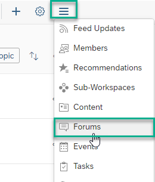
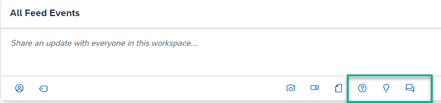

<!-- loioee3546a2e12749cebdbc66bef5dbf1d9 -->

# How to Create and Manage Forums

Create forums so that your workspace members can collablorate.

If the workspace administrator has enable creating forums in a workspace, members can ask questions, open discussions, and give ideas from a list of forums for a specific workspace.

<a name="loioee3546a2e12749cebdbc66bef5dbf1d9__section_knc_xpw_2lb"/>

## How to add a forum

To add a forum to a workpage in your workspace, do the following:

1.  Open the *Forums Topic* list for your workspace. You can get there by using one of the following options:

    -   If you have a *Forums* widget on your workpage, click *Engage with workspace members*.

    -   Click the hamburger icon on the right side of your workpage navigation bar.

        

    -   If you've added a *Forums* tab to the navigation bar of your workpage, click it to open the list.

2.  To create a new forum, choose *\+ New Forum Topic*.

3.  Enter a name for the forum, select the forum type and save your settings. Options are:

    -   *Questions Only*

    -   *Ideas Only*

    -   *Discussions Only*

    -   *Discussions, Ideas, and Questions*

4.  Your forum is created and appears in the *Forum Topics* list.

    Members of the workspace can now ask questions, add ideas, and create discussions in the forum you created.

> ### Note:  
> If you've added a *Forum* widget to your workpage, once you publish the workpage, members can click the widget and view the forum topics that are displayed in the widget. They can then click the forum topic and like it, comment on it, share it, and more.
> 
> For more information about the *Forum* widget, see [Forum Widget](forum-widget-617530d.md).

For more general information about forums, see [About Forums](about-forums-83e4c9a.md).

<a name="loioee3546a2e12749cebdbc66bef5dbf1d9__section_jsf_y4q_mdc"/>

## How to add questions, ideas, and discussions to your forum

To add a question, idea, or start a discussion in your forum, do the following:

1.  Open the*Forum Topics* list.

2.  Click the title of the forum you want to participate in.

3.  Click *\+ New Question*, *\+ New Idea*, or *\+ New Discussion*.

4.  The relative editor opens. Type in your question, idea, or discussion.

5.  *Publish* your forum topic otherwise no one will be able to see it.

    Once you've published your topic, it will appear in the list of *Forum Topics* for your workspace.

    > ### Note:  
    > If you added a *Forum* widget to your workpage, the forum topics are displayed on your workpage according to the settings applied when the widget was created \(for example if you chose to display only 3 items in the widget, 3 forum topics will appear in the widget for your workspace members to see.

    > ### Note:  
    > Questions, ideas, and discussions will also appear in the workspace feed. You can create questions, ideas, and discussions directly in the feed using the text box of the workspace feed.

