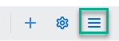

<!-- loioc3734dd8b29a4e8c93304ecb99bac6d6 -->

<link rel="stylesheet" type="text/css" href="css/sap-icons.css"/>

# How to Create Workpages in Your Workspace

A workpage is a regular page that is used in a workspace.

In general, you can design your workpages as you like by adding content such as widgets, cards, forums, wizards, and much more.

When you create a workspace, a default workpage called *Overview* may already be displayed as a tab in the workspace navigation bar depending on the layout you selected when creating the workspace. However you can create and design as many workpages as you want.

Here are the different ways to create a workpage:

<table>
<tr>
<th valign="top">

Where

</th>
<th valign="top">

How

</th>
</tr>
<tr>
<td valign="top">

From the navigation bar of a workspace

</td>
<td valign="top">

1.  Open your workspace.

2.  Click :heavy_plus_sign: in the workspace navigation bar.

    

3.  Select the *Workpage* tile.

4.  Enter a title that will appear in the workspace navigation bar. For example, you can call your workpage `Overview`.

5.  You can either select an existing workpage or create a new one as follows:

    -   Select *Existing Workpage* and choose a workpage from the list. Then click *Add*.

    -   Select *New Workpage* and choose the folder where you want to save it \(usually the *Content* folder\). Then click *Add*. Design your new workpage and publish it.

        The workpage is added to the navigation bar of the workspace as a tab and it's also added to the workspace *Content* list.

</td>
</tr>
<tr>
<td valign="top">

From the *Content* list.

</td>
<td valign="top">

1.  Click the  in your workspace.

    

2.  Select *Content* to open the *Content* list for your workspace.

3.  Click *\+ Create* and select *Workpage*.

4.  Give the workpage a title and publish it.

5.  Go back to your workspace *Content* list using the breadcrumbs at the top of the screen. You'll see that the workpage has been added to the list of content in your workspace.

</td>
</tr>
</table>

> ### Note:  
> Once you've created your workpage, a default thumbnail image is auto generated. A thumbnail image enables you to personalize your workpage so that others can quickly identify it. For more information about how to use thumbnails, see [How to Add Thumbnails to Your Content](how-to-add-thumbnails-to-your-content-0174ab7.md)

