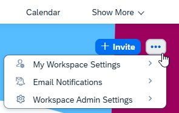

<!-- loio98ae51cfe96e467ebe3523e86c8350c5 -->

<link rel="stylesheet" type="text/css" href="css/sap-icons.css"/>

# How to Edit Workspace Settings

Workspace administrators can enable and configure a variety of settings that determine how workspace members can engage with their workspace.

You've created your workspace but there may be a number of settings that you didn't define when you created the workspace, or there are settings that you still want to add or change. You can do this by clicking on the  icon. This opens a list of settings that you can define for your workspace.

> ### Note:  
> The company administrator may have configured features that affect all the workspaces in the company - these settings will override any settings for a specific workspace.

To go to the workspace settings screen , click *Workspace Admin Settings*.

There are three tabs of settings that you as the workspace administrator can define for your workspace:

<a name="loio98ae51cfe96e467ebe3523e86c8350c5__section_ujq_z5d_rnb"/>

## General

The general settings mainly include basic attributes of the workspace such as name, description, and workspace type. You can edit the following settings:

<table>
<tr>
<th valign="top">

Setting

</th>
<th valign="top">

More Information

</th>
</tr>
<tr>
<td valign="top">

*Name*

</td>
<td valign="top">

Modify the workspace name by changing the text and then checking to see if it's unique by clicking *Check Workspace Name*.

</td>
</tr>
<tr>
<td valign="top">

*Description*

</td>
<td valign="top">

Enter a brief but meaningful description that will help to recognize the purpose of your workspace.

</td>
</tr>
<tr>
<td valign="top">

*Workspace Type*

</td>
<td valign="top">

-   *Private* - workspaces that only users who are invited to the workspace can join and collaborate in.

-   *Public* - workspaces that all users can view, join, and collaborate in.

</td>
</tr>
<tr>
<td valign="top">

*Document Grounding*

</td>
<td valign="top">

> ### Note:  
> This setting is visible only to users who have the company admin role.

Enable this workspace as an AI source for document grounding. Please note the following:

> ### Note:  
> -   If the workspace has a \`Terms of Use\` defined, it can't be enabled as a source for document grounding.
> 
> -   For public workspaces, if the access policy is set to 'All Internal Users' or \`All Users', then this workspace can't be enabled as an AI source.

</td>
</tr>
<tr>
<td valign="top">

*External Users*

</td>
<td valign="top">

If the administrator has enabled the global setting for enabling external users to be invited to workspaces, then you can select whether you want external users to access your workspace and be invited as members.

</td>
</tr>
<tr>
<td valign="top">

*Invite Policy*

</td>
<td valign="top">

Allow all members to invite users.

-   When selected, all workspace members are allowed to invite new members.

-   When not selected, only the workspace administrators are allowed to invite new members.

</td>
</tr>
<tr>
<td valign="top">

*Silent Invites*

</td>
<td valign="top">

If enabled, you can invite user lists to your workspace without triggering a notification to the individual users. The invited users will be automatically assigned to the the workspace as members.

</td>
</tr>
<tr>
<td valign="top">

*Join Policy*

</td>
<td valign="top">

-   For **public** workspaces: *Allow users to join this workspace*.

    -   When selected, non-members can use the *Join* button in the workspace to become a member.
    -   When not selected, non-members don't see a *Join* button on the workspace and they also don't see the workspace in the search results when searching for all workspaces.

-   For **private** workspaces: *Allow users to request to join this workspace*.

    -   When selected, you can send a link to non-members and allow them to request to join the workspace.
    -   When not selected, any non-member who tries to access the workspace will get an Access Denied error.

</td>
</tr>
<tr>
<td valign="top">

*Privilege Policy*

</td>
<td valign="top">

Allow workspace members to request admin privileges.

</td>
</tr>
<tr>
<td valign="top">

*Email Notifications*

</td>
<td valign="top">

Choose the default notification frequency for the workspace \(*Immediate*, *Daily*, *Weekly*, or *None*\). If you change the notification at a later time, workspace members will receive a bell notification regarding the change. Members can accept or reject the change.

</td>
</tr>
<tr>
<td valign="top">

*Compact Page Layout*

</td>
<td valign="top">

Select to display a compact version of your workspace.

This option allows users to focus on the actual workspace content.

</td>
</tr>
</table>

<a name="loio98ae51cfe96e467ebe3523e86c8350c5__section_wh4_ls2_rnb"/>

## Setup

From this tab you can configure the functional appearance of the workspace \(for example, calendar, workspace avatar, which features are enabled, settings for trash, landing page, and if applicable, selection for the administrative area that the workspace belongs to.

<table>
<tr>
<th valign="top">

Setting

</th>
<th valign="top">

More Information

</th>
</tr>
<tr>
<td valign="top">

*Terms Of Use*

</td>
<td valign="top">

Create a custom Terms of Use that must be accepted by the member before they’re granted access to the workspace. When you change the terms, members must re-accept the terms before they can continue to access the workspace.

For more information about terms of use, see [How to Create a Terms of Use](how-to-create-a-terms-of-use-b02df19.md).

</td>
</tr>
<tr>
<td valign="top">

*Announcement*

</td>
<td valign="top">

Create a welcome message or user agreement for all workspace members to see on their first visit to the workspace.

</td>
</tr>
<tr>
<td valign="top">

*Current Avatar*

</td>
<td valign="top">

Choose an image to replace your workspace avatar.

</td>
</tr>
<tr>
<td valign="top">

*Default Calendar View*

</td>
<td valign="top">

Define preferable view for your calendar.

</td>
</tr>
<tr>
<td valign="top">

*Customize what is available in this workspace*

</td>
<td valign="top">

You can enable which features to display in your workspace.

For example, if you enable the *Recommendations Section*, users will have the option to add a *Recommendations* tab to the workspace navigation bar that directly opens the *Recommendations* feature.

</td>
</tr>
<tr>
<td valign="top">

*Trash*

</td>
<td valign="top">

You can determine that items are deleted from the trash after a specified number of days.

</td>
</tr>
<tr>
<td valign="top">

*Administrative Area*

</td>
<td valign="top">

Select the administrative area that your workspace represents.

</td>
</tr>
</table>

<a name="loio98ae51cfe96e467ebe3523e86c8350c5__section_pdx_ms2_rnb"/>

## Participation

From this tab you can configure the degree to which workspace members and non-members can engage with and contribute to a specific workspace:

<table>
<tr>
<th valign="top">

Type

</th>
<th valign="top">

Setting

</th>
<th valign="top">

More Information

</th>
</tr>
<tr>
<td valign="top" rowspan="6">

**Member Settings**

</td>
<td valign="top">

*Collaboration Level*

</td>
<td valign="top">

Collaboration levels affect the visibility of a workspace and determine how members and non-members can collaborate and view the content.

You can define the collaboration levels for members of a workspace as follows:

-   *Read-only*: Members can only view and download content. Collaboration tools such as Polls, Forums, and Tasks are not enabled.

-   *Limited*: Members can collaborate and comment on existing content. They can handle tasks but not create ones.

-   *Full*: Members can create, collaborate, and comment on all existing content and they can create and handle tasks.

</td>
</tr>
<tr>
<td valign="top">

*Task Policy*

</td>
<td valign="top">

-   Tasks are editable by creators and workspace admins. Status can be updated by task assignee.

-   Tasks are editable by assignees, creators, and workspace admins. Status can be updated by all members.

-   Task details and status can be updated by all members.

</td>
</tr>
<tr>
<td valign="top">

*Notification Policy*

</td>
<td valign="top">

Allow members to trigger notifications by typing in @@ in comments, feeds, and forum posts.

</td>
</tr>
<tr>
<td valign="top">

*Content Rating*

</td>
<td valign="top">

Allow members to rate workspace content.

</td>
</tr>
<tr>
<td valign="top">

*Upload Policy*

</td>
<td valign="top">

All members can upload content. If not selected, then only workspace admins can upload content

</td>
</tr>
<tr>
<td valign="top">

*Content Approval*

</td>
<td valign="top">

When workspace members upload documents, photos, videos, wikis, or blogs, the workspace administrator must first review and approve this content before it’s visible in the workspace. This provides content publishing safeguards to ensure that content is appropriate for the business context within a workspace. For more information, see [Approve Content](approve-content-5d4b062.md).

You can either set the approval policy as not required, or you can apply the approval policy to all content in the workspace. You can also apply a specific approval policy for each content item.

</td>
</tr>
<tr>
<td valign="top" rowspan="2">

**Non-Member Settings**

This group of settings is relevant only to public workspaces.

</td>
<td valign="top">

*Collaboration Level*

</td>
<td valign="top">

Collaboration levels affect the visibility of a workspace and determine how members and non-members can collaborate and view the content.

A non-member can be an internal or an external user who can view the workspace according to the following collaboration levels that you set for them. Options are:

-   *Same as members*: this is the default and non-members will inherit the same collaboration level as the members of the workspace.

-   *None*: collaboration tools \(such as Forums\), and member details \(such as who created the content\) are hidden.

</td>
</tr>
<tr>
<td valign="top">

*Access Policy*

</td>
<td valign="top">

The access policy determines who can access the workspace as a non-member. The options available for you are:

-   *Specific users or user lists*: you can limit the access to your workspace to specific users or user lists. Note that the users and user lists should already exist in the system \(added by the administrator\) when you add them. For more information, see [Users](users-3173953.md).

-   *Specific roles*: the list of roles available for selection is limited to the roles that are assigned to the workspace admin. Company administrators can assign all roles.

-   *All internal users*: this is the default option. When selected, all internal users can access the workspace.
-   *All users*
-   *All external users*: workspace admins will see this option only if the Company Admin enabled the following settings in the *Features* screen of the Admin Console:
    -   External users access to workspaces.
    -   Allow workspace admins to enable non-member access to 'All external users' and 'All users'.

-   *All users*: workspace admins will see this option only when the company admin enabled the following settings in the *Features* screen of the Admin Console:
    -   External users access to workspaces.
    -   Allow workspace admins to enable non-member access to 'All external users' and 'All users'.

</td>
</tr>
</table>

Click *Save* in the top right corner of the screen when you're done.

