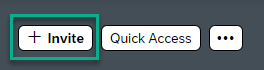

<!-- loiod9af89c237714288a4d8aa31b0a0cf9f -->

<link rel="stylesheet" type="text/css" href="css/sap-icons.css"/>

# How to Invite and Manage Members

Once you’ve created a workspace, you can invite users to join. Users who join a workspace become members of the workspace.

<a name="loiod9af89c237714288a4d8aa31b0a0cf9f__section_utp_mpc_5xb"/>

## How to invite members

When you create a workspace, you have the option to set an invite policy as follows:

-   Only Workspace Admins

-   All Workspace Members

In both cases, you \(or other members\) can invite users to be members of your workspace as follows:

<table>
<tr>
<th valign="top">

Area

</th>
<th valign="top">

Description

</th>
</tr>
<tr>
<td valign="top">

From the header of your workspace

</td>
<td valign="top">

1.  Click *\+ Invite* in the header of your workspace.

    

2.  Under the *Send Invites* tab, enter a name or email address of individual users.

3.  Click *Send*.

    Users are added to your workspace with the status of *Pending* until they accept.

4.  To invite an existing user list, under the *User List* tab, enter the name of the user list. To see the individual names in the user list, simply double click on the list.

5.  *Save* the user list.

</td>
</tr>
<tr>
<td valign="top">

On the *Invite Members to Workspace* screen on the far right.

</td>
<td valign="top">

Click the *\+ Import CSV* button to upload the users to add to the invitation.

</td>
</tr>
</table>

<a name="loiod9af89c237714288a4d8aa31b0a0cf9f__section_v1f_5qc_5xb"/>

## Manage the members in your workspace

You can manage the members of a workspace from the *Members* screen. To open the *Members* screen of a workspace, click the number of members displayed in the workspace header.

Next to each member, click the  to open the actions menu.

From here you can do the following:

You can view the members of your workspace as follows:

<table>
<tr>
<th valign="top">

Action

</th>
<th valign="top">

More information

</th>
</tr>
<tr>
<td valign="top">

Add a *Members* menu item to the workspace.

</td>
<td valign="top">

1.  Click :heavy_plus_sign: in the workspace menu.

2.  Click the *Members* tile and add it to your workspace menu.

3.  Click on the *Members* menu item to see the list of members in your workspace.

</td>
</tr>
<tr>
<td valign="top">

Click *Members* under the workspace name.

</td>
<td valign="top">

Under the workspace name, click the direct link to the members list of your workspace. It also displays the number of members in the workspace.

</td>
</tr>
</table>

Manage members by clicking the … icon on the right to open the actions menu. From here, you can do the following:

-   Make a workspace member an administrator of the workspace.

-   Remove a member from the workspace.

-   Send a reminder about an invite that they haven’t accepted, or cancel the invite.

-   Feature a member to give them higher visibility \(for example, if you want to have a specific member be the contact person of the workspace\).

-   Make a member the default task assignee - in this case members are assigned by default to each task that is created in the workspace and can coordinate them.

