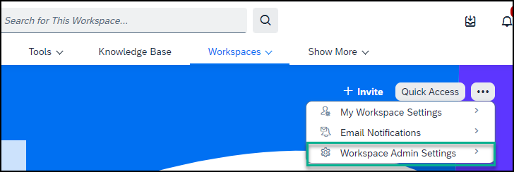

<!-- loiob861107c58d14670a0a6971932c85ad1 -->

<link rel="stylesheet" type="text/css" href="css/sap-icons.css"/>

# How to Manage Workspaces

Workspace administrators have special permissions to configure features and settings in the workspace, they can manage the content, and they can monitor the activities in the workspace.

Anyone who creates a workspace is automatically assigned as an administrator of that workspace. You can also be assigned as an administrator of a workspace that you're a member of.

> ### Note:  
> External users can’t become workspace administrators.

<a name="loiob861107c58d14670a0a6971932c85ad1__section_wsh_mwb_5xb"/>

## How to access administration settings

In your workspace, click the  menu and choose *Workspace Admin Settings*.

<a name="loiob861107c58d14670a0a6971932c85ad1__section_gyt_zyb_5xb"/>

## How can I manage a workspace?

You can manage, monitor, and set up a workspace as follows:

<table>
<tr>
<th valign="top">

Action

</th>
<th valign="top">

Description

</th>
</tr>
<tr>
<td valign="top">

*Edit Workspace*

</td>
<td valign="top">

You can enable and configure a variety of settings for the workspace.

For more information, see [Edit Workspace Settings](edit-workspace-settings-98ae51c.md).

</td>
</tr>
<tr>
<td valign="top">

*Delete Workspace*

</td>
<td valign="top">

When you delete a workspace, you also delete the sub-workspaces of the workspace.

You can find deleted workspaces in your trash, where you can restore or delete them completely from your site.

</td>
</tr>
<tr>
<td valign="top">

*Copy Workspace*

</td>
<td valign="top">

When you copy a workspace, you also copy all content items and sub-workspaces. Once you copy a workspace, you'll automatically become the sole member and workspace administrator for the copied workspace.

To copy a workspace, do the following:

1.  Go to the workspace you want to copy, and click  and choose *Workspace Admin Settings*.

2.  Click *Copy Workspace*.

3.  Enter a new workspace name to differentiate it from the original.

4.  > ### Note:  
    > -   Forums, feed activity, events, tasks, reports, trash items, mirrored content items, content item metadata \(for example, content ratings, number of likes, and views\) and dashboard activity metrics aren’t copied to the new workspace as they’re applicable in context only to the original workspace.
    > 
    > -   Workspace members and any other workspace administrators from the original workspace aren’t automatically invited to the new workspace.
    > 
    > -   When a workspace is cloned, knowledge base articles are also copied as part of the overall workspace content to the new workspace.

</td>
</tr>
<tr>
<td valign="top">

*Move Workspace*

</td>
<td valign="top">

If you move a workspace to another workspace, the workspace becomes a sub-workspace of the workspace to which you’ve moved it.

You can move workspaces as follows:

-   Main workspaces can be moved to sub-workspaces

-   Sub-workspaces can be moved from one main workspace to another main workspace

-   Sub-workspaces can become their own main workspace

> ### Note:  
> You can move a main workspace to a sub-workspace, provided that:
> 
> -   The main workspace doesn’t have existing sub-workspaces
> 
> -   Sub-workspaces that were deleted, haven't yet been removed from the trash

</td>
</tr>
<tr>
<td valign="top">

*Extract Zip To Content*

</td>
<td valign="top">

You can upload a zip file containing documents to a folder in your workspace.

1.  Browse your local machine for the zip file you want to upload and extract.

2.  Click **Open** and choose the folder that you want to upload the content to.

3.  Set the permissions on the file, and then click *Import*.

For more information, see How to Work With Folders

</td>
</tr>
<tr>
<td valign="top">

*Save as workspace template*

</td>
<td valign="top">

You can create a workspace template that has the same structure as the workspace.

> ### Note:  
> Before the template can be used to create a new workspace, it has to be enabled by a company administrator or area administrator in the *Administration Console*.

</td>
</tr>
</table>

<a name="loiob861107c58d14670a0a6971932c85ad1__section_oy2_sl3_5xb"/>

## Pin workspaces to favorites

<table>
<tr>
<th valign="top">

Action

</th>
<th valign="top">

Description

</th>
</tr>
<tr>
<td valign="top">

Pin workspaces to favorites

</td>
<td valign="top">

You can add your workspaces to your favorites and then in the *All Workspaces* screen, you can use the filter to see only your favorite workspaces.

1.  In the top menu bar, open the *Workspaces* menu and choose *View all Workspaces* \> *My Workspaces*.

2.  Click  next to the workspace name.
3.  From the dropdown list of actions, select *Add to favorites*.

> ### Note:  
> You can save up to 48 of workspaces as favorites and access them directly from the *Favorites* entry in the dropdown list of the *Workspaces* menu.

When you're in a workspace, you can also pin or unpin a workspace by selecting the :star: next to the workspace title.

</td>
</tr>
<tr>
<td valign="top">

Enable features

</td>
<td valign="top">

When you create a workspace, all features are enabled by default. You can later change the settings.

For more information, see [Enable Features](enable-features-f069bc6.md)

</td>
</tr>
<tr>
<td valign="top">

Run workspace reports

</td>
<td valign="top">

To display information about the contributions and activities of workspace members, you can run various reports on your workspace.

For more information, see [Run Workspace Reports](run-workspace-reports-9ffe9b5.md)

</td>
</tr>
</table>

