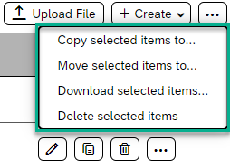
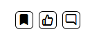

<!-- loioe526beca6d1e4b3f965f57ba70bcd567 -->

<link rel="stylesheet" type="text/css" href="css/sap-icons.css"/>

# How to Manage Your Content

When working with content, you can perform a variety of actions that help you maintain content items and keep them organized as the volume increases.

<a name="loioe526beca6d1e4b3f965f57ba70bcd567__section_y1n_ym3_5xb"/>

## Where do I manage my content?

Generally, you manage your content items from the *Content* list, which is a type of repository containing all the content that your members have created for a particular workspace. Examples of this content can be blog posts, wikis, decision making tools \(such as polls comparison table\), links, planning tools \(such as an agenda, a task, or a timeline\), multimedia options, documents, and folders\).

<a name="loioe526beca6d1e4b3f965f57ba70bcd567__section_yc1_dn3_5xb"/>

## How to access your content

You can get to your Content list as follows:

-   By adding a *Content* widget to your workpage.

-   By adding a *Content* menu item to the navigation bar of the workspace.

-   By clicking  in your workspace and selecting *Content*.

> ### Note:  
> On the *Content* page of a workspace or in a folder, you can copy, move, download, or delete a single content item or several content items at once.
> 
> -   To manage a single content item, go to the list view and click  next to each content item row and use the different options.
> 
>     > ### Note:  
>     > The type of actions you can perform vary according to the content type.
> 
> -   To manage multiple content items simultaneously, go to the top menu bar, click  , and use one of the options in the dropdown list:
> 
>     

<a name="loioe526beca6d1e4b3f965f57ba70bcd567__section_f5l_443_5xb"/>

## How to manage your content

Here are some of the ways you can manage your content:

<table>
<tr>
<th valign="top">

Action

</th>
<th valign="top">

Description

</th>
</tr>
<tr>
<td valign="top">

Copy content

</td>
<td valign="top">

If you have content that needs to be copied to another folder or workspace, you can copy individual or several files and documents at once.

You can copy content items to any of the following destinations:

-   Another folder in the same workspace

-   Another workspace

-   A company home page

> ### Note:  
> You must have access to the destination workspace and the folder.

</td>
</tr>
<tr>
<td valign="top">

Move content

</td>
<td valign="top">

When you add content, it’s probably added to a top-level folder, and you may need to move it to another location to find it faster.

You can move content items from one workspace content folder to any of the following destinations:

-   Another folder in the same workspace

-   Another workspace

-   A company home page

> ### Note:  
> -   You must have access to the destination workspace and the folder.
> 
> -   If you move content items from private folders to public folders, all workspace members can view the content.
> 
> -   If you're moving a content item such as a wiki or blog that contains an unpublished draft, that draft is discarded when you move it.

</td>
</tr>
<tr>
<td valign="top">

Mirror content

</td>
<td valign="top">

Instead of creating several copies of a content item, you can choose to mirror the same content item to other places within a single workspace or in many workspaces.

By mirroring a content item, you make sure that all workspaces have access to the same copy of a given content item rather than a copy that may be out of date. Once a content item is mirrored to other workspaces, their workspace members have read-only access to the mirrored copy.

> ### Note:  
> -   A mirrored content item can only be changed in the original folder and workspace. When the source content item is updated, a feed item in the destination workspace notifies members that an updated version of the mirrored document has been posted.
> 
> -   To mirror a content item from one workspace to another, you must be a member of both workspaces.

</td>
</tr>
<tr>
<td valign="top">

Download content

</td>
<td valign="top">

Select one or more content items to download in a single zip file.

</td>
</tr>
<tr>
<td valign="top">

Feature content

</td>
<td valign="top">

If you need to draw attention to a specific content item, you can specify it as a "featured item" in the *Content* list. The item will then be highlighted within the *Content*widget on a workpage when the type of content to display is set to "Featured".

</td>
</tr>
<tr>
<td valign="top">

Delete content

</td>
<td valign="top">

When you delete content, the content is removed from the *Content* list and placed in the *Trash*.

To permanently delete the content, navigate to the *Trash* screen, select the item, and purge it. Until an item is purged, you can always restore it from the *Trash*.

</td>
</tr>
<tr>
<td valign="top">

Bookmark, Like, or Comment

</td>
<td valign="top">

You can bookmark individual content items to make it easier to access them. You can also like a content item or make a comment about it.

Open the content item and click the relative icon:

> ### Note:  
> In your site menu, open *Tools* and select *Bookmarks* to view all the content that you've bookmarked.

</td>
</tr>
<tr>
<td valign="top">

Tag content

</td>
<td valign="top">

To make information more accessible and searchable, you can categorize it by using tags. Tags are keywords that you can add to content items, feed items, tasks, and knowledge base articles. Tags can be used as search terms in the search tool.

> ### Note:  
> When tagging an item, enter the term without a hashtag symbol \(\#\). For example, if you want to use the keyword “policy” to describe your content, you would type `'policy'`.

Open your content item and click *Add a new tag*.

Next to the hashtag that appears, enter your tag, and click the tick next to it.

The tag can appear in a *Tag Cloud* widget or in a list of tags associated with the content item. When a user searches for that tag, the content item appears in the search results.

</td>
</tr>
<tr>
<td valign="top">

Rate content

</td>
<td valign="top">

You can assign a starred rating to indicate the overall value or perceived usefulness of a content item.

Open the *Content* list in your workspace. When the content item is in view, a content rating area with five stars is visible on the right side of the screen.

> ### Note:  
> If you’ve rated the content before, your previous rating is replaced with your new selection. This ensures that while members can change their rating selection, their input will only be counted once in order to provide a fair and accurate rating average.

</td>
</tr>
</table>

