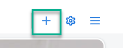
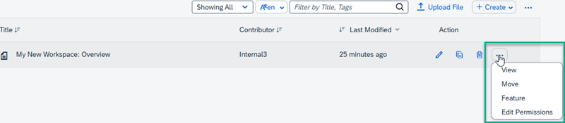
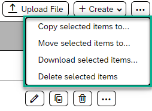
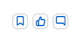
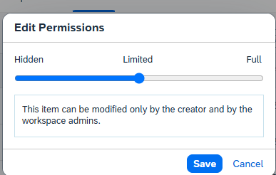

<!-- loioe526beca6d1e4b3f965f57ba70bcd567 -->

<link rel="stylesheet" type="text/css" href="css/sap-icons.css"/>

# How to Manage Your Content in the Content List

Learn how to manage your content in the content repository of your workspace.

<a name="loioe526beca6d1e4b3f965f57ba70bcd567__section_y1n_ym3_5xb"/>

## Where do I manage my content?

Generally, you manage your workspace content from the *Content* list, which is a type of repository containing all the content that you and members of your workspace have created. Examples of this content can be workpages, blog posts, wikis, decision making tools \(such as polls comparison table\), links, planning tools \(such as an agenda, a task, or a timeline\), multimedia options, documents, folders and more.

<a name="loioe526beca6d1e4b3f965f57ba70bcd567__section_yc1_dn3_5xb"/>

## How to access your Content list

You can access your *Content* list in one of the following ways:

<table>
<tr>
<th valign="top">

Where

</th>
<th valign="top">

How to access the content list

</th>
</tr>
<tr>
<td valign="top">

From the workspace navigation bar

</td>
<td valign="top">

1.  Click the :heavy_plus_sign: on the right side of the workspace navigation bar:

    

2.  Select the *Content* tile to open your *Content* list.

</td>
</tr>
<tr>
<td valign="top">

From the content finder

</td>
<td valign="top">

1.  From your workpage, click :pencil2: to open the workpage editor.

2.  Select the *Content* widget.

3.  Make the changes in the dialog box - these settings will determine how your *Content* list will be displayed in the workpage.

4.  Save your changes.

</td>
</tr>
<tr>
<td valign="top">

From the workspace navigator

</td>
<td valign="top">

Click  in your workspace and select *Content*.

</td>
</tr>
</table>

<a name="loioe526beca6d1e4b3f965f57ba70bcd567__section_f5l_443_5xb"/>

## How to manage your content

In the *Content* list of a workspace, there are a number of actions you can do on specific content items. From the*Actions* column you can use one of the icons to edit, copy, or delete a single content item.

You can also right click  in the menu bar. Next to each content item row, select from the list of different options.

For example, if you select a workpage content item, your options are displayed in the following pop up menu:

> ### Note:  
> The type of actions you can perform vary depending on the content item.

To manage multiple content items simultaneously, go to the top menu bar, and click and select from the list of the following options:

-   

<a name="loioe526beca6d1e4b3f965f57ba70bcd567__section_zpd_n33_tfc"/>

## More details of how to do the various actions in the Content list

<table>
<tr>
<th valign="top">

Action

</th>
<th valign="top">

More information

</th>
</tr>
<tr>
<td valign="top">

Edit

</td>
<td valign="top">

Click the :pencil2: icon in the content item row to open a dialog box that enables you to change the name of the content item.

</td>
</tr>
<tr>
<td valign="top">

Copy content

</td>
<td valign="top">

Click the  icon to copy your content to a different place.

If you have content that needs to be copied to another folder or workspace, you can copy individual or several files and documents at once.

You can copy content items to any of the following destinations:

-   Another folder in the same workspace

-   Another workspace

-   A company home page

> ### Note:  
> You must have access to the destination workspace and the folder.

</td>
</tr>
<tr>
<td valign="top">

Delete a content item

</td>
<td valign="top">

Click the :wastebasket:icon to delete a content item.

When you delete content, the content is removed from the *Content* list and placed in the *Trash*.

To permanently delete the content, navigate to the *Trash* screen, select the item, and purge it. Until an item is purged, you can always restore it from the *Trash*.

> ### Remember:  
> If your workpage is referenced from the workspace navigation bar or from the site menu, you first need to remove it from the menu or navigation bar before you can delete it.

</td>
</tr>
<tr>
<td valign="top">

View content

</td>
<td valign="top">

From the overflow icon at the end of the row, select *View* to open the content item in a dedicated screen. From here you can use the following icons to do the following:

-   *Bookmark* the content item. In your site menu, open *Tools* and select *Bookmarks* to view all the content that you've bookmarked.

-   *Like* the content item.

-   *Comment* on the content item. The creator of the content can then choose to show only the comments or show all activity on the page.

In addition, in the content item view, you can also:

-   *Rate* content

    You can assign a starred rating to indicate the overall value or perceived usefulness of a content item.

    Open the *Content* list in your workspace. When the content item is in view, a content rating area with five stars is visible on the right side of the screen.

    > ### Note:  
    > If you’ve rated the content before, your previous rating is replaced with your new selection. This ensures that while members can change their rating selection, their input will only be counted once in order to provide a fair and accurate rating average.

-   *Tag* content

    To make information more accessible and searchable, you can categorize it by using tags. Tags are keywords that you can add to content items, feed items, tasks, and knowledge base articles. Tags can be used as search terms in the search tool.

    > ### Note:  
    > When tagging an item, enter the term without a hashtag symbol \(\#\). For example, if you want to use the keyword “policy” to describe your content, you would type `'policy'`.

    Open your content item and click *Add a new tag*.

    Next to the hashtag that appears, enter your tag, and click the tick next to it.

    The tag can appear in a *Tag Cloud* widget or in a list of tags associated with the content item. When a user searches for that tag, the content item appears in the search results.

</td>
</tr>
<tr>
<td valign="top">

Move content

</td>
<td valign="top">

When you add content, it’s probably added to a top-level folder, and you may need to move it to another location to find it faster.

You can move content items from one workspace content folder to any of the following destinations:

-   Another folder in the same workspace

-   Another workspace

-   A company home page

> ### Note:  
> -   You must have access to the destination workspace and the folder.
> 
> -   If you move content items from private folders to public folders, all workspace members can view the content.
> 
> -   If you're moving a content item such as a wiki or blog that contains an unpublished draft, that draft is discarded when you move it.

> ### Remember:  
> If your workpage is referenced from the workspace navigation bar or from the site menu, you first need to remove it from the menu or navigation bar before you can move it.

</td>
</tr>
<tr>
<td valign="top">

Mirror content

</td>
<td valign="top">

Instead of creating several copies of a content item, you can choose to mirror the same content item to other places within a single workspace or in many workspaces.

By mirroring a content item, you make sure that all workspaces have access to the same copy of a given content item rather than a copy that may be out of date. Once a content item is mirrored to other workspaces, their workspace members have read-only access to the mirrored copy.

> ### Note:  
> A mirrored content item can only be changed in the original folder and workspace. When the source content item is updated, a feed item in the destination workspace notifies members that an updated version of the mirrored document has been posted.

> ### Note:  
> To mirror a content item from one workspace to another, you must be a member of both workspaces.

</td>
</tr>
<tr>
<td valign="top">

Feature a content item

</td>
<td valign="top">

If you need to draw attention to a specific content item, you can mark it as a featured item. The item will then be highlighted within the *Content* widget on a workpage when the type of content to display is set to *Featured*.

</td>
</tr>
<tr>
<td valign="top">

Edit Permissions

</td>
<td valign="top">

This action opens a pop up box that gives you various levels of permissions that you can apply to your workpages, wikis, and other content to determine who can view or modify the content.

</td>
</tr>
</table>

