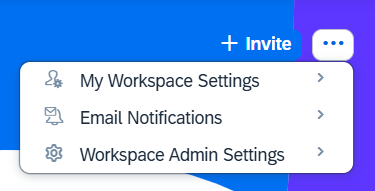
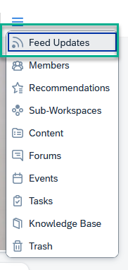
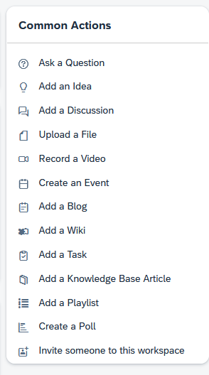
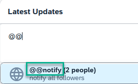
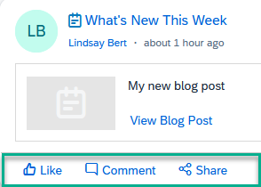
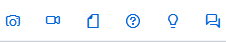
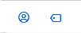
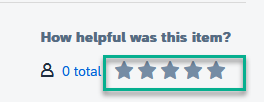

<!-- loiob861107c58d14670a0a6971932c85ad1 -->

<link rel="stylesheet" type="text/css" href="css/sap-icons.css"/>

# How to Optimally Set Up and Use a Workspace

Learn how to optimally use the available settings and features in your workspace.

<a name="loiob861107c58d14670a0a6971932c85ad1__section_wsh_mwb_5xb"/>

## Settings

In your workspace header on the far right of the screen, click the  to open a dropdown list of settings:

Here you can access the following settings:

-   *My Workspace*

    These settings are available for all members of the workspace. They can choose to:

    -   Check the access information of the workspace.

    -   Start or stop following a workspace.

        Users can start following a workspace. If they no longer want to receive updates from the workspace to their feed, they can unfollow.

    -   Leave or join a workspace.

    -   Request admin privileges for the workspace.

-   *Email Notifications*

    Set up how often you want to receive email notifications.

-   *Workspace Admin Settings*

    As a workspace admin you can enable and set up your workspace as follows:

    <table>
    <tr>
    <th valign="top">

    Action
    
    </th>
    <th valign="top">

    Description
    
    </th>
    </tr>
    <tr>
    <td valign="top">
    
    *Edit Workspace*
    
    </td>
    <td valign="top">
    
    This opens up a multiple tab list of settings that will help you enable or disable a variety of settings for the workspace.

    For more detailed information about these settings, see [How to Edit Workspace Settings](how-to-edit-workspace-settings-98ae51c.md).
    
    </td>
    </tr>
    <tr>
    <td valign="top">
    
    *Delete Workspace*
    
    </td>
    <td valign="top">
    
    When you delete a workspace, you also delete the sub-workspaces of the workspace.

    You can find deleted workspaces in your trash, where you can restore or delete them completely from your site.
    
    </td>
    </tr>
    <tr>
    <td valign="top">
    
    *Copy Workspace*
    
    </td>
    <td valign="top">
    
    When you copy a workspace, you also copy all content items and sub-workspaces. Once you copy a workspace, you'll automatically become the sole member and workspace administrator for the copied workspace.

    To copy a workspace, do the following:

    1.  Go to the workspace you want to copy, and click  and choose *Workspace Admin Settings*.

    2.  Click *Copy Workspace*.

    3.  Enter a new workspace name to differentiate it from the original.

    > ### Note:  
    > -   Forums, feed activity, events, tasks, reports, trash items, mirrored content items, content item metadata \(for example, content ratings, number of likes, and views\), and dashboard activity metrics aren’t copied to the new workspace as they’re applicable in context only to the original workspace.
    > 
    > -   Workspace members and any other workspace administrators from the original workspace aren’t automatically invited to the new workspace.
    > 
    > -   When a workspace is copied, knowledge base articles are also copied as part of the overall workspace content to the new workspace.

    
    </td>
    </tr>
    <tr>
    <td valign="top">
    
    *Move Workspace*
    
    </td>
    <td valign="top">
    
    You can move a workspace to another workspace. The workspace becomes a sub-workspace of the workspace to which you’ve moved it.

    You can move workspaces as follows:

    -   Main workspaces can be moved to sub-workspaces provided that:

        -   The main workspace doesn’t have existing sub-workspaces

        -   Sub-workspaces that were deleted, haven't yet been removed from the trash

    -   Sub-workspaces can be moved from one main workspace to another main workspace

    -   Sub-workspaces can become their own main workspace

    
    </td>
    </tr>
    <tr>
    <td valign="top">
    
    *Export Workspace*
    
    </td>
    <td valign="top">
    
    You can export a workspace from a source system and import the exported file into the target system.

    For more information about exporting a workspace, see the following topics:

    -   [Transporting Workspace Content Items](transporting-workspace-content-items-0a5c641.md).
    -   [Exporting Workspaces](exporting-workspaces-1176af7.md).

    
    </td>
    </tr>
    <tr>
    <td valign="top">
    
    *Extract Zip To Content*
    
    </td>
    <td valign="top">
    
    You can upload a ZIP file containing documents to a folder in your workspace.

    1.  Browse your local machine for the ZIP file you want to upload and extract.

    2.  Click *Open* and choose the folder that you want to upload the content to.

    3.  Set the permissions on the file, and then click *Import*.

    For more information, see [How to Work With Workspace Folders](how-to-work-with-workspace-folders-b589340.md).
    
    </td>
    </tr>
    <tr>
    <td valign="top">
    
    *Save as workspace template*
    
    </td>
    <td valign="top">
    
    You can create a workspace template that has the same structure as the workspace.

    > ### Note:  
    > Before the template can be used to create a new workspace, it has to be enabled by a company administrator or area administrator in the *Administration Console*.

    
    </td>
    </tr>
    </table>
    

<a name="loiob861107c58d14670a0a6971932c85ad1__section_oy2_sl3_5xb"/>

## Features

<table>
<tr>
<th valign="top">

Action

</th>
<th valign="top">

Description

</th>
</tr>
<tr>
<td valign="top">

Pin workspaces to favorites

</td>
<td valign="top">

You can add your workspaces to your favorites and then in the *All Workspaces* screen, you can use the filter to see only your favorite workspaces.

1.  In the top menu bar, open the *Workspaces* menu and choose *View all Workspaces* \> *My Workspaces*.

2.  Click  next to the workspace name.
3.  From the dropdown list of actions, select *Add to favorites*.

> ### Note:  
> You can save up to 48 workspaces as favorites and access them directly from the *Favorites* entry in the dropdown list of the *Workspaces* menu.

When you're in a workspace, you can also pin or unpin a workspace as a favorite by selecting the :star: next to the workspace title.

</td>
</tr>
<tr>
<td valign="top">

Navigate easily within the workspace

</td>
<td valign="top">

Use the  \(workspace navigator\), to easily navigate to the different content areas of your workspace.

For example navigate to the *Members* page that will open the list of members of the workspace, or the *Content* page that will open a list of the content created for this workspace.

</td>
</tr>
<tr>
<td valign="top">

Manage your feed updates

</td>
<td valign="top">

Navigate to *Feed Updates* using the workspace navigator.

From here you can:

-   Select *Common Actions* to open a list of useful actions that you can do in your workspace. These actions are added to your feed.

    

-   Notify your colleagues about a change \(if the *@@Notify* feature is enabled\).

    

-   Like content, comment on the content in the feed, and share any updates that you've made.

    

-   Share an update with everyone in the workspace by mentioning someone or sharing an image, video, document or asking a question, give an idea, or start a discussion.

    

-   Add a tag by inserting a hashtag to the feed to make information more searchable.

    

</td>
</tr>
<tr>
<td valign="top">

Rate content

</td>
<td valign="top">

From your Content list, open the content you want to rate. You'll see the 5-star rating option:

</td>
</tr>
<tr>
<td valign="top">

Run workspace reports

</td>
<td valign="top">

To display information about the contributions and activities of workspace members, you can run various reports on your workspace.

For more information, see [How to Run Workspace Reports](how-to-run-workspace-reports-9ffe9b5.md).

</td>
</tr>
</table>

