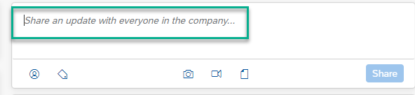

<!-- loioa80f406cafec428cb09f53e883559ef5 -->

<link rel="stylesheet" type="text/css" href="css/sap-icons.css"/>

# How to Set Up Your User Profile

Your profile contains information about you that you want to share with your colleagues and it helps your colleagues identify you.

If you are new to a company and want to learn who's who, you can click a profile to learn names, job titles, and contact details.

Once your user profile is set up, you can edit your profile information.

> ### Note:  
> Some of the following fields may not be available or could be set as read-only by your company administrator.

<a name="loioa80f406cafec428cb09f53e883559ef5__section_xcr_jdg_nkb"/>

## Your Profile

To access your user profile:

1.  From the top menu bar, in the top-right corner, click your avatar to open the User Actions menu.

2.  From the dropdown menu, select *User Profile*.

### Edit Your Profile

> ### Note:  
> Company administrators customize which information is displayed and in which order, for all user profiles.

From your profile page, in the *Overview* section, you can edit the following information:

****

<table>
<tr>
<th valign="top">

Information

</th>
<th valign="top">

What you can do

</th>
</tr>
<tr>
<td valign="top">

*Away Alerts*

</td>
<td valign="top">

Create an away alert.

1.  Click *Away Alerts*.

2.  Choose *Create Away Alert*.

3.  Select the start date and the end date for your away alert. You can also choose whether or not your alert is an all-day event.

4.  Save your away alert.

> ### Note:  
> You cannot set an away alert for absences that occurred in the past.

You can also delete an away alert by choosing :wastebasket:.

</td>
</tr>
<tr>
<td valign="top">

*Expertise*

</td>
<td valign="top">

Enter skills and areas of expertise that you want to advertise on your profile page.

When you receive an endorsement of expertise from a colleague, it is listed on your profile page under *Hidden Expertise*. You can display a hidden expertise on your profile by selecting *Show*. If you don't want to display an expertise, choose *Remove*.

> ### Note:  
> External users can't endorse expertise, but they can add expertise tags to their own profile.

</td>
</tr>
</table>

To edit your profile information:

1.  In your profile, on your profile page, choose *Edit Details*.

2.  You can edit the following categories:

    -   *Basic Profile Information*
    -   *Contact Information*
    -   *Office Information*

3.  Save your changes.

### Edit Your Profile Image

By default, your profile image consists of your initials within a circle.

To edit your profile image:

1.  On your default profile image, choose the camera icon :camera:.

2.  Choose *Upload an Image*, or you can drag and drop an image to the indicated area to upload a new profile image.

### Profile Data Disclosure

The disclosure details satisfy the compliance requirements for European security standards.

Personal data from SuccessFactors foundation or SCIM \(for example, email addresses, phone numbers, location addresses\) can also display on this page.

To access a list of your stored personal data :

1.  From the top menu bar, choose the User Actions menu.

2.  From the dropdown list, select *Settings* \> *Advanced Settings* \> *Profile Data Disclosure*.

    Your profile data is displayed.

<a name="loioa80f406cafec428cb09f53e883559ef5__section_v4s_j1s_rkb"/>

## Your Profile Page

Your profile page displays activities and updates that directly affect you. For example, you see all status updates and content that was posted by you or directly addressed to you. You can also see updates on changes to your profile information. Every post to your profile page is visible to everyone inside your company, but not to external users. You can post personal status updates or content to your profile page to let everyone know what you are working on.

To post an update from your profile page:

1.  In the text box, enter your status update.

    

2.  Optional: @mention someone, add a tag, an image, a video/audio, or a document.

3.  Choose *Share*.

When colleagues view your profile, they see the feed items and updates of workspaces of which you and your colleagues are a member.

<a name="loioa80f406cafec428cb09f53e883559ef5__section_qfd_cqy_rkb"/>

## Your Profile Sections

On your profile page, below your profile image, there are several profile sections. You can view and edit the following profile sections:

****

<table>
<tr>
<th valign="top">

Section

</th>
<th valign="top">

What you can do

</th>
</tr>
<tr>
<td valign="top">

*Overview*

</td>
<td valign="top">

You can view and edit basic information about yourself.

</td>
</tr>
<tr>
<td valign="top">

*Achievements*

</td>
<td valign="top">

If enabled by your company administrator, you can view *Rewards*, *Missions*, and *Kudos*.

You can choose to show or hide each kudo in this section.

</td>
</tr>
<tr>
<td valign="top">

*Social Graph*

</td>
<td valign="top">

Lists people, workspaces, terms, or wiki pages that you are following and people who are following you.

</td>
</tr>
<tr>
<td valign="top">

*Workspaces*

</td>
<td valign="top">

Lists workspaces of which you are a member. You can delete workspaces that you created.

</td>
</tr>
<tr>
<td valign="top">

*Blog Posts*

</td>
<td valign="top">

Lists your blog posts. You can create a new blog or delete a blog.

</td>
</tr>
<tr>
<td valign="top">

*Documents*

</td>
<td valign="top">

Lists your uploaded documents. You can share an update that includes a document. The document is saved to your profile in the documents folder.

</td>
</tr>
<tr>
<td valign="top">

*Images*

</td>
<td valign="top">

Lists images that you have added and images in which you have been tagged. You can share an update that includes an image.

</td>
</tr>
<tr>
<td valign="top">

*Polls*

</td>
<td valign="top">

Lists polls that you created. You can create a new poll or delete a poll.

</td>
</tr>
<tr>
<td valign="top">

*Videos*

</td>
<td valign="top">

Lists videos that you have created, uploaded, or videos in which you have been tagged. You can create and delete videos.

</td>
</tr>
<tr>
<td valign="top">

*Wiki Pages*

</td>
<td valign="top">

Lists your wiki pages. You can create and delete wiki pages.

</td>
</tr>
</table>

<a name="loioa80f406cafec428cb09f53e883559ef5__section_bcs_hwc_tkb"/>

## Interact with Your Colleagues

Your colleagues' profile pages contain information about how they can be contacted, what their job title is, and their recent activity.

There are several ways to interact with your colleagues from their profile page. To access a colleague's profile page:

1.  In the top menu bar, in the search field, start typing a colleague's name.

2.  From the list of suggested people, choose a colleague.

On your colleague's profile page, you can choose from the following interactions:

****

<table>
<tr>
<th valign="top">

Interaction

</th>
<th valign="top">

What you can do

</th>
</tr>
<tr>
<td valign="top">

*Follow*

</td>
<td valign="top">

Receive feed updates on your colleague's activities.

</td>
</tr>
<tr>
<td valign="top">

*Unfollow*

</td>
<td valign="top">

Stop receiving a colleague's updates in your feed.

</td>
</tr>
<tr>
<td valign="top">

*Actions*

</td>
<td valign="top">

*Send a Kudo*, *Review Usage*, or *Endorse Expertise* 

</td>
</tr>
<tr>
<td valign="top">

*Show Additional Info*

</td>
<td valign="top">

Display more details about their job, ways to contact them, and their office location.

</td>
</tr>
<tr>
<td valign="top">

*Share an update with \[Name\]*

</td>
<td valign="top">

Post a message on your colleague's page. This message is also visible to other people visiting the profile page.

</td>
</tr>
</table>

From the Actions dropdown menu, you can choose the following actions:

****

<table>
<tr>
<th valign="top">

Action

</th>
<th valign="top">

 

</th>
</tr>
<tr>
<td valign="top">

*Send a Kudo*

</td>
<td valign="top">

Recognize a colleague by selecting a kudo that acknowledges their work \(for example, teamwork, thank you\).

</td>
</tr>
<tr>
<td valign="top">

*Review Usage*

</td>
<td valign="top">

If content administration is enabled, you can audit usage or view abuse reports on a selected colleague.

</td>
</tr>
<tr>
<td valign="top">

*Endorse Expertise*

</td>
<td valign="top">

Enter an area of expertise in which your colleague excels. The endorsement remains hidden until your colleague chooses to show it on their profile.

</td>
</tr>
</table>

> ### Note:  
> External users cannot endorse expertise, nor view workspace members or other users' expertise tags.

From the left side navigation menu, you can click through content posted by your colleague to public workspaces or on their profile page.

