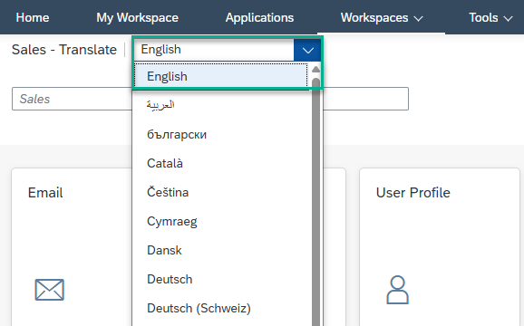
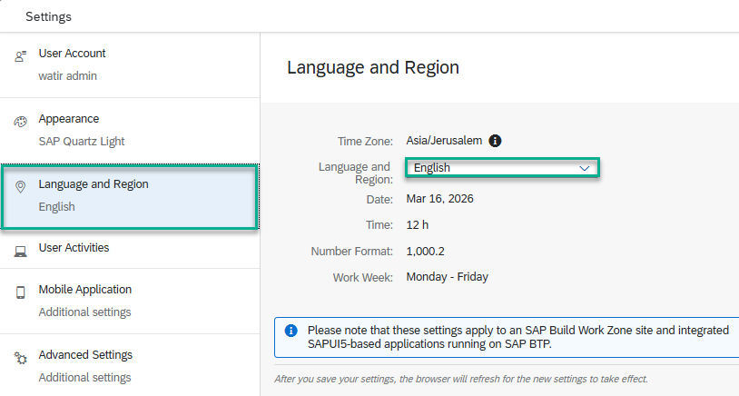

<!-- loiocc6838c7c2694a738cb01a3258627340 -->

<link rel="stylesheet" type="text/css" href="css/sap-icons.css"/>

# How to Translate Workpage Texts and Titles

To support organizations with employees who understand multiple languages, you can provide translations for texts on workpages.

You can translate the following:

-   Section headers

-   Cell headers

-   Text in text widgets

-   Titles and captions in widgets

To translate the above content in your workpage, do the following:

1.  Open the workpage editor using the wand icon :magic_wand:. This opens up the workpage settings.

2.  Click  to activate the translation editor. When activated, the translation icon appears in widgets that support translation.

3.  Select the language that you want to work in from the dropdown menu.

    

4.  Enter translation texts for the content.

5.  Publish the workpage with the translations or save it as a draft.

6.  To enter translations for widget titles, click next to the widget title and choose *Translate*. Then enter the translation for the widget title.

7.  Publish the translation of the workpage or save it as a draft.

In order for the end user to see the translation, they need to open *Settings* \> *Language & Region*, select the language from the dropdown list, and save the settings.

> ### Note:  
> Users see the translations of workpages based on their preferred language settings. If a translation is not available for their preferred language, they see the original, untranslated text.

