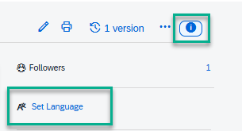
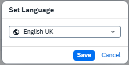
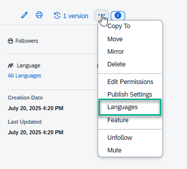
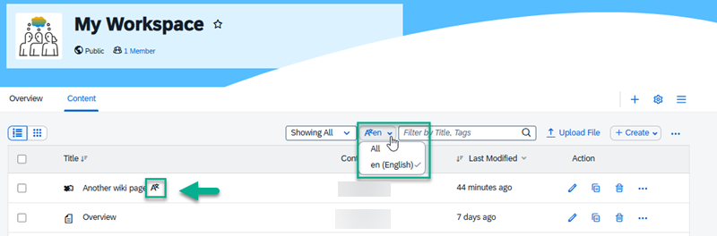

<!-- loio09d5b21f054e4db898329e99c9992456 -->

# How to Translate Your Content

Learn how to set bundles and package together translated content.

A language bundle is a package containing all the necessary language-specific translations for a particular content type.

You can upload new or select existing translated content such as documents, PDFs, wiki pages, blogs, videos, and knowledg base articles and add them to a language bundle.

> ### Note:  
> You can only bundle translations of the same type of content - for example wiki pages can be bundled but you can't bundle any other content with them.

By bundling translated content you can:

-   Ensure translations are up-to-date with respect to the original content.

-   Quickly find all available translations for the content item.

-   See a default or fallback translation, even if a preferred translation is unavailable. For example, if a bundle contains English, French, and Spanish translations, and English is set to the default, a user with any other language preference will see the English version.

For more information about how to set a language and how to add translations to a bundle, see [How to Manage Translations](how-to-manage-translations-2d4c05a.md).

<a name="loio09d5b21f054e4db898329e99c9992456__section_ewp_y4x_1gc"/>

## How to set a language

To set the language on content if the language locale has not already been specified:

1.  Open the content item in single item view. This means that if you're setting the language for a wiki page, open the wiki page view.

2.  Select the *Show More* icon and then select *Set Language*.

    

3.  Select a language from the dropdown list and then click *Save*.

    

4.  On the right side panel, the language you selected for the content will display. Here, you can change the language by clicking the current one or add other languages for the same content by clicking *All Languages*.

<a name="loio09d5b21f054e4db898329e99c9992456__section_lkv_b2m_bgc"/>

## How to bundle languages

A language bundle is a collection of languages for a specific type of content.

You can upload new or select existing translated content such as documents, PDFs, wiki pages, blogs, videos, and knowledg base articles and add them to a language bundle.

> ### Note:  
> You can only bundle the same type of content - for example wiki pages can be bundled but you can't bundle any other content with it.

By bundling translated content you can:

-   Ensure translations are up-to-date with respect to the original content.

-   Quickly find all available translations for the content item.

-   See a default or fallback translation, even if a preferred translation is unavailable. For example, if a bundle contains English, French, and Spanish translations, and English is set to the default, a user with any other language preference will see the English version.

    Manage your language bundles as follows:

    <table>
    <tr>
    <th valign="top">

    Action
    
    </th>
    <th valign="top">

    More information
    
    </th>
    </tr>
    <tr>
    <td valign="top">
    
    Add a language to a bundle
    
    </td>
    <td valign="top">
    
    1.  Upload the translated version of your content.

    2.  Set a language. Once you've set the language, you've created a bundle for 1 language.

    3.  To add more languages to the bundle, click *Languages* from the right side panel.

        

    4.  From the *Languages* dialog box, click *\+ Add another language* to add translated content to the bundle. You can choose to upload new content or select existing content from the workspace. The languages that have already been translated for the bundle appear with the text "already selected". Select the language and then click *Add*.

    5.  Add more languages to the bundle by repeating the above steps.

    6.  When you're done, click *Close*.

    
    </td>
    </tr>
    <tr>
    <td valign="top">
    
    Remove a translation from a bundle
    
    </td>
    <td valign="top">
    
    1.  In the *Languages* dialog box, click the dropdown icon next to the selected language for the content and click *Remove from the list*. The translated content item will automatically be removed from the bundle.

    2.  Click *Close*.

    
    </td>
    </tr>
    <tr>
    <td valign="top">
    
    View translated content from a bundle
    
    </td>
    <td valign="top">
    
    1.  In the *Languages* dialog box, click the dropdown icon next to the selected language and click *View*. The content will automatically open in a new browser tab.

    2.  Return to the previous browser tab and click *Close*.

    
    </td>
    </tr>
    <tr>
    <td valign="top">
    
    Set a translated content item in a bundle as the default
    
    </td>
    <td valign="top">
    
    1.  On the *Languages* dialog box, click the dropdown next to the selected language for the content and choose *Set as default*. This is now the default content item that displays when a preferred language is unavailable or not selected.

    2.  Click *Close*.

    
    </td>
    </tr>
    </table>
    

<a name="loio09d5b21f054e4db898329e99c9992456__section_ek4_svx_1gc"/>

## Filter languages in the Content list

In the *Content* list view, you can click the language dropdown to filter content items by language. In the content listing, a translation icon displays next to a content item that has been translated into one or more other languages. To view the other translations, select Languages from the dropdown on the right.

You can also choose to view a list of content in all offered languages.

