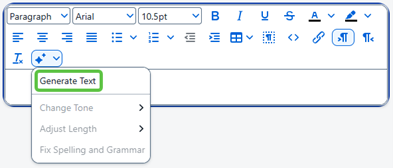
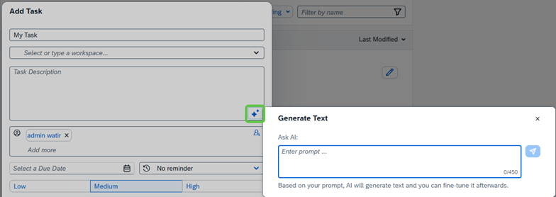
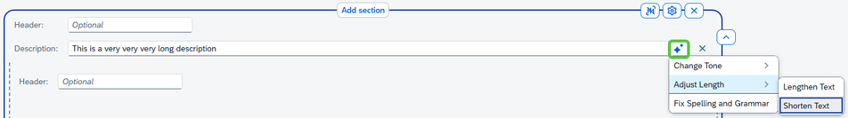
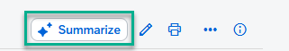

<!-- loiof950f0d92af14e14b9e7ee7a2c6b0aba -->

<link rel="stylesheet" type="text/css" href="css/sap-icons.css"/>

# How to Use AI Features to Create Content

Learn how to use AI features that have been enabled for your site to create content for your workspaces.

<a name="loiof950f0d92af14e14b9e7ee7a2c6b0aba__section_lfv_kkl_bgc"/>

## Overview

Before you can use AI features in your site, your administrator needs to have enabled them. For more information, see [Enabling AI Features](enabling-ai-features-2945fa8.md).

> ### Note:  
> You will be entitled to trigger a limited number of requests per calendar month.
> 
> If the monthly requests exceed the limit, these features will be temporarily disabled and you will be notified accordingly. The following month, the monthly quota will be reset, and you can use the features again.

> ### Caution:  
> To ensure data privacy compliance, please don’t use personal or sensitive data when generating text using AI.

<a name="loiof950f0d92af14e14b9e7ee7a2c6b0aba__section_xvx_gll_bgc"/>

## AI features and how to use them

Using the following AI options, you can generate texts in seconds saving hours of manual writing.

<table>
<tr>
<th valign="top">

Feature

</th>
<th valign="top">

Description

</th>
<th valign="top">

How to use it

</th>
</tr>
<tr>
<td valign="top">

**Ask Joule** 

</td>
<td valign="top">

Clicking the *Ask Joule* button, enables users to ask any questions about documents, wikis, and workpages related to SAP Build Work Zone, advanced edition.

</td>
<td valign="top">

Before you can use the *Ask Joule* button, it must be enabled in the Site Settings by your administrator. Once enabled, the button appears on your screen. If this button isn't enabled, then the *Summarize* button will appear instead.

</td>
</tr>
<tr>
<td valign="top">

**AI Text Generation in the Text Widget** 

</td>
<td valign="top">

Enables you to generate content from within the *Text* widget.

</td>
<td valign="top">

1.  In a section, click *Add Content* and select the *Text* widget.

2.  In the toolbar, click the  \(AI writing assistant\) and select *Generate Text*.

    

3.  Enter your prompt and click the  \(send icon\).

You have the option to accept the suggested text or you can discard it and try again.

</td>
</tr>
<tr>
<td valign="top">

**AI text generation in Text Areas**

</td>
<td valign="top">

Enables you to generate text in all text boxes.

</td>
<td valign="top">

AI text generation can now be used in all places where you would enter text in your workspace.

> ### Note:  
> The text can't be a specific field, short phrase or sentence, for example the name of the workspace or a section header.

Once the text area is in focus, the AI writing assistant,  becomes available and you can start entering your prompts.

Where will you be able to use this feature?

-   Text widget in workpage

-   Wikis

-   Blogs

-   Knowledge base articles

-   Events

-   Tasks

-   Feeds and comments

</td>
</tr>
<tr>
<td valign="top">

**Refine and Regenerate Texts** 

</td>
<td valign="top">

Use AI to refine the text in input fields, text areas, and text widgets.

</td>
<td valign="top">

To enable the refining of your texts and regenerating them, simply highlight the existing text to enable the various AI options such as changing the tone, adjusting the length, and fixing grammar and spelling mistakes.

</td>
</tr>
<tr>
<td valign="top">

**AI Summarization** 

</td>
<td valign="top">

Enables you to condense lengthy texts by summarizing them. This way you can quickly understand key points without reading everything.

> ### Note:  
> When *Ask Joule* is enabled, it replaces the *Summarize* button. If *Ask Joule* isn’t enabled, the *Summarize* button appears instead.

</td>
<td valign="top">

1.  Open the *Content* list of the workspace from the workspace navigation bar and select the content item that you want to summarize.

    > ### Note:  
    > You can summarize wikis, blogs, workpages, and documents.

2.  Once you've opened the content item, select the *Summarize* button at the top of the screen to get a summary of the original text.

    

> ### Note:  
> You can summarize text with up to 75,000 words.

</td>
</tr>
</table>

