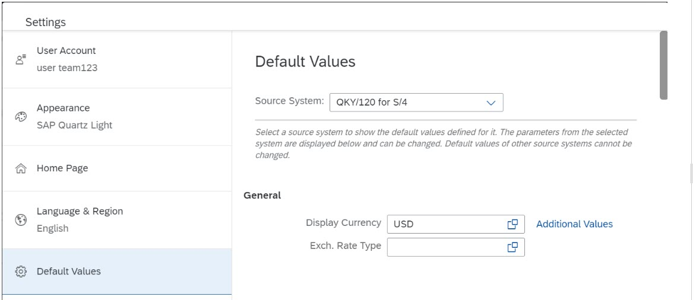

<!-- loiofb9d1cad535a439b8e250962f884d86b -->

# How to Use Default Values in App Fields

Some applications can be launched with user-specific default values.

You can provide user-specific values for some fields, so that when launching the app, these values are used as a default for those fields. For example, you may want to specify the default currency to use for a pricing field. If you change a default value, the new value will be used in all applications that reference that value.

You can view and edit the default values under the User Actions menu, using the option: *Settings* \> *Default Values*.

> ### Note:  
> This option is available only if you have integration with an SAP S/4HANA system.

When you work with apps that are available in multiple SAP S/4HANA systems, each system has a different name, referred to as the source system. In this case, you use the *Source System* drop-down list to select the system for which to view the default values. For example:

Source systems that don't have saved default values, aren't displayed in the list.

> ### Note:  
> The source system can be displayed directly on each tile of an SAP S/4HANA app, to help you identify the source system of the apps represented by the different tiles. This feature needs to be enabled by your administrator. For more information, see *Display Settings* in the topic [Site Settings](site-settings-ca74965.md).

To change the default values, do the following:

1.  In the User Actions menu, choose *Settings* \> *Default Values*.

2.  If working with multiple source systems, select the relevant system from the *Source System* list.

3.  Edit the values that you want to change.

4.  Some parameters allow you to specify additional values. Click *Additional Values* to add values to the parameter.

5.  Click *Save* to apply the new values to your current system.

> ### Note:  
> For additional information about the source of an app, you can also select *About* from the User Actions menu.

