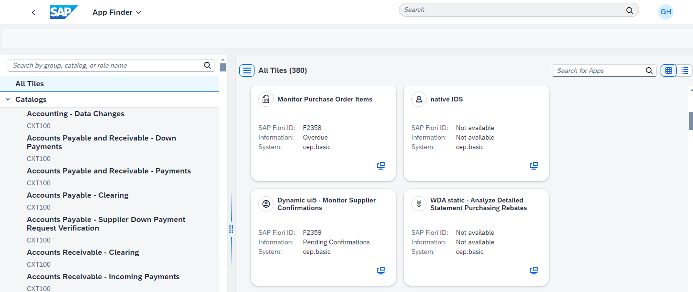

<!-- loio477a2ba8b0b54c1f9160f837bebb33b5 -->

<link rel="stylesheet" type="text/css" href="css/sap-icons.css"/>

# How to Use the App Finder

The *App Finder* displays all the apps available for your role that you may potentially want to launch in your daily work.

You access the *App Finder* from the User Actions menu. When you open the *App Finder*, you see all your apps with a tile representation in the pane on the right:

The *Catalogs* option enables you to select a specific catalog to display only the apps that it contains.

You can switch between grid view and list view using the respective icons at the top right side of the pane. In either view, you use the  \(launch application\) icon to launch the app.

To search for an app, you can use any property that is visible in the pane on the right, such as the the app name, the SAP Fiori ID, or the description in the *Information* field. Some apps may also have a subtitle. However, you can't search by the ID displayed in the *System* property.

> ### Note:  
> -   If a property is not defined, it is not displayed.
> 
> -   For apps that were configured manually in the Content Manager, the value of the *System* property is *Local*.

