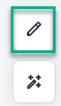
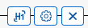
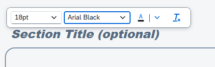
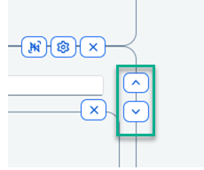
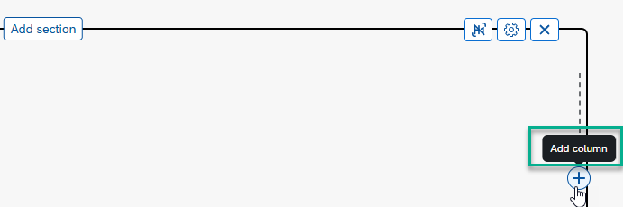
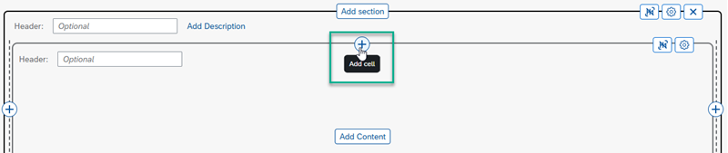
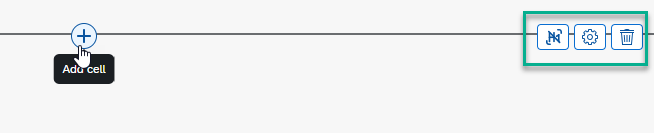
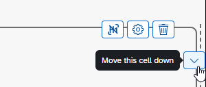
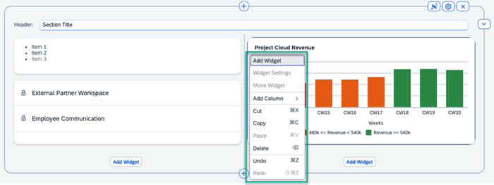

<!-- loio9164929567b64932814d7f899a955e19 -->

<link rel="stylesheet" type="text/css" href="css/sap-icons.css"/>

# How to Use the Workpage Editor

As a workspace administrator, you can create and design workpages for your workspace using the workpage editor.

<a name="loio9164929567b64932814d7f899a955e19__section_nsc_4mg_sfc"/>

## How to access the workpage editor

Access the workpage editor from the right side of your workpage by clicking the :pencil2: icon.

<a name="loio9164929567b64932814d7f899a955e19__section_rf4_vmg_sfc"/>

## About the different layout elements in the workpage editor

Workpages can be structured using various layout elements that offer a flexible way to organize and display information. The layout contains the following elements:

<table>
<tr>
<th valign="top">

Layout Element

</th>
<th valign="top">

More Information

</th>
</tr>
<tr>
<td valign="top">

**Sections** 

</td>
<td valign="top">

Sections are the top-level containers. When you add a section to a workpage, you'll get a popup with the option to select the layout you prefer. There are two choices:

-   *Freestyle* layout that you can use to add various types of content such as widgets, app tiles, cards, and more.

-   *Wizard* layout that you use if you want to add a guided process consisting of a wizard with steps. For more information, see [How to Create a Wizard](how-to-create-a-wizard-061fb6b.md) .

</td>
</tr>
<tr>
<td valign="top">

**Columns** 

</td>
<td valign="top">

Columns divide the content horizontally allowing for side-by-side display of your content. You can add up to 8 columns.

</td>
</tr>
<tr>
<td valign="top">

**Cells** 

</td>
<td valign="top">

Cells are the smallest units within a column, where you can add tiles, cards, and widgets to your workpage. They are typically arranged in rows and columns forming a grid-like structure.

</td>
</tr>
</table>

<a name="loio9164929567b64932814d7f899a955e19__section_lk4_1hb_snb"/>

## How to use the different layout options

<table>
<tr>
<th valign="top">

What you can do

</th>
<th valign="top">

How to do it

</th>
</tr>
<tr>
<td valign="top">

Define various settings for the section

</td>
<td valign="top">

1.  Hover over the top of the section to expose the following settings:

    

2.  Select one of the following settings:
    -   : Show or hide the section header.

    -   : From here you can:

        -   Set the padding to increase the spacing between sections

        -   Show a section description

        -   Make a section collapsible

        -   Display a section expanded by default

        -   Define the settings for the background of the section

    -   : Delete section.

</td>
</tr>
<tr>
<td valign="top">

Add additional sections

</td>
<td valign="top">

In the center of the section, click the *Add Section* button.

</td>
</tr>
<tr>
<td valign="top">

Format the section header

> ### Note:  
> Formatting is also available for cell headers and for your texts in the Text widget .

</td>
<td valign="top">

1.  If you've entered a header for the section, click within the border of the header to open a small text bar.

2.  From here select a different format for your header - font size, font, or color.

</td>
</tr>
<tr>
<td valign="top">

Move a section up or down

</td>
<td valign="top">

Use the arrows on the left of the section border to move the section up or down on your workpage.

</td>
</tr>
<tr>
<td valign="top">

Add columns to your section

</td>
<td valign="top">

Use the :heavy_plus_sign: on the side of each section, to add additional columns.

You can also move and rearange your columns.

> ### Note:  
> You can add up to 8 columns.

</td>
</tr>
<tr>
<td valign="top">

Add cells to your section

</td>
<td valign="top">

Use the centered :heavy_plus_sign: to add a cell to your layout.

</td>
</tr>
<tr>
<td valign="top">

Define settings in a cell

</td>
<td valign="top">

Hover over a cell to see the cell settings:

s

-   Hide or show the cell header.

-   Open the cell settings to enable the background and border.

-   Delete a cell.

</td>
</tr>
<tr>
<td valign="top">

Move cells up and down

</td>
<td valign="top">

Use the side arrows to move a cell up and down.

</td>
</tr>
<tr>
<td valign="top">

Add tiles, cards, and widgets

</td>
<td valign="top">

Click *Add Content* to open a content finder displaying all kinds of different content such as app tiles, cards, and widgets.

-   Click *Tiles* to display app tiles representing the apps that you can access. You can add a single app to a column or you can select multiple apps and add them side by side in a column. For more information, see [How to Add Applications to Your Workpage](how-to-add-applications-to-your-workpage-7bcef04.md).

-   Click *Cards* to display all cards that you can access. You can only add one card at a time. For more information about cards, see [About Cards](about-cards-a202464.md).

-   Select from a variety of widgets such as forums, events, images, and more. For more information about the different widgets, see [About Widgets](about-widgets-5a73a41.md).

> ### Note:  
> If there are already tiles in a particular cell, you will only be able to add tiles to that cell. The same applies to cards and widgets - if there are already cards and widgets in a cell, you can't add tiles to it - only cards and widgets.

</td>
</tr>
<tr>
<td valign="top">

Use the context menu to easily navigate to specific elements to edit them

</td>
<td valign="top">

Open the context menu by right-clicking on any element like a widget, a column, a section, or an empty area of the page. From the context menu you can easliy navigate to and edit the selected element.

</td>
</tr>
</table>

<a name="loio9164929567b64932814d7f899a955e19__section_bq2_t31_fdc"/>

## Additional settings in the workpage editor

There are a few settings on the right side of the workpage editor that you can use when designing your workpage:

To use these additional workpage settings, click the :magic_wand:icon to open the following options:

<table>
<tr>
<th valign="top">

Setting

</th>
<th valign="top">

More information

</th>
</tr>
<tr>
<td valign="top">

*Views*



</td>
<td valign="top">

Hover over this icon to display the number of viewers of the workpage.

</td>
</tr>
<tr>
<td valign="top">

*Translations*



</td>
<td valign="top">

Translate the workpage, section, or cell titles.

For more information, see [How to Translate Workpage Texts and Titles](how-to-translate-workpage-texts-and-titles-cc6838c.md).

</td>
</tr>
<tr>
<td valign="top">

*Versions* 



</td>
<td valign="top">

Revert to a previous version of a workpage.

By editing a workpage, you create a new version. If you want to make the new version visible for other workspace members or users, you have to publish it. If you don't want to publish the new version immediately, you can save the changes as a draft.

The next time you open the workspace you can view and edit your draft. To revert to an old version of a workpage, select the version that you want to revert to.

</td>
</tr>
</table>

