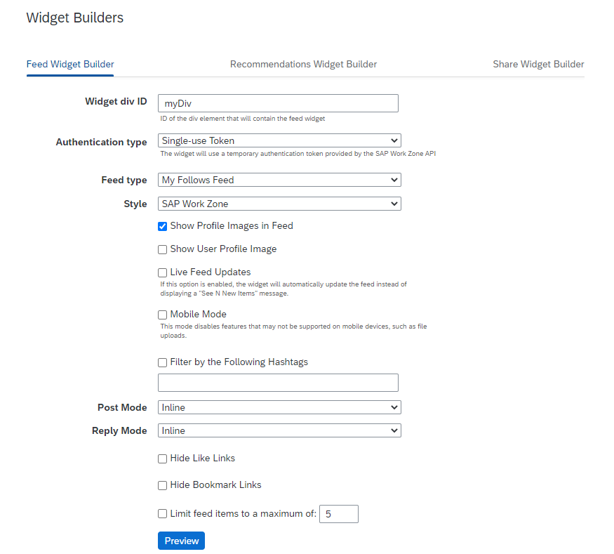
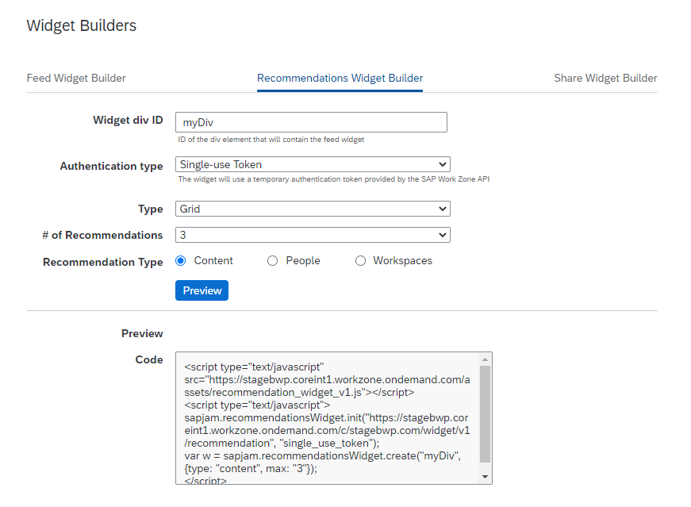
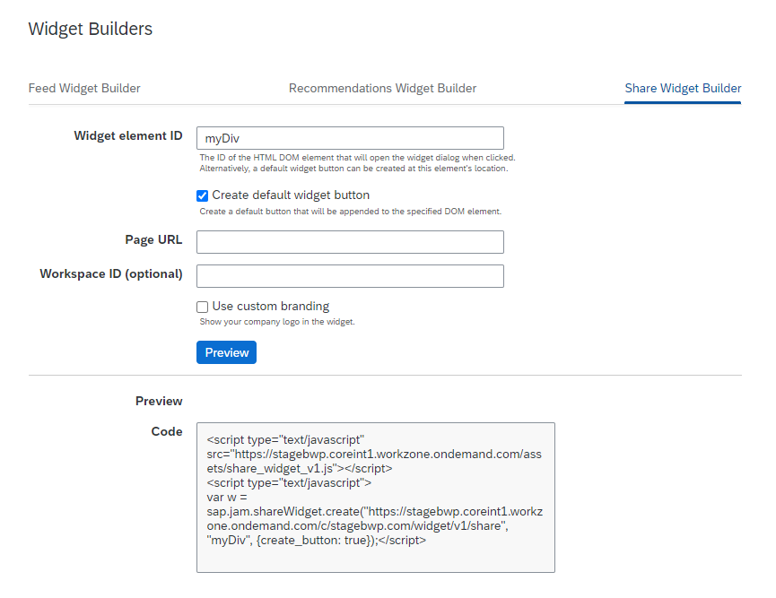

<!-- loiod6526cfa9eab4de182a08b6acbaaea07 -->

# HTML div-Embedded Widgets

You can embed the following widgets into HTML pages of a third-party application.

HTML div-embedded widgets are available in the *Administration Console* *UI Integration* \> *Widget Builders* screen. The widget builders currently available are for a **Feed** widget, a **Recommendations** widget, and a **Share** widget. The options for these widgets can be set using the form for each widget, and the options selected will alter the auto-generated JavaScript that is shown at the bottom of the page.

Once you have set the widget options that you want, click *Preview* to see both a rendering of options you have selected and the JavaScript for the widget with those options.

Copy all the JavaScript code into the body of your HTML page, and add a div tag above the script, with the ID that you set in the Widget div ID field of the form and with a specified width and height.


<a name="loiod6526cfa9eab4de182a08b6acbaaea07__section_stp_kq1_rwb"/>

## Feed Widget

The Feed Widget Builder provides the easy creation of a highly customizable feed widget that can be used to embed one of five different types of feeds in an external web page: the Company Feed, My Follows Feed, Workspace Feed, External Object Feed, or the External Wall Feed. No previous knowledge of JavaScript is required.

> ### Note:  
> The minimum width for the feed widget is 320 pixels.

Fill in the widget builder form:




<table>
<tr>
<th valign="top">

Property


</th>
<th valign="top">

More Info


</th>
</tr>
<tr>
<td valign="top">

Widget div ID


</td>
<td valign="top">

Enter a unique and meaningful name for the HTML div tag that will encapsulate your feed widget.

This div ID is used in the widget JavaScript that you generate using this form, and it must match the div ID in the HTML page that you use to call and display this widget. The div ID must be unique within the page in which you add the widget.


</td>
</tr>
<tr>
<td valign="top">

Authentication Type


</td>
<td valign="top">

In productive systems, the only recommended authentication type is **Single-use Token**: uses a single-use token provided by the API \(Recommended\).

After obtaining a single-use token, it needs to be included in the parameters passed into the `sapjam.feedWidget.create` function call in the widget initialization script. For example,

```
sapjam.feedWidget.init(
    "https://<workzone#>.workzone.ondemand.com/widget/v1/feed",
    "single_use_token");
var w = sapjam.feedWidget.create("myDiv",{
    type: "follows",
    avatar: false,
    post_mode: "inline",
    reply_mode: "inline"
    single_use_token: '883a5486-62af-407a-a5ca-cec6dcf259dc'
});
```


</td>
</tr>
<tr>
<td valign="top">

Feed Type


</td>
<td valign="top">

Select the type of feed that you want to display.

-   Company Feed: will display the same feed that you would see under the Company tab.
-   My Follows Feed: will display the same feed that you would see under your Home tab.
-   Workspace Feed: will display the same feed, or feeds, for one or more workspaces. This requires the entry of one or more workspace IDs.
-   External Object Feed: will display the feed for an external object or business record.

    -   In the *External ID* field, enter the value of the *Exid* property returned by the OData API’s ExternalObjects endpoint. This value is typically the external OData URL for the object.
    -   In the *External type* field, enter the value of the *ObjectType* property returned by the OData API’s ExternalObjects endpoint. This value is the External Type value for the object.

    The feed will behave differently depending on whether the logged-in user is able to view the full feed history for that particular external object type.

-   External Wall Feed: will display the same feed that you would see under the Home tab in if you were to log in as an external user.
    -   In the *External ID* field, enter any string that you want to use to uniquely identify the topic.
    -   In the *Name* field, enter a user-friendly name for the topic. This is the name that will show up in the feed when you comment on the topic, which will appear in the form "John Doe commented on <name\>".
    -   \[Optional\] In the*External URL* field, enter any fully-qualified external URL. If this property is provided, then the topic name will be rendered in the feed as a link that opens this URL in a new tab when a user clicks on it.


</td>
</tr>
<tr>
<td valign="top">

Style


</td>
<td valign="top">

Select the styling that you want to apply to your widget.


</td>
</tr>
<tr>
<td valign="top">

Post Mode


</td>
<td valign="top">

Select the text entry box at the top of the feed in which you can post a comment.


</td>
</tr>
<tr>
<td valign="top">

Reply Mode


</td>
<td valign="top">

Select the option to reply to other peoples' comments.


</td>
</tr>
</table>

When you are satisfied with the configuration of your widget, copy the JavaScript from the bottom text box of the *Preview* area and paste it into your web page within script tags.

Add a div tag above the JavaScript that you pasted into the HTML body. This div tag must:

-   Be placed before the JavaScript, or you must use something like the jQuery .ready\(\) function, so that the order of script elements in the page does not matter.
-   Use the same "id" as you set or accepted in the Widget div ID field of the Widgets Builder form.
-   Include style statements that set the width and height of the widget, otherwise it will inherit the dimensions of its container element.

```
<html>
    <head>
        <title> Div-Based Widget</title>
    </head>
    <body>
        <div id="myDiv" style="width:100%; height:100%"></div>
        <script type="text/javascript" src="https://<workzone#>.workzone.ondemand.com/assets/feed_widget_v1.js"></script>
        <script type="text/javascript">sapjam.feedWidget.init(
            "https://<workzone#>.workzone.ondemand.com/widget/v1/feed",
            "single_use_token");
        var w = sapjam.feedWidget.create("myDiv", {
            type: "follows", 
            avatar: false, 
            post_mode: "inline", 
            reply_mode: "inline"
            single_use_token: '883a5486-62af-407a-a5ca-cec6dcf259dc'
        });</script>
    </body>
</html>
```


<a name="loiod6526cfa9eab4de182a08b6acbaaea07__section_cyd_4gh_rwb"/>

## Recommendation Widget

The Recommendations widget is a customizable widget that can be used to embed content, people, or workspace recommendations in an external web page.

Fill in the widget builder form:




<table>
<tr>
<th valign="top">

Property


</th>
<th valign="top">

More Info


</th>
</tr>
<tr>
<td valign="top">

Widget div ID


</td>
<td valign="top">

Enter a unique and meaningful name for the HTML div tag that will encapsulate your recommendations widget.

This div ID is used in the widget JavaScript that you generate using this form, and it must match the div ID in the HTML page that you use to call and display this widget. The div ID must be unique within the page in which you add the widget.


</td>
</tr>
<tr>
<td valign="top">

Authentication Type


</td>
<td valign="top">

In productive systems, the only recommended authentication type is **Single-use Token**: uses a single-use token provided by the API \(Recommended\).

After obtaining a single-use token, it needs to be included in the parameters passed into the `sapjam.feedWidget.create` function call in the widget initialization script. For example:

```
sapjam.feedWidget.init(
    "https://<workzone#>.workzone.ondemand.com/widget/v1/feed",
    "single_use_token");
var w = sapjam.feedWidget.create("myDiv",{
    type: "follows",
    avatar: false,
    post_mode: "inline",
    reply_mode: "inline"
    single_use_token: '883a5486-62af-407a-a5ca-cec6dcf259dc'
});
```


</td>
</tr>
<tr>
<td valign="top">

Type


</td>
<td valign="top">

Select the layout of the recommendations that you want to use.


</td>
</tr>
<tr>
<td valign="top">

\# of Recommendations


</td>
<td valign="top">

Select the number of recommendations that you want to display.


</td>
</tr>
<tr>
<td valign="top">

Recommendation Type


</td>
<td valign="top">

Select the type of recommendations you want to display: Content, People, Workspaces.


</td>
</tr>
</table>

When you are satisfied with the configuration of your widget, copy the JavaScript from the bottom text box of the *Preview* area and paste it into your web page within script tags.

Add a div tag above the JavaScript that you pasted into the HTML body. This div tag must:

-   Be placed before the JavaScript, or you must use something like the jQuery .ready\(\) function, so that the order of script elements in the page does not matter.
-   Use the same "id" as you set or accepted in the Widget div ID field of the Widgets Builder form.
-   Include style statements that set the width and height of the widget, otherwise it will inherit the dimensions of its container element.

```
<html>
    <head>
        <title> Div-Based Widget</title>
    </head>
    <body>
        <div id="myDiv" style="width:100%; height:100%"></div>
        <script type="text/javascript" src="https://<workzone#>.workzone.ondemand.com/assets/recommendation_widget_v1.js"></script>
        <script type="text/javascript">sapjam.recommendationsWidget.init(
            "https://<workzone#>.workzone.ondemand.com/widget/v1/recommendation",
            "single_use_token");
        var w = sapjam.recommendationsWidget.create("myDiv", {
            style: "link",
            type: "people",
            max: "5",
            single_use_token: '883a5486-62af-407a-a5ca-cec6dcf259dc'
        });</script>
    </body>
</html>
```


<a name="loiod6526cfa9eab4de182a08b6acbaaea07__section_clm_5gh_rwb"/>

## Share Widget

The Share widget can be used to embed a "share link" \(like other social network share buttons\), and which will post the containing page to either workspace or member feeds when clicked in the external web page.

Fill in the widget builder form:




<table>
<tr>
<th valign="top">

Property


</th>
<th valign="top">

More Info


</th>
</tr>
<tr>
<td valign="top">

Widget element ID


</td>
<td valign="top">

Enter a unique and meaningful name for the HTML div tag that will encapsulate your Share widget.

This div ID is used in the widget JavaScript that you generate using this form, and it must match the div ID in the HTML page that you use to call and display this widget. The div ID must be unique within the page in which you add the widget.


</td>
</tr>
<tr>
<td valign="top">

Create default widget button


</td>
<td valign="top">

Select this option to have a widget button included in the embedded widget. If you deselect this option, you must add the text or icon to be displayed in the div tag from which the widget is displayed.


</td>
</tr>
<tr>
<td valign="top">

Page URL


</td>
<td valign="top">

Enter the URL of the external web page in which the widget it embedded. It is the initial content of this page that will be displayed in the feed.


</td>
</tr>
<tr>
<td valign="top">

Workspace ID \(Optional\)


</td>
<td valign="top">

Enter the ID for the workspace in which you want the external page to have an entry added to that workspaces feed. You can get this ID from the last segment of the workspaces URL

> ### Note:  
> If you leave this field blank, the widget will add the shares to your company's feed.


</td>
</tr>
<tr>
<td valign="top">

Use custom branding


</td>
<td valign="top">

Select this option to include your company's logo in the shared content.


</td>
</tr>
</table>

When you are satisfied with the configuration of your widget, copy the JavaScript from the bottom text box of the *Preview* area and paste it into your web page within script tags.

Add a div tag above the JavaScript that you pasted into the HTML body. This div tag must:

-   Be placed before the JavaScript, or you must use something like the jQuery .ready\(\) function, so that the order of script elements in the page does not matter.
-   Use the same "id" as you set or accepted in the Widget div ID field of the Widgets Builder form.
-   Include style statements that set the width and height of the widget, otherwise it will inherit the dimensions of its container element.

```
<html>
    <head>
        <title>Some Page</title>
    </head>
    <body>
        <div id="myDiv" style="width:100%; height:100%"></div>
        <script type="text/javascript" src="https://<workzone#>.workzone.ondemand.com/assets/share_widget_v1.js" ></script>
        <script type="text/javascript">var w = sap.jam.shareWidget.create(
            "https://<workzone#>.workzone.ondemand.com/c/sfcubetree01.com/widget/v1/share",
            "myDiv",
            {
                url: "http://www.example.com/some-page.html",
                create_button: true, 
                branding: true
            });</script>
    </body>
</html>
```

