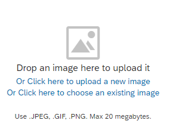
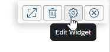

<!-- loiodf9e20366de74ab48e28283d21aab61e -->

# Image Widget

Image widgets can be added to your workpages in various ways.

There are 3 options for uploading an image:

-   *Drop an image here to upload it* - click and drag an image file from a folder on your computer into the widget space.

-   *Click here to upload a new image* - click the link to browse for an image file on your computer.

-   *Click here to choose an existing image* - click the link to browse for an image that was previously added to a workspace or to a folder.

Once you add the image you can define various settings such as adjusting the scale of the image, clearing the image and remvoing the image widget. Place your cursor over the right tip cornner of the image to see the following toolbar:

> ### Note:  
> To easily replace an image within an image widget while preserving its position on the page, you can click the *Clear Image* icon to remove the image rather than clicking the X to delete the widget and then inserting a new widget with a new image

<a name="loiodf9e20366de74ab48e28283d21aab61e__section_uqq_qh4_hcc"/>

## What else should you know about the image widget?

-   Images up to 20MB can be loaded to your workpages.

-   If you upload images to the *Content* folder, a preview is available for images up to 20MB. Above 20MB, a preview will not be available.

-   When you click and drag the bottom edge of an image widget to resize it, a guideline appears to help you align the edge with another image-based widget on the same row. As you drag the guideline, it will automatically snap to the bottom edge alignment matching the other widget.

-   Thumbnail images used for wikis, blogs, workpages or KBAs can be adjusted using a slider or dragging the image so that it’s displayed properly in *Content* widgets with different layouts \(thumbnail/gallery/carousel\) and in the *Content* list in grid view. This also applies to the thumbnail image that’s added to a video widget.

-   By default, small images \(those that are narrower than the column it's placed in\), can be scaled to fully fit the column. It can also be centered with whitespace on either side. With centering however, zooming, panning and cropping actions are unavailable.

-   Images can be embedded within image, rotating banner, and search widgets. These images are "bundled" as part of the workspace overview page or custom home page and can't be searched or browsed for independently.

-   When your image, rotating banner, or search widget uses an image that already exists in the content repository, and you update that image by uploading a new version, the image is also automatically updated in those widgets.

<a name="loiodf9e20366de74ab48e28283d21aab61e__section_zjy_tgl_crb"/>

## Tips for adding image widgets

When using an image widget, keep the following recommended width sizes in mind for an up to 4-column span to ensure highest viewing quality:

-   image spanning width of one column: 288 pixels

-   image spanning width of two columns: 585 pixels

-   image spanning width of three columns: 883 pixels

-   image spanning width of four columns: 1180 pixels

For an up to 6-column span, when using an image widget, consider the following for highest viewing quality:

-   image spanning width of one column: 188 pixels

-   image spanning width of two columns: 386 pixels

-   image spanning width of three columns: 585 pixels

-   image spanning width of four columns: 783 pixels

-   image spanning width of five columns: 981 pixels

-   image spanning width of six columns: 1180 pixels

