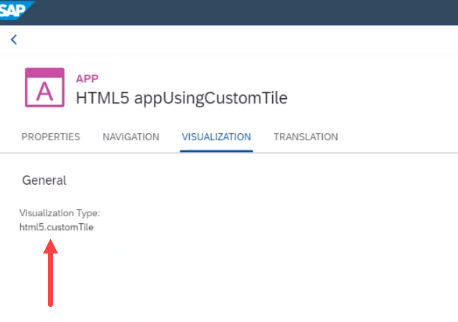

<!-- loio376785f52254440590c970e2e90de2c9 -->

# Implement a Custom Visualization

You can implement a custom visualization \(tile\) for an app.


The tile visualizations that are provided out-of-the-box are *Static App Launcher* and *Dynamic App Launcher*.

To display a custom tile for an app, you can implement a custom visualization, referred to as a vizType.


<a name="loio376785f52254440590c970e2e90de2c9__section_qb2_vql_3nb"/>

## Procedure

Create two different apps with different IDs. One for the visualization itself and one for the app that implements the visualization.

1.  See example of a `manifest.json` file of a custom visualization app. Note the `"type":"tile"` in the `"sap.flp"` section.

    ```
    {
    	"_version": "1.32.0",
    	"sap.cloud": {
    		"public": true,
    		"service": "com.sap.sample.instance.app",
    		"backgroundImageRelativeToComponent": "custom_tile.png"
    	},
    	"sap.flp":{
    		"type" : "tile"
    	},
    	"sap.app": {
    		"id": "html5.customTile",
    		"type": "application",
    		"applicationVersion": {
    			"version": "1.0.0"
    		},
    		"title": "Custom Dynamic App Launcher",
    		"description": "Custom Tile",
    		"tags": {
    			"keywords": []
    		},
    		"ach": "CA-UI2-INT-FE"
    	},
    	"sap.ui5": {
    		...
    	}
    }
    ```

    > ### Note:  
    > The `backgroundImageRelativeToComponent` property provides the background image for the custom visualization. The URL of the image must be relative to the location of the `component.js` file.

2.  See example of a `manifest.json` file of an app that implements the custom visualization. Note the `vizType` in the `"sap.cloud.portal"`.

    ```
    {
        "_version": "1.32.0",
        "sap.cloud": {
            "public": true,
            "service": "com.sap.sample.instance.app"
        },
        "sap.app": {
            "id": "html5.appUsingCustomTile",
            "type": "application",
            "i18n": "i18n/i18n.properties",
            "applicationVersion": {
                "version": "1.0.0"
            },
            "title": "{{appTitle}}",
            "description": "{{appDescription}}",
            "resources": "resources.json",
            "ach": "EP-CPP-CF-LP-DEV",
            "sourceTemplate": {
                "id": "html5moduletemplates.basicSAPUI5ApplicationProjectModule",
                "version": "1.40.12"
            },
            "crossNavigation": {
                "inbounds": {
                    "intent1": {
                        "signature": {
                            "parameters": {
                                "name1": {
                                    "defaultValue": {
                                        "value": "",
                                        "format": "plain"
                                    },
                                    "filter": {
                                        "value": "",
                                        "format": "plain"
                                    }
                                }
                            },
                            "additionalParameters": "allowed"
                        },
                        "semanticObject": "object1",
                        "action": "action1"
                    }
                }
            }
        },
        "sap.ui": {
            ...
        },
        "sap.ui5": {
            ...
        },
        "sap.cloud.portal": {
            "object1-action1": {
                "vizType": "html5.customTile"
            }
        }
    }
    ```

    > ### Note:  
    > In this example, the `sap.app.id` of the `vizType` is `html5.customTile`, and `object1-action1` is the intent defined in the `crossNavigation` section.


When the app is integrated in the Content Manager, the *Visualization* tab of the App editor displays the `sap.app.id` of the `vizType`:



For more information, see [HTML5 Apps Content Provider \(Local Repository\)](html5-apps-content-provider-local-repository-ad2103e.md).

