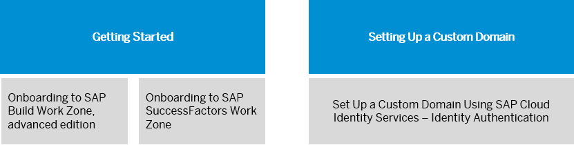

<!-- loioc8e3eb22477843e1a94a33e6cdaac294 -->

# Initial Setup

In this section you can find a detailed Getting Started guide, which helps you onboarding to SAP Build Work Zone, advanced edition and SAP SuccessFactors Work Zone. In addition, you can find a configuration guide for setting up a custom domain.

> ### Note:  
> In China region, SAP Build Work Zone, advanced edition, which is based on the subscription commercial model, isn’t supported. You can only onboard to SAP SuccessFactors Work Zone.

