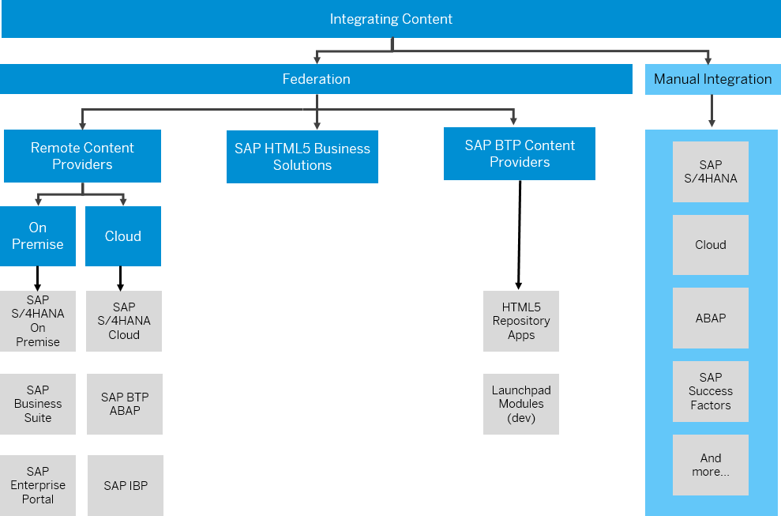
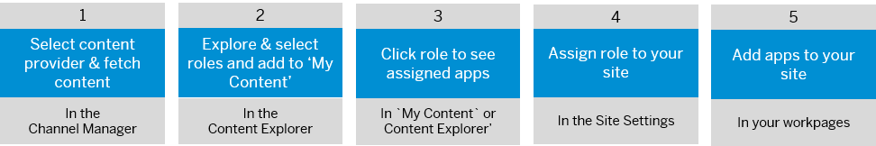
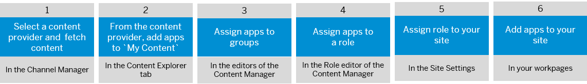
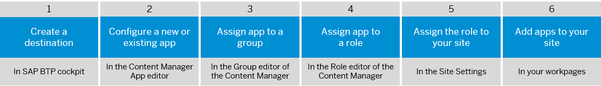

<!-- loiob7fa275656b94a3cb4f65e70c31d6ef1 -->

# Integrating Business Content

Learn how to integrate business content from different sources into your subaccount. In runtime, users can then access the content they need to fulfill their tasks from a central point of entry.

<a name="loiob7fa275656b94a3cb4f65e70c31d6ef1__section_nrv_fdm_w3b"/>

## Overview

You can integrate content into your subaccount either by federation of content channels or by manual integration. The following options are available:

<table>
<tr>
<td valign="top">

Remote content providers

</td>
<td valign="top">

This provider type exposes on premise and cloud apps from remote sources. The integration of the exposed content is done at the role level. All content items related to these roles, including apps, groups, and catalogs, are also integrated and are all visible in the runtime.

For more information, see [Federation of Remote Content Providers](federation-of-remote-content-providers-fa46cc3.md).

</td>
</tr>
<tr>
<td valign="top">

HTML5 business solutions

</td>
<td valign="top">

HTML5 business solutions are developed and deployed to a provider subaccount and can be consumed from different consumer subaccounts. These business solutions can be accessed from any other subaccount that shares the same Identity Authentication tenant.

On the consumer subaccount, the content is federated at the role level, and the business roles are added to the Content Manager together with their app assignments. You then assign a role to a site, so that business content \(such as apps, groups, catalogs\) assigned to a specific role can be accessed from the site.

For more information, see [Federation of Business Solutions](federation-of-business-solutions-2686d71.md).

</td>
</tr>
<tr>
<td valign="top">

SAP BTP content providers

</td>
<td valign="top">

This provider type exposes apps that have been deployed to the subaccount - either directly or through the local HTML5 repository of the subaccount.

For more information, see [Federation of SAP BTP Content Providers](federation-of-sap-btp-content-providers-2551d53.md).

</td>
</tr>
<tr>
<td valign="top">

Adding apps manually

</td>
<td valign="top">

Add apps manually by configuring existing apps in the App editor of the Content Manager or by creating and configuring a new app.

For more information, see [Manual Integration of Apps](manual-integration-of-apps-ddb655a.md).

</td>
</tr>
</table>

> ### Note:  
> The back-end system must be on a SAPUI5 version that is still in maintenance and has not yet reached its ‘end of cloud provisioning’ date. Otherwise, the integrated apps will not be displayed in your site.
> 
> For more information about SAPUI5 versions, see [Version Overview](https://ui5.sap.com/versionoverview.html).
> 
> Note that we recommend to update the SAPUI5 version of your back-end systems on a regular basis, at least once a year.

This diagram gives a high-level view of the possibilities of integrating content:

> ### Note:  
> If you are using XSUAA for authentication, custom domains are only supported for apps added from the HTML5 Application Repository. Apps from other content providers \(SAP BTP and remote content providers\) are not supported and will cause a security error. For more information, see [Set up a Custom Domain - SAP Authentication and Trust Management \(XSUAA\)](set-up-a-custom-domain-sap-authentication-and-trust-management-xsuaa-ae475bf.md).

## Where do I integrate business content?

You integrate business content from a tool called the *Site Manager*.

To get to the *Site Manager*, do the following:

1.  Under your avatar, click *Administration Console*.

2.  Go to the *External Integrations* section, expand it, and click *Business Content*.

3.  In the screen that opens, click *Content Manager*.

This takes you to the *Content Manager* screen in the *Site Manager*.

In the left panel of the *Site Manager*, you'll see icons of various tools that you can access. These are the ones you'll be using for integrating your apps:

-   *Site Directory* - where the site's tile is located. From here you can update the site settings, assign your site to roles, and navigate to the runtime site.

-   *Content Manager* - where you manage your business content such as apps, roles, and more.

    > ### Note:  
    > When using the search functionality in the *Content Manager*, use at least 3 characters to obtain the most accurate results. Using 2 characters or less will search only from the beginning of a title or an id.

-   *Channel Manager* - where you manage content providers. Content providers expose business content that you can integrate into your site.

For more information about the *Site Manager*, and the various tools, see [About the Site Manager](about-the-site-manager-3f619a1.md).

<a name="loiob7fa275656b94a3cb4f65e70c31d6ef1__section_ljp_pzv_11c"/>

## Overall process for integrating content to your site

In this section, we explain how to integrate content manually or from different types of content providers to the workpages of your site.

### Integrating content from remote content providers

The high-level overall process is as follows:

### Integrating content from an SAP BTP content provider

The high-level overall process is as follows:

### Integrating content manually from the Content Manager

The overall high-level process is as follows:

