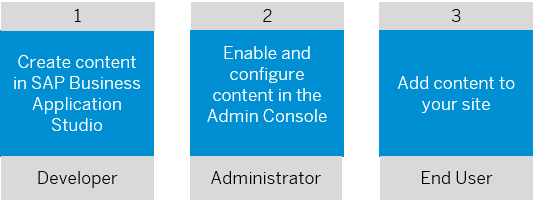

<!-- loiof23f25fdf57d4bc3ac4367b4ea119fee -->

# Integrating Content into SAP Build Work Zone, advanced edition

SAP provides out-of-the-box content that's available for use in SAP Build Work Zone, advanced edition. However, it’s also possible to add custom content such as SAPUI5 cards, and other types of content that are developed in SAP Business Application Studio.

A typical flow for integrating custom content into SAP Build Work Zone, advanced edition is as follows although there are dual actions that the different personas can do.

For more information about how to integrate content into SAP Build Work Zone, advanced edition, see: [UI Integration Cards](https://help.sap.com/viewer/b03c84105ff74f809631e494bd612e83/Cloud/en-US/0bf9adc001e446d7b458aa26f2066c95.html "SAP UI integration cards allow you to show application content from different sources side by side without the user having to switch screens. They contain a certain set of information from an app or page that&apos;s presented to users in a specific context.") :arrow_upper_right:.

