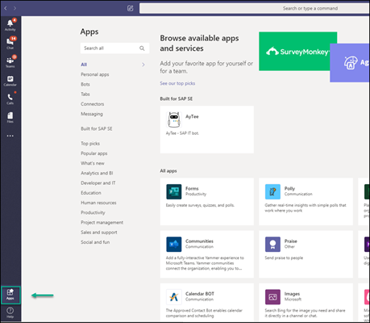

<!-- loiobfa596db8219450ba9c65b809300b55d -->

# Integrating with Microsoft Teams

Connect SAP Build Work Zone, advanced edition with Microsoft Teams to easily collaborate with your colleagues.

Once you've integrated SAP Build Work Zone, advanced edition with Microsoft Teams, you can:

-   Access business information and apps that you've added to the workspaces in your site and share with your colleagues in Microsoft Teams.

-   Start chatting directly from your site with your colleagues in Microsoft Teams.

<a name="loiobfa596db8219450ba9c65b809300b55d__section_gkl_tsf_ypb"/>

## Share SAP Build Work Zone, advanced edition content in Microsoft Teams

You can access and share content that you created in a workspace with various colleagues working in Microsoft Teams. The process involves steps that are done by the following personas:

<table>
<tr>
<th valign="top">

Step

</th>
<th valign="top">

Persona

</th>
<th valign="top">

Tasks

</th>
</tr>
<tr>
<td valign="top">

Step 1: Download a ZIP file with the relevant files from SAP Build Work Zone, advanced edition.

</td>
<td valign="top">

SAP Build Work Zone, advanced edition administrator

</td>
<td valign="top">

1.  Open the *Administration Console* in SAP Build Work Zone, advanced edition.

2.  Under *External Integrations*, click *Microsoft Teams*.

3.  Click *Download ZIP* to download the `wzteamsapp.zip` file that contains all necessary information for integrating with Microsoft Teams.

4.  Send this file to the Microsoft Teams administrator.

</td>
</tr>
<tr>
<td valign="top">

Step 2: Upload the ZIP file into Microsoft Teams.

</td>
<td valign="top">

Microsoft Teams administrator

</td>
<td valign="top">

1.  When the Microsoft Teams admin gets the zip file, they upload it from the *Apps* tab in Microsoft Teams.

    For more information, see the following Microsoft Teams documentation: [Upload an app package to Microsoft Teams](https://docs.microsoft.com/en-us/microsoftteams/platform/concepts/deploy-and-publish/apps-upload).

2.  The uploaded package is now available in the list of apps that can be integrated with and accessed from Microsoft Teams.

    For more information, see [Access your apps in Teams.](https://support.microsoft.com/en-us/office/access-your-apps-in-teams-0758cb09-9e85-40e7-a974-51df7734646a?ui=en-US&rs=en-US&ad=US)

</td>
</tr>
<tr>
<td valign="top">

Step 3: Access SAP Build Work Zone, advanced edition in Microsoft Teams.

</td>
<td valign="top">

SAP Build Work Zone, advanced edition end user

</td>
<td valign="top">

1.  Open Microsoft Teams on your system, and click *Apps*.

    

2.  Type in `SAP Build Work Zone` to search for the app.

    You'll find the SAP Build Work Zone, advanced edition tile.

3.  Click on the tile. The menu item appears in the left side panel. When you click the menu item, it is opened displaying 3 tabs - *My Inbox*, *My Workspace*, and *About*.

> ### Note:  
> *My Workspace* tab is displayed only if you created it in SAP Build Work Zone, advanced edition.

</td>
</tr>
</table>

You can now share content from your workspace with any one of your colleagues working in Microsoft Teams. You can also share your entire site.

<a name="loiobfa596db8219450ba9c65b809300b55d__section_k4t_4bh_zlb"/>

## Chat with your colleagues in Microsoft Teams

To enable users to chat with their colleagues in Microsoft Teams, you first need to enable the chat in SAP Build Work Zone, advanced edition. The process involves steps that are done by the following personas:

<table>
<tr>
<th valign="top">

Steps

</th>
<th valign="top">

Persona

</th>
<th valign="top">

Tasks

</th>
</tr>
<tr>
<td valign="top">

Step 1: Enable the chat.

</td>
<td valign="top">

SAP Build Work Zone, advanced edition administrator

</td>
<td valign="top">

1.  Open the *Administration Console* in SAP Build Work Zone, advanced edition.

2.  Under *External Integrations*, click *Microsoft Teams*.

3.  Enable the *Chats* toggle switch.

</td>
</tr>
<tr>
<td valign="top">

Step 2: Chat with your colleagues in Microsoft Teams.

</td>
<td valign="top">

SAP Build Work Zone, advanced edition end user

</td>
<td valign="top">

1.  Go to your profile page in SAP Build Work Zone, advanced edition.

2.  Click the chat icon next to your name.

    You're directed to a URL that opens up Microsoft Teams.

3.  Start chatting.

> ### Note:  
> You can also start chatting from:
> 
> -   The chat icon on your workspace *Members* page tab. The icon appears next to each member in the *Actions* column.
> 
> -   Hovering over a member's name and clicking the chat icon in the popup.

</td>
</tr>
</table>

