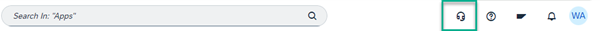

<!-- loio53c71626fbe648dea38ed52543dbea56 -->

<link rel="stylesheet" type="text/css" href="css/sap-icons.css"/>

# Integration with Built-In-Support

Use Built-In Support to find the relevant support channel or the information that you need.

<a name="loio53c71626fbe648dea38ed52543dbea56__section_klz_zb3_5pb"/>

## Overview

Built-In Support is a support platform that enables you to get access to support content and channels directly from your current system.

You can use Built-In Supprt to:

-   Search for information in SAP support knowledge base articles, SAP documentation, and many more information sources.

-   Directly report issues to SAP by opening a ticket.

-   Contact SAP experts in real-time and get support.

For more information about Built-In Support, see [Built-In Support](https://help.sap.com/docs/built-in-support).

<a name="loio53c71626fbe648dea38ed52543dbea56__section_wpt_qtq_ydc"/>

## How to access Built-In Support

1.  From your site, open the *Site Settings* screen.

2.  Under *Services*, enable the *Built-In Support* setting.

    When you enable the setting, a headset icon appears in the header bar of your site.

    

    For more information, see [Site Settings](site-settings-ca74965.md).

3.  Simply click the  icon to open Built-In Support options.

<a name="loio53c71626fbe648dea38ed52543dbea56__section_aww_z5q_ydc"/>

## Language availability

To find out which languages are supported by Built-In Support, please refer to this topic: [Language Availability](https://help.sap.com/docs/built-in-support/user-guide-for-end-users/language-availability).

<a name="loio53c71626fbe648dea38ed52543dbea56__section_fvm_4vq_ydc"/>

## Limitations

-   Custom domains are not supported - the headset icon is not displayed.

-   Built-In Support is not supported in China and NS2 data centers.

-   Built-In Support is not supported in mobile devices.

-   Navigating in SAP Build Work Zone to applications integrated from other products, may only reflect the SAP Build Work Zone system instead of the system of the integrated product. For example, when navigating to SAP S/4HANA applications, the built in support could display information from the SAP Work Zone system and not from the SAP S/4HANA system.

-   In SAP Build Work Zone, advanced edition and SAP SuccessFactors Work Zone, Built-In Support is only supported in the *Applications* tab.

For a full list of the known limitations of Built-In Support, please refer to this KBA: [3554111 - Known Limitations - Built-In Support](https://me.sap.com/notes/3554111 - Known Limitations - Built-In Support).

