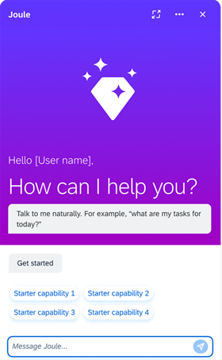
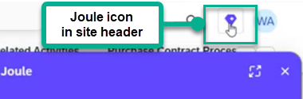

<!-- loio79b84b35e44445b8bcb00d2311754a1f -->

# Integration with Joule

Joule is a conversational user interface that is integrated with SAP applications and can be accessed from your site.

<a name="loio79b84b35e44445b8bcb00d2311754a1f__section_hz1_p5k_gdc"/>

## Overview

Joule is an artificial intelligence copilot tool that enables users to simply ask a question or present a problem and receive replies from connected SAP systems.

For more information, see [What is Joule?](https://help.sap.com/docs/JOULE/3fdd7b321eb24d1b9d40605dce822e84/38636457acc346daa4ff7069f041a11a.html?version=CLOUD)

<a name="loio79b84b35e44445b8bcb00d2311754a1f__section_lck_vvn_hdc"/>

## Prerequisites

-   Before completing the Joule onboarding tasks, you'll need to ensure that you've met the required prerequisites for both SAP Build Work Zone, advanced edition and for Joule. For a list of these prerequisites, please refer to: [Prerequisites](https://help.sap.com/docs/JOULE/6189c8655c484916bb8eb767126a653a/d42f2b7768f44b98a91f2d4178e8593c.html?version=CLOUD).
-   The Joule booster has been run. For more information, see [Run the Joule Booster](https://help.sap.com/docs/joule/integrating-joule-with-sap/run-booster).

    > ### Note:  
    > When running the Joule booster or formation, choose integration with only a single SAP Build Work Zone edition. Choosing both standard and advanced editions will cause the integration to fail.
    > 
    > To integrate Joule with both the standard and advanced editions, you can create an additional subscription to Joule in another subaccount and use one edition per subaccount.

<a name="loio79b84b35e44445b8bcb00d2311754a1f__section_uq1_gvk_gdc"/>

## Setting Up Integration of Joule

1.  Once the Joule booster has been run, and the integration between SAP Build Work Zone, advanced edition and Joule is complete, a setting becomes available in the *Site Settings* screen of the site.

    > ### Note:  
    > If you have a subscription to both the standard edition and the advanced edition on the same subaccount, you might notice that the after integrating Joule with one edition, the Joule site setting becomes enabled also on the other edition. Please note that running Joule on the other edition is not supported and might yield unexpected results.

2.  As an administrator, you can then go to the*Site Settings* screen and enable the *Joule* setting under the *Services* section.

3.  Once enabled, the Joule icon is displayed in the header of your runtime site.

    

> ### Note:  
> If you plan to set up Joule in another subaccount other than the SAP Build Work Zone, advanced edition subaccount, then you need to ensure that for both subaccounts trust is established to the same SAP Cloud Identity Services - Identity Authentication tenant.

<a name="loio79b84b35e44445b8bcb00d2311754a1f__section_f2v_y3s_3dc"/>

## Restrictions

To view Joule general restrictions and constraints, see [Contraints for Joule](https://help.sap.com/docs/JOULE/4d4f3bd714d443f194732c43d0c51b54/782a97f290794ca09080da54c5f230de.html?version=CLOUD).

