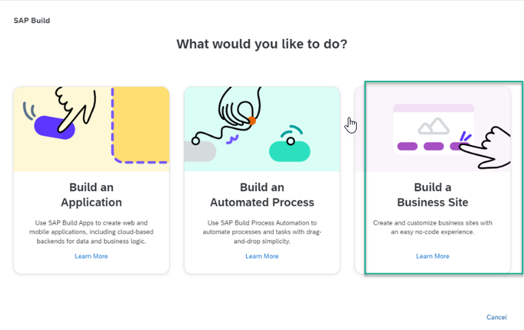

<!-- loio3d61413105714954a1cec2e416f1f439 -->

# Integration with SAP Build

SAP Build Work Zone is one of the components of SAP Build.

SAP Build enables anyone, no matter what is their skill level, to create and augment enterprise applications, process automation, and business sites with drag-and-drop simplicity.

<table>
<tr>
<th valign="top">

Component

</th>
<th valign="top">

More Information

</th>
</tr>
<tr>
<td valign="top">

SAP Build Apps

</td>
<td valign="top">

SAP Build Apps is a low-code development platform to create apps for the Web and native mobile use. Business users can build enterprise-grade apps without writing a single line of code. Professional developers can reduce coding effort in the creation of complex data models and business logic.

For more info, see [What Is SAP Build Apps?](https://help.sap.com/docs/BUILD_APPS/431746e4c663458aa68d9754b237bfc6/daece9f87abf4f7187a14ae0b1f8b2ab.html)

</td>
</tr>
<tr>
<td valign="top">

SAP Build Process Automation

</td>
<td valign="top">

SAP Build Process Automation is a citizen developer solution to adapt, improve, and innovate business processes with no-code workflow management and robotic process automation capabilities. For example, creating forms-based workflows and automating repetitive tasks within existing process flows.

For more information, see [What Is SAP Build Process Automation?](https://help.sap.com/docs/PROCESS_AUTOMATION/a331c4ef0a9d48a89c779fd449c022e7/c20b4e77201b4cde9ce4227e21850deb.html)

</td>
</tr>
<tr>
<td valign="top">

SAP Build Work Zone

</td>
<td valign="top">

Using SAP Build Work Zone, you can create business sites that serve as a unified point of access to SAP, custom-built, and third party applications and extensions, both on the cloud and on premise.

After creating a business app, you can deploy it to your subaccount in SAP BTP and integrate it into a business site to make it available for users.

</td>
</tr>
</table>

