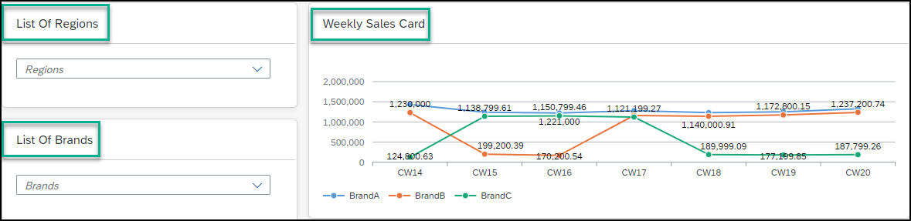
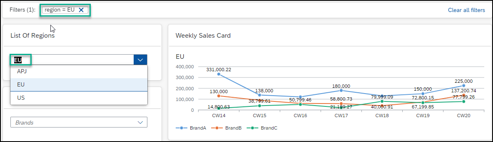
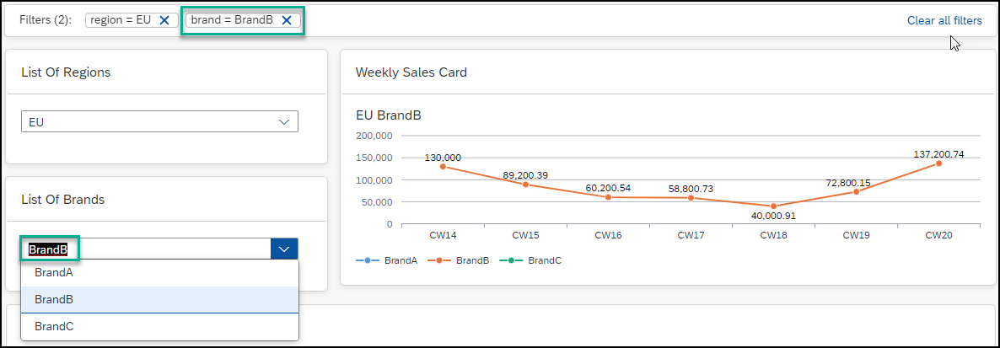

<!-- loioe3dd5cc172034d4eb5f7812ce7bb5c5e -->

# Interaction Between Cards

UI integration cards on the same workpage, can interact with each other.

Card developers can add parameters to UI integration cards that enable the cards to interact with each other.

For more information, see [Interaction Between Cards in the Developer Guide.](https://help.sap.com/viewer/7d3b9c7211ca4d7a9630b524205ee836/Cloud/en-US/2af7015bc37346f9973d88256385f01f.html)

Once you select one of the available card parameters, all other cards that are designed to respond to the workpage context, will respond and update accordingly. Each time you add a parameter, it acts like a filter that you can see in the top menu bar and it remains in focus even when you scroll down the workpage. In this way, you can always see the filters you've added.

Here's a typical example of how it works:

<table>
<tr>
<th valign="top">

Step No.

</th>
<th valign="top">

Step Description

</th>
<th valign="top">

Screen Capture

</th>
</tr>
<tr>
<td valign="top">

**1** 

</td>
<td valign="top">

On your workpage you have the following UI Integration cards – *List of Regions*, *List of Brands*, and *Weekly Sales Card* that have been developed to support context awareness.

</td>
<td valign="top">

</td>
</tr>
<tr>
<td valign="top">

**2** 

</td>
<td valign="top">

In the *List of Regions* card, select `EU` as the parameter.

This parameter is added as a filter to the bar at the top of the workpage and updates the *Weekly Sales Card* accordingly.

> ### Note:  
> If you scroll down the workpage, you'll see that the filter bar remains in focus, and you can see the filters you've added at all times.

</td>
<td valign="top">

</td>
</tr>
<tr>
<td valign="top">

**3** 

</td>
<td valign="top">

Now add another parameter and filter the graph even further. In the *List of Brands* card, select `BrandB`.

Note that once again the new filter appears in the bar at the top, and the *Weekly Sales Card* is updated accordingly showing the result after adding both filters.

</td>
<td valign="top">

</td>
</tr>
</table>

