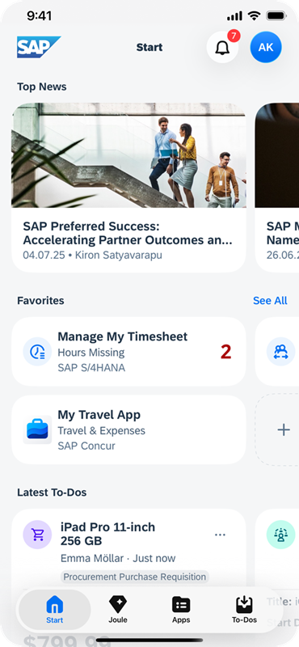

<!-- loioaee73c50034b4ccdaf6919e84fd27453 -->

# Joule Work Mobile App: Overview

The Joule Work mobile app is a native mobile application for all SAP users.

Users can access native or web-responsive business apps \(such as SAPUI5\), data, and information from SAP Build Work Zone, advanced edition. - all from one place so that they can stay informed and carry out all their tasks no matter where they are. Note that the Joule Work mobile app requires internet access to exchange data. In other words it doesn't work offline.

> ### Note:  
> The Joule Work mobile app is available on all public data centers that are supported by SAP Build Work Zone, advanced edition.

**Joule Work Mobile App**

