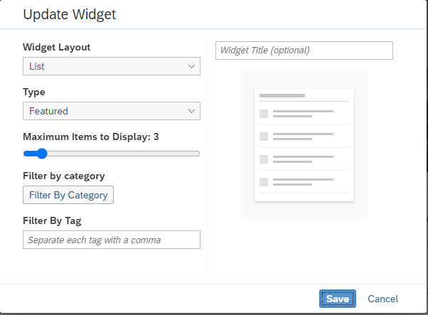

<!-- loio08ab831402da4c8eabc8829e32fee280 -->

# Knowledge Base Widget

Use the knowledge base widget to show all knowledge base articles that are available to the members of a workspace.

You can set the following details:

<table>
<tr>
<th valign="top">

Setting

</th>
<th valign="top">

More Information

</th>
</tr>
<tr>
<td valign="top">

*Widget Layout* 

</td>
<td valign="top">

Your options are list, carousel, gallery, and thumbnail.

</td>
</tr>
<tr>
<td valign="top">

*Type* 

</td>
<td valign="top">

Select the type of knowledge base articles to display \(for example, featured, article by title, last updated, most replies, most viewed, most liked, most rated, and highest rated\).

</td>
</tr>
<tr>
<td valign="top">

*Maximum Items to Display* 

</td>
<td valign="top">

You can choose the number of articles you want to display in the widget. You can set between 1 and 25.

</td>
</tr>
<tr>
<td valign="top">

*Filter by Category* 

</td>
<td valign="top">

Choose one or more categories to filter the list of articles that display.

</td>
</tr>
<tr>
<td valign="top">

*Filter by Tag* 

</td>
<td valign="top">

Enter text that refines what appears in the list of knowledge base articles; one or more tags are allowed, comma-separated.

</td>
</tr>
<tr>
<td valign="top">

*Widget Title* 

</td>
<td valign="top">

Enter a name for the widget \(optional\).

</td>
</tr>
</table>

