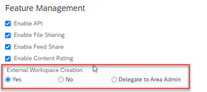

<!-- loio983b77d60c0a49109406a47d825ab3ee -->

# Managing External Users

In this topic, we explain the different options that you can use to manage your external users.

You can manage existing external users from the *Administration Console* \> *Users* \> *External Users* screen.

From here you can do the following:

<table>
<tr>
<th valign="top">

Task

</th>
<th valign="top">

Description

</th>
</tr>
<tr>
<td valign="top">

Manage domains

</td>
<td valign="top">

To make external logins more secure, you can set either an `allowlist` or a `blocklist` of email domains from which external users can log in to SAP Build Work Zone, advanced edition.

This setting is only available if you've enabled the creation of workspaces as follows:

In the *Administration Console* \> *Feature Enablement* \> *Features* screen, check the following feature:

</td>
</tr>
<tr>
<td valign="top">

Filter users according to status

</td>
<td valign="top">

Select how to filter the users in the *Show* dropdown list.

</td>
</tr>
<tr>
<td valign="top">

Stop sending emails to an external user.

</td>
<td valign="top">

From the *Action* dropdown list, choose *Edit*, and in *Email Settings*, choose *Stop all emails*.

</td>
</tr>
<tr>
<td valign="top">

Review usage

</td>
<td valign="top">

Allows the company administrator to view a single user's complete history of which pages or content \(office documents, PDFs, images, videos, blogs, or wikis\) a user has viewed.

Includes also other user's profile pages, the comments they've made, which content they've liked, which content they've uploaded or modified, and which content they've deleted, including user, administrator, and system modified profile information.

> ### Note:  
> To enable this feature, the admin first needs to enable content administration using the button on the *Content Administration* screen.

</td>
</tr>
<tr>
<td valign="top">

Edit limited user profile information

</td>
<td valign="top">

Next to the user, in the *Action* dropdown list, choose *Edit*.

</td>
</tr>
</table>

Apart from the management tasks mentioned above, there are many other features that you can set up for your external users:

<table>
<tr>
<th valign="top">

Task

</th>
<th valign="top">

Description

</th>
<th valign="top">

More information

</th>
</tr>
<tr>
<td valign="top">

Show the number of external users and external user licenses.

</td>
<td valign="top">

See the *Overview* section in the Administration Console.

</td>
<td valign="top">

[Overview](overview-120b50d.md)

</td>
</tr>
<tr>
<td valign="top">

Configure a theme for external users.

</td>
<td valign="top">

Configure a theme for external users in *Theming & Branding*.

</td>
<td valign="top">

[About Local and Global Themes](about-local-and-global-themes-f68b18b.md)

</td>
</tr>
<tr>
<td valign="top">

Configure an email template for external users.

</td>
<td valign="top">

Configure an email template for external users under *Theming & Branding* \> *Email Templates*, or use the email template for internal users.

</td>
<td valign="top">

[Email Templates](email-templates-b998d91.md)

</td>
</tr>
<tr>
<td valign="top">

Configure a home page for external users.

</td>
<td valign="top">

Configure a home page for external users under *Area & Workspace Configuration* \> *Home Page*. If you don't configure a home page, a default home page is shown.

</td>
<td valign="top">

[Home Pages](home-pages-000e8a1.md)

</td>
</tr>
<tr>
<td valign="top">

Set a customized terms of service agreement for your external users .

</td>
<td valign="top">

Define the text of the terms of service agreement for external users from *Compliance & Security* \> *Terms of Service* screen.

</td>
<td valign="top">

[Terms of Service](terms-of-service-fa7a091.md)

</td>
</tr>
<tr>
<td valign="top">

Invite external users to a workspace.

</td>
<td valign="top">

Configure a SAML identity provider to authenticate external users to join a workspace.

</td>
<td valign="top">

[SAML Trusted IDPs](saml-trusted-idps-c2f81fd.md)

</td>
</tr>
</table>

