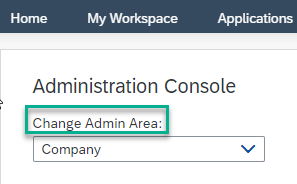

<!-- loio888ef2f9d6464a53b8711528822671de -->

# Managing Internal Users

Company or area internal users are employees of the company and are managed from the Administration Console.

Depending on whether you're a company administrator or whether you have switched to an administrative area, the *Internal Users* screen shows different options: At company level, you manage general user settings, whereas on the administrative area level, you manage users specifically from a chosen area.

<a name="loio888ef2f9d6464a53b8711528822671de__section_c3w_bc5_mtb"/>

## Internal users of the company

To manage the internal users of the company, you must be a Company Admin or a Support Admin. You manage the internal users from the *Internal Users* screen from the Adminisration Console under *Users*. From here you get an overview of all the internal users in your company and this is where you can manage each one individually as follows:

<table>
<tr>
<th valign="top">

Task

</th>
<th valign="top">

Description

</th>
</tr>
<tr>
<td valign="top">

Filter users according to status

</td>
<td valign="top">

Select how to filter the users in the *Show* dropdown list. You can filter according to active users, alumni users, company admins, and support admins

</td>
</tr>
<tr>
<td valign="top">

Edit the users profile

</td>
<td valign="top">

Next to the user, in the *Action* dropdown list, select *Edit* to update the users profile information and email settings.

</td>
</tr>
<tr>
<td valign="top">

Review usage

</td>
<td valign="top">

Allows the company administrator to view a single user's complete history of which pages or content \(office documents, PDFs, images, videos, blogs, or wikis\) a user has viewed.

Includes also other user's profile pages, the comments they've made, which content they've liked, which content they've uploaded or modified, and which content they've deleted, including user, administrator, and system modified profile information.

> ### Note:  
> To enable this feature, the admin first needs to enable content administration in the *Compliance & Security* \> *Content Administration* screen.

</td>
</tr>
<tr>
<td valign="top">

Export user data

</td>
<td valign="top">

You can trigger the export of an internal user's data. When the export is done, you'll get a notification that includes the user's email telling you if the export was successful, or if it failed.

If the export was successful, a ZIP file is added to your user profile under *My Exports*. From here you can download the exported file.

> ### Note:  
> You can't export the data of more than one user at a time.

</td>
</tr>
<tr>
<td valign="top">

Make a user a Company Admin or Support Admin

</td>
<td valign="top">

From the *Action* menu, choose *Edit* \> *User Type*.

For more information about administration roles, see [About Administrators](about-administrators-63a91fb.md) and the *Delegating Administrator Rights to Area Administrators and Workspace Administrators* section below.

</td>
</tr>
<tr>
<td valign="top">

Revoke application access

</td>
<td valign="top">

As a company administrator, you might need to prevent a user from accessing applications. For example, due to offboarding of an employee or contractor, or a reported lost or stolen device.

From the *Action* menu, choose *Edit* \> *Authorized Applications* \> *Revoke All Applications*.

</td>
</tr>
<tr>
<td valign="top">

Permanently remove alumni profile information \(personal data erasure\)

</td>
<td valign="top">

People who have left your organization or people who should no longer be able to access the site, become alumni when you deactivate their users.

To permanently remove all profile information \(for example, first name, last name, email address, office location\) for an alumni account or never-used account \(user was invited but never logged in\):

-   From the *Action* menu, choose *Clear Profile*.

The alumni profile no longer appears in search results. For never-used accounts, the invitation to join is revoked.

> ### Note:  
> The setting deletes the profile information, not the alumni user's content and feed items.

On the *Feature Enablement* \> *Features* page, you can configure this setting globally.

</td>
</tr>
</table>

<a name="loio888ef2f9d6464a53b8711528822671de__section_csv_tb5_mtb"/>

## Internal users from a specific area

To manage the internal users of a specific area in the company, you must be the administrator of that particular area.

1.  First you need to switch to your area by selecting your area from the *Change Admin Area* dropdown box:

    

    You'll get to the *My Area* overview screen.

2.  To manage the users for your area, click *Internal Users* under the *Users* menu item in the Administration Console.

3.  From the *Actions* menu on the right of each user of your area you can:

    -   Make a user of your area an Area Admin.

    -   Make a user of your area a Content Admin.

    -   Remove a user from your area.

<a name="loio888ef2f9d6464a53b8711528822671de__section_dzn_wh5_mtb"/>

## Delegating Administrator Rights to Area Administrators and Workspace Administrators

Company Admins, when setting up administrative areas, define which parts of the Administration Console, Area Admins are allowed to configure for a particular administrative area.

In addition, on the *Features* page, Company Admins can delegate the following configurations:

-   To area administrators

    -   Enable users to create their own workspaces

-   To workspace administrators

    -   Change the external document integration name

    -   Configure repositories at the workspace level for Microsoft Office 365 SharePoint

