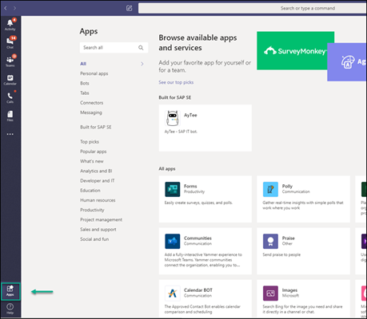

<!-- loiodde145f8482a442aba85a139e4b2fac8 -->

# Microsoft Teams

From SAP Build Work Zone, advanced edition, you can share content and chat with your colleagues in Microsoft Teams.

Once the SAP Build Work Zone, advanced edition administrator and the Microsoft Teams administrator have done the necessary integration setup steps, you'll be able to:

-   Access and share content that you created in your workspace with various colleagues working in Microsoft Teams.

-   Chat with your colleagues in Microsoft Teams.

For more information about the administrator tasks, see [Integrating with Microsoft Teams](integrating-with-microsoft-teams-bfa596d.md).

<a name="loiodde145f8482a442aba85a139e4b2fac8__section_ok5_vh1_zpb"/>

## How to share content using Microsoft Teams

1.  Open Microsoft Teams on your system, and click *Apps*.

    

2.  Type in `SAP Build Work Zone` to search for the app.

    You'll find the SAP Build Work Zone, advanced edition tile.

3.  Click on the tile. The menu item appears in the left side panel. When you click the menu item, 3 tabs are displayed - *My Inbox*, *My Workspace*, and *About*.

    > ### Note:  
    > *My Workspace* tab is displayed only if you created it in the site.

<a name="loiodde145f8482a442aba85a139e4b2fac8__section_wfv_xh1_zpb"/>

## How to chat with your colleagues in Microsoft Teams

1.  Go to your profile page in the site.

2.  Click the chat icon next to your name.

    You're directed to a URL that opens up Microsoft Teams.

3.  Start chatting.

> ### Note:  
> You can also start chatting from:
> 
> -   The chat icon on your workspace *Members* page. The icon appears next to each member in the *Actions* column.
> 
> -   Hovering over a member's name and clicking the chat icon in the popup.

