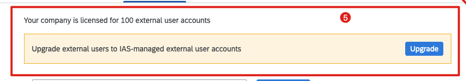

<!-- loio9969e144eb5c45d2a98c7c5165489e87 -->

# Migrating SAP Jam External Users

This topic is relevant to customers who have upgraded their existing SAP Jam environment to SAP SuccessFactors Work Zone/SAP Build Work Zone, advanced edition and had active external users in SAP Jam, managed in the SAP ID Service \(IDS / accounts.sap.com\).

## Prerequisites

1.  Complete the external users configuration steps in this topic: [Configuring External Users](configuring-external-users-df89bb3.md).
2.  Open a ticket on component LOD-SF-JAM-EXT, and request to enable the external user migration beta flag for SAP SuccessFactors Work Zone/SAP Build Work Zone, advanced edition environment.

<a name="loio9969e144eb5c45d2a98c7c5165489e87__section_ubq_h3b_nsb"/>

## How to migrate the external users

1.  Go to the Administration Console, *Users* \> *External Users*, and select the *EXTERNAL USERS* tab.

    The legacy external user migration banner should appear as follows:

    

2.  Click the *Upgrade* button to switch to the configuration check page.

    All the steps there should be completed already and as a result, the *Next* button should be active.

3.  Go through the upgrade screens:
    -   Legacy users with outstanding invitations or conflicting emails will not be migrated. Please notify them to log in directly.
    -   Add a message to the users about the upgrade.

4.  Click *Upgrade*.
5.  Verify the migration results. All the migrated users will receive a password reset email.
6.  Once the migration is completed. The status of external users should change to *Active*, which indicates active Identity Authentication-managed external users.

