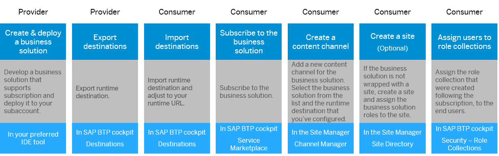
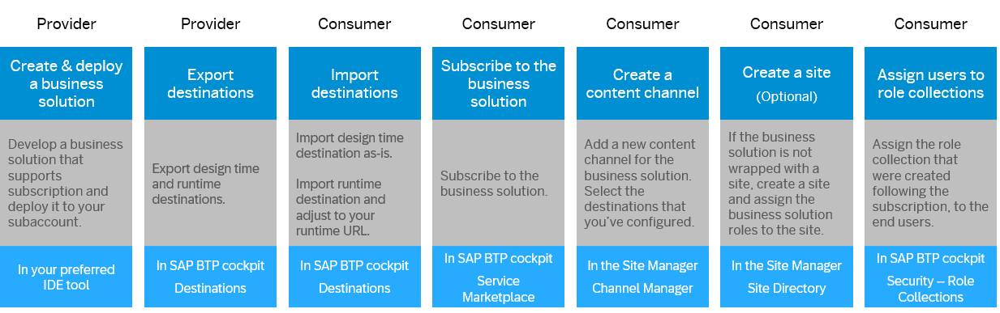

<!-- loiof8a4a6325096402e8f309783bb90102b -->

<link rel="stylesheet" type="text/css" href="css/sap-icons.css"/>

# Multi-tenant Business Solution

Consume a business solution across subaccounts that belong to different tenants.


## Prerequisites

-   Both provider and consumer subaccounts have a subscription to SAP Build Work Zone.
-   You have developed an MTA project that supports multitenancy. For more information, see [Developing Multitenant Applications in the Cloud Foundry Environment](https://help.sap.com/docs/BTP/65de2977205c403bbc107264b8eccf4b/5e8a2b74e4f2442b8257c850ed912f48.html).


<a name="loiof8a4a6325096402e8f309783bb90102b__section_ptc_1tf_xfc"/>

## Overall Flow


### Option A: Local Business Solution

This option is relevant to the case where the consumers subscribe to the business solution on the same subaccount where they have a subscription to SAP Build Work Zone. When you integrate a local business solution, the configuration flow is somewhat simpler because the system auto-detects the solution and there's no need to configure design-time destinations.




### Option B: Remote Business Solution

This option is relevant to the case where the consumers subscribe to the business solution on a different subaccount from the one where they have a subscription to SAP Build Work Zone.




<a name="loiof8a4a6325096402e8f309783bb90102b__section_uf4_hxz_wfc"/>

## Procedure


### Step 1: Modify the MTA - Add a CDM file and configure destinations

1.  **Add a CDM file:**

    The `cdm.json` file contains the site design time definitions. In this file you define the roles, groups, spaces & pages, and in most cases the site itself. By default, the MTA doesn't include this file, therefore your first step would be to create this file and manually define it.

    Defining the CDM manually might be error prone for large content providers, however, currently, this is the only available option. For more information about how to build this file, see [About the Common Data Model](about-the-common-data-model-c961060.md).

    1.  In the MTA project folder, create a folder named `workzone` and add a `cdm.json` in it.
    2.  Define the business content as needed. You can refer to the sample project that contains an app, a group, a catalog, and a role: [Manage Products sample project](https://github.com/SAP-samples/build-workzone-integration/tree/main/standard/html5-content-provider-sample/ManageProducts).
    3.  Add a script that will copy the `cdm.json` from the `workzone` folder to the `resources` folder at build time:

        ```
        build-parameters:
          before-all:
            - builder: custom
              commands:
                - # Other commands if needed..
                - cp workzone/cdm.json app/resources/cdm.json
        ```

        The `HTML5 app deployer module` deploys what's in the `resources` folder to the HTML5 repo: `target-path: resources/`.

        Then, the CDM content will be consumed by the design-time destination.


2.  **Define design-time and runtime destinations:**

    Define design-time and runtime destinations in the `mta.yaml`. A design-time destination is required to define the location from which to fetch the CDM content. The runtime destination is required to obtain the resources needed to run the app at runtime.

    When you deploy the app, the destinations are created automatically in the cockpit of the subaccount.

    -   **Design-Time Destination**

        The design-time destination points to the location of the stored CDM in the HTML5 repo. The design-time destination has the following format. Please replace the values with your own project's credentials.

        ```
        # CDM design time destination configuration ############
                    - Name: manageproductscdm-dt
                 	ServiceInstanceName: manageproductscdm-html5-app-runtime-service
                 	ServiceKeyName: manageproductscdm-html5-app-runtime-key
                 	URL: https://html5-apps-repo-rt.${default-domain}/applications/cdm/manageproductscdm
        ```

        The destination URL consists of the following sections:

        -   `html5-apps-repo-rt` - the HTML5 repo runtime instance.
        -   `manageproductscdm` - end point, the SAP cloud service. This is the same service that is configured in the `sap.cloud` section of the `manifest.json` of the apps.

        > ### Note:  
        > If you're using extension landscapes, manually change the URL to the service key of the html5-apps-repo app-runtime service instance.

    -   **Runtime Destination**

        Define the runtime destination as follows:

        ```
        # CDM runtime destination configuration ############
        ...
        destinations:
        	- Authentication: NoAuthentication
        	Name: manageproductscdm-rt
        	ProxyType: Internet
        	Type: HTTP
        	CEP.HTML5contentprovider: true
        	HTML5.DynamicDestination: true
        	HTML5.ForwardAuthToken: true
        	URL: https://SUBDOMAIN.${default-domain} 
        
        
        ```

        -   **URL**: This is the runtime URL of SAP Build Work Zone, advanced edition, and is pointing to the Approuter URL. Please replace the URL value with the runtime URL of your subaccount. Later, the consumer will have to replace this value with his own subdomain.
        -   **CEP.HTML5contentprovider**: This is a mandatory parameter that identifies this runtime destination as the one related to the HTML5 business solution that serves as a content provider.
        -   **HTML5.DynamicDestination** and **HTML5.ForwardAuthToken** are only mandatory if you're using dynamic tiles.

            > ### Caution:  
            > Adding an `HTML5.DynamicDestination` property and setting it to true, enables dynamic access to the destination to any logged-in user.
            > 
            > Therefore before adding this property to the destination, make sure that the underlying API is not public and requires the correct user credentials.


    -   > ### Note:  
        > If you're using a custom domain:
        > 
        > -   In the URL of the runtime destination use the custom domain URL and not the default domain URL.
        > -   Make sure that both the provider subaccount and the consumer subaccount are using the same Common Super Domain.


3.  **Optional: Include cards in the project**

    For more information, see [Cards in Business Solutions](cards-in-business-solutions-a765b4c.md).

4.  **Optional change: Async loading**

    The consumer subaccount can't influence the loading mode of the apps from the consumer Site Settings screen. By default, all apps are loaded in an async mode \(value is `true`\). To overwrite the default setting, you can set this value to `false` in the `manifest.json` file as follows:

    ```
     "sap.platform.cf": {
            "sapAsyncLoading": false
        }
    ```

    For more information about async loading, see [Site Settings](site-settings-ca74965.md).

5.  **Build and deploy the MTA:**

    Install dependencies and build the MTA:

    ```
    npm install
    mbt build --mtar <project name>.mtar
    
    ```

    Log in to your space and deploy the mtar:

    ```
    cf login -o <your organization> -s <your space> --sso
    cf deploy mta_archives/<project name>.mtar
    
    ```

    After deployment, the design-time and runtime destinations are created automatically in your subaccount based on the definitions in the `mta.yaml`. Your business solution is now available for subscription in the SAP BTP cockpit Service Marketplace.


### Step 2: Subscribe to the Business Solution

Upon deployment of the business solution, the business solution becomes available for subscription in the SAP BTP cockpit *Service Marketplace*.

For more information about how to subscribe to a SaaS application, see [Subscribe to Multitenant Applications Using the Cockpit](https://help.sap.com/docs/BTP/65de2977205c403bbc107264b8eccf4b/7a3e39622be14413b2a4df7c02ca1170.html).


### Step 3: Export & Import Destinations

1.  **Export Design-Time Destination \(only required for remote business solutions\):**
    1.  In the SAP BTP cockpit of the business solution provider, navigate to *Connectivity* \> *Destinations*.
    2.  Select the design-time destination of the business solution and export it using the <span class="SAP-icons-V5"></span>\(Export\) icon.

        > ### Note:  
        > The value of the *Client Secret* property can't be exported but you can get it as follows:
        > 
        > 1.  In the cockpit, navigate to *Services* \> *Instances and Subscriptions* and go to the *Instances* tab.
        > 
        > 2.  In the *Service* filter, select *HTML5 Application Repository Service*, and select the service instance in the table.
        > 
        > 3.  Click *View Credentials* at the top right corner of the screen.
        > 
        > 4.  From the *Credentials* file that opens, copy the value of the `clientsecret` and keep it for later.

        For more information, [Export Destinations](https://help.sap.com/docs/connectivity/sap-btp-connectivity-cf/export-destinations?&version=Cloud).


2.  **Export Runtime Destination \(required both for local and remote business solutions\):** 
    1.  In the SAP BTP cockpit of the business solution provider, navigate to *Connectivity* \> *Destinations*.
    2.  Select the runtime destination of the business solution and export it.

3.  **Import Design-Time Destination \(only required for remote business solutions\):**
    1.  In the SAP BTP cockpit of the business solution consumer, navigate to *Connectivity* \> *Destinations*.
    2.  Import the design-time destination. Add the *Client Secret* details you previously saved.

        For more information, see [Import Destinations](https://help.sap.com/docs/connectivity/sap-btp-connectivity-cf/import-destinations?&version=Cloud).


4.  **Import Runtime Destination \(required both for local and remote business solutions\):**
    1.  In the SAP BTP cockpit of the business solution consumer, navigate to *Connectivity* \> *Destinations*.
    2.  Import the runtime destination.
    3.  Adapt the value of the subdomain in the URL property with your own subdomain: `https://SUBDOMAIN.${default-domain}`. This is the runtime URL of SAP Build Work Zone, which is pointing to the Approuter URL.


### Step 4: Create a Content Provider for the Business Solution

-   **Local Business Solution:** 

    Choose this option if the business solution is deployed to the HTML5 repository or subscribed to from the same subaccount where you have a subscription to SAP Build Work Zone.

    1.  On the business solution consumer subaccount, go to the Channel Manager.
    2.  Click *New* \> *Content Provider*.
    3.  Choose *Local* in the content provider source.
    4.  Enter a title for the business solution.
    5.  The ID is identical to the title by default, but you can change it. The ID can contain up to 20 alphanumeric characters, dots, or underscores, and it must be unique within a subaccount. The ID is used as a prefix \(preceded by the ~ sign\) for the ID of the roles you add to the Content Manager.
    6.  Choose whether the business solution is deployed locally or subscribed to.
    7.  Choose the business solution from the list and the runtime destination.
    8.  Content granularity - here you select the scope of the content that will be integrated from this provider. It can be applications only or roles and all related content. Selecting applications only will require you to manually assign roles, spaces and pages to the apps, but it will also allow maximum flexibility when designing the site. Selecting roles and all related items means that the business solution will "ready to use" with no additional manual configuration but on the other hand, it will be fully defined by the developer and it will be consumed as a "read-only" solution.
    9.  Keep the option *Include group and catalog assignments to role* - disabled.

-   **Remote Business Solution:** 

    Choose this option if the business solution is deployed or subscribed to from a different subaccount from where you have a subscription to SAP Build Work Zone.

    1.  On the business solution consumer subaccount, go to the Channel Manager.
    2.  Click *New* \> *Content Provider*.
    3.  Choose *Remote* in the content provider source.
    4.  Enter a title for the business solution.
    5.  The ID is identical to the title by default, but you can change it. The ID can contain up to 20 alphanumeric characters, dots, or underscores, and it must be unique within a subaccount. The ID is used as a prefix \(preceded by the ~ sign\) for the ID of the roles you add to the Content Manager.
    6.  Select the design-time destination and runtime destination that you imported/created in the previous section. As for the runtime destination for dynamic data, leave the default value, which is the runtime destination.
    7.  Content granularity - here you select the scope of the content that will be integrated from this provider. It can be applications only or roles and all related content. Selecting applications only will require you to manually assign roles, spaces and pages to the apps, but it will also allow maximum flexibility when designing the site. Selecting roles and all related items means that the business solution will "ready to use" with no additional manual configuration but on the other hand, it will be fully defined by the developer and it will be consumed as a "read-only" solution.
    8.  *Automatically add all content items to subaccount* - enabled.

        When this option is enabled, all the content items that are associated with the business solution are added to the subaccount.

        **When updating a business solution, the new content items are updated automatically**. Following an update, the report reflects the changes done as a result of the update.

        > ### Note:  
        > If necessary, it is also possible to use the :arrows_clockwise: action in the Channel Manager to fetch the updated content.

    9.  *Provision authorizations with Identity Provisioning service* - disabled.
    10. *Include group and catalog assignments to role* - disabled.


After the new content provider is created, click the *Report* link to see the list of content items that were created under this content provider.


### Step 5: Assign Roles to the Site \(as needed\)

Business solutions may or may not include a site entity. If the business solution contains a site, the site is exposed in the Site Directory and all the business solution roles that were defined in the CDM are automatically assigned to it.

However, if the business solution doesn't contain a site, it is necessary to create a site and assign the roles of the business solution to this site. The same is true if you want to include the business solution apps in additional sites, and not only the site that came with it. For more information, see, [Assign Roles to Your Site](assign-roles-to-your-site-7afe670.md).


### Step 6: Assign Users to Role Collections

Upon deployment, for every role in the business solution, a role collection is created in SAP BTP cockpit, and the next step is to assign the role collection to the end users.

1.  In the SAP BTP cockpit of your subaccount, go to *Security* \> *Role Collections*.

2.  Find the relevant role collection and click the arrow on the far right.

3.  Click *Edit* and in the *Users* section, search for the users of the consumers you want to assign to the role collection.

4.  *Save*.


### \(Optional\) Assign Users to Role Collections \(Scopes\)

If your business solution contains authorization scopes to limit the access of the apps to the backend systems, deploying the business solution to the your subaccount automatically creates role collections in the SAP BTP cockpit that correspond to these scopes.

You need to assign the users from the consumer subaccount to these role collections on the provider subaccount.

1.  In the SAP BTP cockpit of the provider subaccount, navigate to *Security* \> *Role Collections*.

2.  Select a role collection and under *Users*, assign the users from the consumer subaccount.

    Repeat this step for the rest of the role collections.

    For more information, see [Assign Users to Role Collections](https://help.sap.com/docs/btp/sap-business-technology-platform/assign-users-to-role-collections?&version=Cloud).


**Result**

Your business solution is now available to end users in the consumer subaccount. Users access it through the site in the Site Directory, and the application runs on your subaccount.

