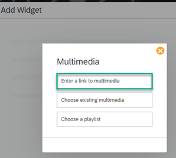
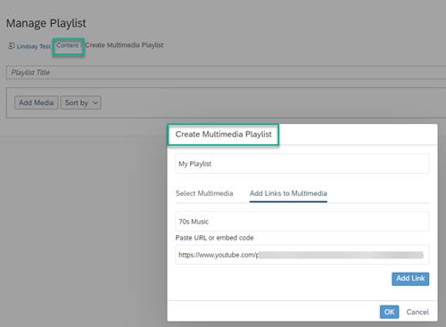

<!-- loio27b9bd13ff6d4c4cbc78d76d567d5d2b -->

# Multimedia Widget

Insert a multimedia widget to enable users to play audios, watch a video, or listen to a playlist.

When you insert a multimedia widget, you have the following options:

-   Copy and paste a link to a video or embed code.

-   Select an existing multimedia file from the workspace content folder.

-   Choose an existing playlist that you created in the workspace *Content* list.

When a workspace member views the workpage, they will be able to play the audio, video, or playlist within the same workpage.

> ### Note:  
> If the multimedia item \(video or playlist\) has been added to a workpage that is part of the site menu, the content that was added to the video or playlist can be referenced from any public or private workspace. In other words, the content can come from different workspaces. Users can view the all the content in the multimedia item depending on their access permissions for the content.

> ### Note:  
> You can view, select and search for audio files in the parent workspace, but not in one of the sub-workspaces.

<a name="loio27b9bd13ff6d4c4cbc78d76d567d5d2b__section_nwt_cl1_fcc"/>

## Add a video to your multimedia widget

1.  From the dialog box, select *Enter a link to multimedia*.

    

2.  Fill in the following information:

    -   Paste the URL of the video or in the case of Kaltura videos, embed the code into the first field.

    -   Give the widget a title.

3.  *Save* to display the video on your workpage where you can click on the start button to watch it.

<a name="loio27b9bd13ff6d4c4cbc78d76d567d5d2b__section_xyx_2lv_fcc"/>

## Create a multimedia playlist

1.  From the *Content* screen, select *Multimedia* \> *Playlist*.

2.  Enter a title for the playlist.

3.  Either select existing multimedia files or add your own links or code to multimedia files that you want to add to your playlist.

4.  Once you've created your playlists, you can select them from the *Multimedia* widget by choosing *Choose existing multimedia* or *Choose a playlist* and add them to your workpage .

> ### Note:  
> Video playback with HTML5 is supported for Microsoft Edge and non Microsoft Internet Explorer browsers \(for example, Mozilla Firefox, Google Chrome, Safari, iOS Safari, Android browser, and Android Chrome\).
> 
> Code embedding for HTML5 videos is supported for wikis and overview pages. Switching videos between high definition and standard definition is supported with HTML5.

