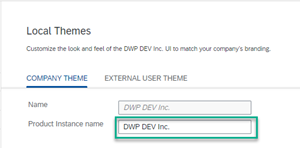

<!-- loio120b50d75d6545a192b1657d08a943fe -->

# Overview

What you see on the *Overview* screen depends on whether you're looking at the company overview or an overview of a specific area.

<a name="loio120b50d75d6545a192b1657d08a943fe__section_tmt_phl_4qb"/>

## Company Overview

As a company administrator, you can find the following information on the company overview screen:

<table>
<tr>
<th valign="top">

Item

</th>
<th valign="top">

Description

</th>
</tr>
<tr>
<td valign="top">

Host

</td>
<td valign="top">

The domain where your site is running.

</td>
</tr>
<tr>
<td valign="top">

Revision

</td>
<td valign="top">

The current revision of SAP Build Work Zone, advanced edition that is running.

</td>
</tr>
<tr>
<td valign="top">

Product Version

</td>
<td valign="top">

Determines which features and capabilities are available in the SAP Build Work Zone, advanced edition instance that you are running.

</td>
</tr>
<tr>
<td valign="top">

Product Instance name

</td>
<td valign="top">

You can choose to set a product instance name in a local company theme - in this case, the name is displayed on the screen.

From the Administration Console, choose *Theming & Branding* \> *Local Theme Designer*, and enter the product instance name.

</td>
</tr>
<tr>
<td valign="top">

Custom Domain

</td>
<td valign="top">

The unique domain name defined for accessing this instance of SAP Build Work Zone, advanced edition.

</td>
</tr>
<tr>
<td valign="top">

Storage Usage

</td>
<td valign="top">

The horizontal bar indicator shows the percentage of the purchased storage space used, the numeric values for the total amount of cloud storage that your company has purchased, and the amount of storage used. In SAP Build Work Zone, advanced edition, all customers get 1TB by default \(with the option of additional storage packages\).

> ### Note:  
> Notifications are sent to company administrators when storage use reaches 80% and 100% of their allocation.
> 
> -   If you receive an 80% usage notification, you should free up storage by deleting old content or contact support to purchase more storage space.
> 
> -   If you receive a 100% usage notification, users will no longer be able to upload content.
> 
> 
> Repeated notifications will be sent every week until the situation is resolved. If your company has purchased additional storage space, an email notification will be sent when you have only 90% available storage space rather than 80%.

</td>
</tr>
<tr>
<td valign="top">

Subscribe company admins to receive product news and updates

</td>
<td valign="top">

As a company administrator, you can enable the toggle switch to receive product news and updates.

If there's more than one company administrator for your organization, they'll also be subscribed or unsubscribed based on your selection.

</td>
</tr>
<tr>
<td valign="top">

Enable Preview Release

</td>
<td valign="top">

Any new feature that's flagged as preview, can be viewed and will be available in a productive system in the next release.

-   When this setting is enabled, the system is updated with the new features according to the *Valid as Of*date that appears in the What's New Viewer.
-   When this setting is disabled, the system is updated with the new features in the following monthly release.

> ### Note:  
> Once enabled, you can't disable this setting on a given system.

</td>
</tr>
</table>

<a name="loio120b50d75d6545a192b1657d08a943fe__section_rzq_ddr_4qb"/>

## Area Overview Screen

The *Overview* screen for area administrators provides a set of links to the major operations that an area administrator can perform in their administrative areas.

As an area administrator, go to the Administration Console and choose your area \(if available\) from the dropdown menu.

