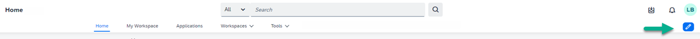
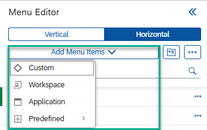
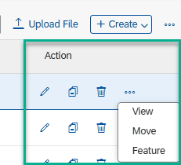
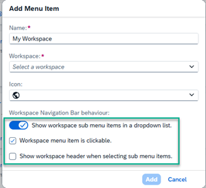
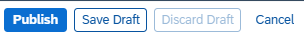

<!-- loio620515b70c3a40e0aaa64b50accb2b3d -->

<link rel="stylesheet" type="text/css" href="css/sap-icons.css"/>

# Overview of the Site Menu

SAP Build Work Zone, advanced edition includes a versatile, WYSIWYG menu editor that administrators can use to easily create a fully customized menu bar in their site.

By creating a multi-level menu bar with a hierarchical structure that includes menu items and nested sub-menu items, users of your site can quickly and easily navigate to the most important information they need. One of the main advantages of the site menu, is that you can use predefined out-of-the-box menu items together with your own custom menu items.

<a name="loio620515b70c3a40e0aaa64b50accb2b3d__section_ztr_qgv_pvb"/>

## Access the Menu Editor

If you're a company or a support admin, when you hover over the default menu bar, you'll see an :pencil2: \(Edit\) icon. Clicking on it opens the *Menu Editor*.

When you open the *Menu Editor* for the first time, the menu bar displays a number of predefined menu items, namely *Home*, *My Workspace*, *Applications*, *Workspaces*, and *Tools*. You can design a completely different menu using these predefined menu items as well as adding your own custom menu items.

<a name="loio620515b70c3a40e0aaa64b50accb2b3d__section_rxp_j3v_pvb"/>

## What can I do in the Menu Editor?

On the left of the screen, you'll see the *Menu Editor* panel displaying a list of menu items that are the same menu items displayed in your site menu. As you add menu items to the panel, they're simultaneously added to the site menu.

Let's see how to use the *Menu Editor*.

<table>
<tr>
<th valign="top">

Action

</th>
<th valign="top">

Where to do it

</th>
</tr>
<tr>
<td valign="top">

Select menu type

</td>
<td valign="top">

From the *Menu Editor* header, select whether to display your site menu vertically or horizontally by using the dedicated buttons.

Use the following options to display your menu:

-   *Vertical*: you can choose whether to have a fixed menu panel or use an *Overlay mode* that displays the menu as a pop-over.

-   *Horizontal*: you can choose *Full width* to display the menu as a bar over the entire menu area.

    > ### Note:  
    > For the horizontal menu, if there are more than 10 menu items in the main menu or in the submenu dropdown list, menu items are loaded progressively, and a scrollbar will display on the right to show more items.

</td>
</tr>
<tr>
<td valign="top">

Add menu items to your menu

</td>
<td valign="top">

Click *Add Menu Items* and select the type of menu item that you want to add from the dropdown list. Your options are *Custom*, *Workspace*, *Application*, and *Predefined*. We’ll provide more details about these menu items later in this topic

.

> ### Note:  
> You can see that as you add menu items in the panel, they're simultaneously displayed in the menu.

For more information about the different menu items that you can add, see **Using the different menu item types** in the last section of this page.

</td>
</tr>
<tr>
<td valign="top">

Manage content

</td>
<td valign="top">

Click the  \(Content\) icon to open the *Menu Content* screen - this is where you manage and create content that you can reference from the menu.

You can:

-   Select whether you want to see the content list in *List* view or *Grid*view.

-   From the dropdown list filter and view a specific type of content such as a blog post or a video.

-   Filter for content according to title or tags.

-   Upload files to add to the site menu.

-   Click *\+ Create* to open a list of possible content items that you can create on the fly. Once you've created the content, publish it to add it to the content list.

    > ### Note:  
    > All content items on the *Menu Content* screen can only be accessed by the company or support administrator. Workpages created from here can only be referenced by the menu and aren't available in any workspace.

-   Select a few content items and then click the  \(Actions\) icon in the top menu bar to execute various actions on multiple items simultaneously.

-   Use the action items on the far right of each content item to edit, copy, delete, move, feature, and view details of a specific item.

    

    > ### Note:  
    > The list of actions that you can perform depends on the type of menu item.

-   From the *Trash* tab, you can restore any menu content items that you may have deleted.

For more information, see [Add Content to Your Site Menu](add-content-to-your-site-menu-bd70f45.md)

</td>
</tr>
<tr>
<td valign="top">

Translate menu items

</td>
<td valign="top">

At the top of the *Menu Editor*, click the  icon to open a dedicated screen for translating your menu items. In the left column, there's a list of all your menu items. Simply select the language you want, and start entering the translated terms. Don't forget to *Save* and then *Publish* your changes.

If you've enabled the language in the *Site Settings*, then the user can select this language in the user settings screen. The site and all translated menu items appear in the selected language.

</td>
</tr>
<tr>
<td valign="top">

Export and import your site menu to another environment

</td>
<td valign="top">

For more information, see [Transporting the Site Menu](transporting-the-site-menu-eb185e9.md).

</td>
</tr>
<tr>
<td valign="top">

Search for menu items

</td>
<td valign="top">

Search for menu items by typing a name in the search bar. As you start typing, the result list condenses.

</td>
</tr>
<tr>
<td valign="top">

Configure the display of a workspace menu item

</td>
<td valign="top">

When you add a workspace menu item to your site menu, you can determine how the workspace navigation bar is rendered by configuring the following checkboxes:

<table>
<tr>
<th valign="top">

Option

</th>
<th valign="top">

Result

</th>
</tr>
<tr>
<td valign="top">

*Show workspace sub menu items in a dropdown list* 

</td>
<td valign="top">

Select this option to display sub menu items in a horizontal menu as a dropdown list under the menu item.

This option is required when you choose not to display the workspace header, which hides the workspace navigation bar. This way, you can navigate to the workspace sub menu items directly from the site menu.

</td>
</tr>
<tr>
<td valign="top">

*Workspace menu item is clickable* 

</td>
<td valign="top">

In a vertical list of menu items, you will find only the sub menu items. If this option is selected the parent workspace is clickable and you can open the workspace header and see the workspace navigation bar.

If it’s not clickable, you can only navigate to the sub menu items.

</td>
</tr>
<tr>
<td valign="top">

*Show workspace header when selecting sub menu items* 

</td>
<td valign="top">

Select this option to show the workspace header when navigating to a sub menu item in the horizontal navigation bar.

</td>
</tr>
</table>

</td>
</tr>
<tr>
<td valign="top">

Preview menu items

</td>
<td valign="top">

Click on a menu item to get a real-time preview of the menu according to how you built it. You can also click menu items in the preview to open them.

> ### Note:  
> You can't preview applications while in edit mode.
> 
> There is no preview for external links because they open in a new tab.

</td>
</tr>
<tr>
<td valign="top">

Publish your menu

</td>
<td valign="top">

Use *Save Draft* to save your changes and continue working on it later. *Discard Draft* will revert your changes back to the last published version of the menu. When you're done, click *Publish* to make your changes visible to all users.

</td>
</tr>
<tr>
<td valign="top">

Use the redo and undo buttons

</td>
<td valign="top">

Use the  \(Undo\) icon to reverse any action that you made by mistake. Use the  \(Redo\) icon to restore any actions that were previously undone.

</td>
</tr>
<tr>
<td valign="top">

Open or close the menu editor

</td>
<td valign="top">

You can close the Menu Editor panel and then show it again by using the  \(back icon\) at the top of the panel.

</td>
</tr>
<tr>
<td valign="top">

Hide or show the site menu

</td>
<td valign="top">

You can hide the site menu from users by selecting the *Hide menu bar* checkbox at the bottom of the menu panel.

> ### Note:  
> The menu bar is always visible to admins even when it's hidden from users.

</td>
</tr>
<tr>
<td valign="top">

Set a default landing page that includes the site menu

</td>
<td valign="top">

When you log on to a site, the *Home* page is launched. You can select a different page to be the default landing page that includes the site menu by selecting a specific workpage or a predefined menu item such as *Knowledge Base* or *Tasks*.

Next to the menu item, click the  icon and select *Set as Default Page*.

</td>
</tr>
<tr>
<td valign="top">

Display icons for menu items

</td>
<td valign="top">

You can enable or disable the display of icons in your runtime menu. The behavior is as follows:

-   When the *Display icons* checkbox is selected, icons that have been defined for for all menu items will be displayed at runtime.

-   When the *Display icons* checkbox is not selected, icons that have been defined for all menu items won't be displayed. However, if any of the following predefined menu items are added as level 2 menu items, the icons will always be displayed.

    -   Workspaces
    -   Calender
    -   Task
    -   Bookmarks
    -   Knowledge Base
    -   Recommendations
    -   Business Records
    -   Applications
    -   Application

</td>
</tr>
</table>

<a name="loio620515b70c3a40e0aaa64b50accb2b3d__section_yny_vrv_pvb"/>

## Using the different menu item types

In this section, we'll explain more about the types of menu items that you can select.

<table>
<tr>
<th valign="top">

Type

</th>
<th valign="top">

More information

</th>
</tr>
<tr>
<td valign="top">

*Custom*

</td>
<td valign="top">

The custom menu item is the most versatile. You can build a multi-level hierarchical menu by nesting up to three levels of sub-menu items. When you create a custom menu item, you can link to any of the following:

-   *Navigation Group* - this is a structural element that helps you organize and categerize related menu items.

-   *Link* - use to direct users to internal or external links.

-   *Workpage* - use to allow users to select a workpage from the menu content or they can create a new workpage.

    > ### Note:  
    > Other content types aren't supported but can be added using a URL.

> ### Note:  
> When you add a URL to an external link, it opens in a new tab so there's no preview.

Creating a custom menu item enables you to do any of the following actions:

-   *Edit* - clicking the edit option opens a screen enabling you to name your menu item and to link to either a URL or to any workpage. If you've created a workpage from the *Menu Content* screen, you can reference it from here.

-   *Access Control* - custom menu items include a powerful mechanism that enables you to expose different subsets of the menu items to different audiences. You can restrict the menu item to be shown to internal users, external users, or to any specific group of users defined by a User List or the members of a specific workspace.

-   *Duplicate*, *Hide*, or *Delete* a menu item.

</td>
</tr>
<tr>
<td valign="top">

*Workspace*

</td>
<td valign="top">

You can add a workspace as a menu item - once you've named your menu item, you can reference the workspace by simply selecting it as an existing workspace from a dropdown list. Once it's added to the menu bar, the workpages in the workspace are displayed as sub-menu items.

> ### Note:  
> Widgets in workpages that are part of the site menu, can reference content from any public or private workspace. Supported widgets are *Multimedia*, *Image*, *Poll*, *Slide Show*, and *Rotating Banner* widgets.

If a workspace is clickable, when clicking the workspace in the menu you'll see the main screen. If the workspace isn't clickable, you'll only be able to navigate to its sub-pages.

Because the workspace admin manages the workspace, and because the workpages will show up on the menu as sub-menu items, the workspace admin in effect manages those sub-menu items.

> ### Remember:  
> If the workspace includes predefined page tabs like *Content*, *Feeds*, *Members*, and so on, they won’t be displayed.
> 
> If it's a private workspace, menu items will only be seen by the members of that workspace.

</td>
</tr>
<tr>
<td valign="top">

*Application*

</td>
<td valign="top">

You can select any application that you have permissions to view and access. You can then access these applications directly from the site menu.

</td>
</tr>
<tr>
<td valign="top">

*Predefined*

</td>
<td valign="top">

You can use any of the predefined out-of-the-box menu items to quickly customize your menu. For example, *Applications*, *Workspaces*, *My Workspace*, *Calendar*, and more. Some of these menu items appear in the menu when you first open your site and you can either hide or delete these items.

> ### Note:  
> The *Applications* predefined menu item is a single page that displays the apps configured in the Content Manager and that are assigned to roles, groups, and catalogs. Don't confuse this with the *Application* menu category that enables you to add any application directly to the menu and access it from there.
> 
> For more information, see [Business Content](business-content-cb936ef.md) 

> ### Note:  
> Each type of predefined menu item can only be added once to the menu. If you've already added one of them, it is grayed out in the dropdown list of predefined menu items. If a menu item is grayed out in the Menu Editor panel on the left, it means that the menu item has been hidden when clicking the  \(Actions\) icon and selecting*Hide*.

</td>
</tr>
</table>

## Menu usability

The scroll bar is responsive and it appears according to the size of the screen.

