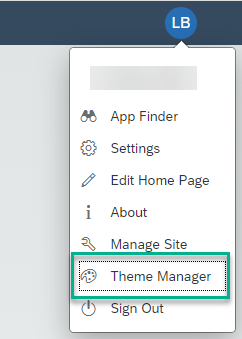
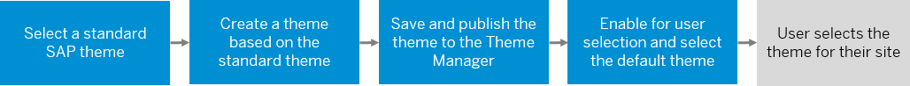

<!-- loioc9299d9f4c544f90b75f216b9cb5c2d5 -->

# Overview of Theming and Branding

You can create your own themes and apply your corporate branding to your sites.

This topic gives a high-level overview of theming and branding options that are available, and describes where and how to apply them to your sites.

<a name="loioc9299d9f4c544f90b75f216b9cb5c2d5__section_j4b_5gt_h5b"/>

## Overview

Themes are created in a browser-based tool called the UI theme designer. It has a WYSIWYG designer to make it easy to create and maintain custom themes. By simply changing theme parameter values, images, and other resources, you can create your own themes with your corporate brand, corporate colors, and company logo.

<a name="loioc9299d9f4c544f90b75f216b9cb5c2d5__section_kpj_bht_h5b"/>

## How to access the UI theme designer

1.  Under your avatar, in the User Actions menu, select the *Theme Manager*.

    > ### Note:  
    > In order to access the Theme Manager, you must be assigned to the Theme\_Admin role.

    

2.  Click the *Launch Theme Designer*button located at the bottom left of the Theme Manager.

    For more information about the UI theme designer, see [UI Theme Designer.](https://help.sap.com/docs/BTP/09f6818d8e064537973102d6289e2aca/935325fb130d41449362181fb6020dd0.html)

<a name="loioc9299d9f4c544f90b75f216b9cb5c2d5__section_jfb_3lt_h5b"/>

## How to apply the themes to your site

A default standard theme provided by SAP is assigned to your site.

You can choose a different SAP standard theme \(out-of-the-box\) or you can create a custom theme based on one of the standard themes.

Once a theme is saved and published, it's automatically registered in the Theme Manager of your site.

In the Theme Manager, you can select whether you want to set this theme as the default theme for the site. You can also let users select a theme on their own with the *Enable User Selection* button. Users can then go to their *Settings* screen and select any theme you've made available to them and apply it to their sites.

The overall process is as follows:

This is a very high-level explanation of how you assign themes to your site.

<a name="loioc9299d9f4c544f90b75f216b9cb5c2d5__section_yk4_ytt_h5b"/>

## Themes provided by SAP

SAP offers several different standard themes; each display the screens with a different look and feel. Remember that you can only create a custom theme from an existing standard theme. To create a new theme, you need to select one of the following standard themes and base your new custom theme on the one you've selected.

<table>
<tr>
<th valign="top">

Theme Name

</th>
<th valign="top">

More Details

</th>
</tr>
<tr>
<td valign="top">

Quartz \(default theme\)

</td>
<td valign="top">

A standard theme used for SAPUI5 applications. It supports themes in dark and light settings.

</td>
</tr>
<tr>
<td valign="top">

Belize

</td>
<td valign="top">

Supports dark and light settings.

</td>
</tr>
<tr>
<td valign="top">

High Contrast Black

</td>
<td valign="top">

Accessibility theme that supports people with visual impairments especially those with light sensitivity.

</td>
</tr>
<tr>
<td valign="top">

High Contrast White

</td>
<td valign="top">

Accessibility theme used by those who are working with mobile devices in bright environments or when there's a glare. The high contrast screen helps people to see more details.

</td>
</tr>
<tr>
<td valign="top">

Horizon

</td>
<td valign="top">

This is the default theme.

It's a visual theme with a vibrant color palette.

Supports dark and light settings in combination with high contrast.

SAP Horizon provides two options:

-   Morning Horizon

-   Evening Horizon as an optional dark theme

> ### Note:  
> This theme doesn't require enabling in the Theme Manager - it's already available for end users to select. For sites created before the Horizon theme was introduced, you'll need to enable this theme.

</td>
</tr>
</table>

