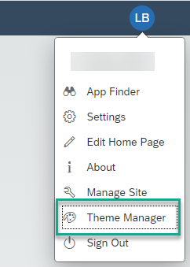
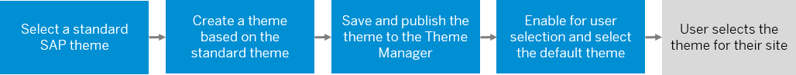

<!-- loioc9299d9f4c544f90b75f216b9cb5c2d5 -->

# Overview of Theming and Branding

Customize the visual appearance of your site to reflect your corporate identity. This process is referred to as theming and branding.

This topic gives a high-level overview of theming and branding options that are available, and describes where and how to apply them to your sites.

<a name="loioc9299d9f4c544f90b75f216b9cb5c2d5__section_j4b_5gt_h5b"/>

## Overview

Themes are created in a browser-based tool called the UI theme designer. It has a WYSIWYG designer to make it easy to create and maintain custom themes. By simply changing theme parameter values, images, and other resources, you can create your own themes with your corporate brand, corporate colors, and company logo.

The UI theme designer is equipped with a WYSIWYG \(What You See Is What You Get\) designer, enabling users to create and maintain custom themes. With this tool, you can simply change theme parameter values, images, and other resources, to create your own themes with your corporate brand, corporate colors, and company logo.

In SAP Build Work Zone, advanced edition, you can also create local themes for your site. In this case, we recommend that you use the Theme Manager to manage your themes as local themes only partially affect the user interface. You can also brand your emails and change the style of your email notifications by using different templates.

For more information, see [About Local and Global Themes](https://help.sap.com/docs/build-work-zone-advanced-edition/sap-build-work-zone-advanced-edition/about-local-and-global-themes) and also [Email Templates](https://help.sap.com/docs/build-work-zone-advanced-edition/sap-build-work-zone-advanced-edition/email-templates).

## Themes

### How to access the UI theme designer

1.  Under your avatar, in the User Actions menu, select the *Theme Manager*.

    > ### Note:  
    > In order to access the Theme Manager, you must be assigned to the Theme\_Admin role.

    

2.  Click the *Launch Theme Designer*button located at the bottom left of the Theme Manager.

    For more information about the UI theme designer, see [UI Theme Designer.](https://help.sap.com/docs/BTP/09f6818d8e064537973102d6289e2aca/935325fb130d41449362181fb6020dd0.html)

### How to apply the themes to your site

A default standard theme provided by SAP is assigned to your site.

You can choose a different SAP standard theme \(out-of-the-box\) or you can create a custom theme based on one of the standard themes.

Once a theme is saved and published, it's automatically registered in the Theme Manager of your site.

In the Theme Manager, you can select whether you want to set this theme as the default theme for the site. You can also let users select a theme on their own with the *Enable User Selection* button. Users can then go to their *Settings* screen and select any theme you've made available to them and apply it to their sites.

The overall process is as follows:

This is a very high-level explanation of how you assign themes to your site.

### Themes provided by SAP

SAP offers several different standard themes; each display the screens with a different look and feel. Remember that you can only create a custom theme from an existing standard theme. To create a new theme, you need to select one of the following standard themes and base your new custom theme on the one you've selected.

<table>
<tr>
<th valign="top">

Category

</th>
<th valign="top">

Theme Name

</th>
<th valign="top">

More Details

</th>
</tr>
<tr>
<td valign="top" rowspan="4">

SAP Quartz Set

</td>
<td valign="top">

SAP Quartz Light

</td>
<td valign="top" rowspan="4">

A standard theme set used for SAPUI5 applications.

</td>
</tr>
<tr>
<td valign="top">

SAP Quartz Dark

</td>
</tr>
<tr>
<td valign="top">

SAP High Contrast Black \(Quartz\)

</td>
</tr>
<tr>
<td valign="top">

SAP High Contrast White \(Quartz\)

</td>
</tr>
<tr>
<td valign="top" rowspan="4">

SAP Horizon Set

</td>
<td valign="top">

SAP Morning Horizon

</td>
<td valign="top" rowspan="4">

SAP Morning Horizon is the **default** theme.

</td>
</tr>
<tr>
<td valign="top">

SAP Evening Horizon

</td>
</tr>
<tr>
<td valign="top">

SAP High Contrast Black \(Horizon\)

</td>
</tr>
<tr>
<td valign="top">

SAP High Contrast White \(Horizon\)

</td>
</tr>
<tr>
<td valign="top">

Individual Themes

</td>
<td valign="top">

Additional themes that are not part of a set.

</td>
<td valign="top">

SAP Belize themes have been deprecated.

</td>
</tr>
</table>

> ### Note:  
> For more information about the Automatic \(based on your operating system settings\) option, see [User Settings](https://help.sap.com/docs/build-work-zone-advanced-edition/sap-build-work-zone-advanced-edition/user-settings).

