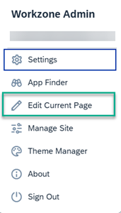
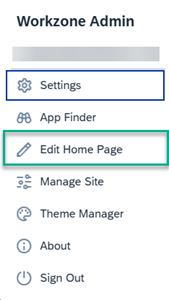

<!-- loio2707b790c178490784a3f3f60fbccd02 -->

<link rel="stylesheet" type="text/css" href="css/sap-icons.css"/>

# Personalizing the Applications Page

Users can personalize the applications page in the site menu to suit the way they work.

There are different options of how to personalize the applications page in the site menu depending on the view mode that you are working in:

<table>
<tr>
<th valign="top">

View Mode

</th>
<th valign="top">

Available Personalization Options

</th>
</tr>
<tr>
<td valign="top">

*Groups* 

</td>
<td valign="top">

-   **Layout**

    In groups view mode, there's one page called the *Home Page* that contains your apps clustered in groups. To personalize the layout, you can:

    -   Drag and drop app tiles or links to rearrange them on the page.

    -   Move app tiles or links between the different groups.

-   **Content**

    From the User Actions menu, click *Edit Current Page*:

    

    > ### Note:  
    > *Manage Site* and *Theme Manager* are only displayed if you're an administrator.

    From here you can:

    -   Add new groups.

    -   Open the App Finder and add more app tiles to a group.

    -   Remove an app tile from a group.

    -   Hide or show a group.

    -   Reset a group to its initial state.

    -   Click  on a tile to edit tile information, move the tile, and you can also convert the tile to a link.

</td>
</tr>
<tr>
<td valign="top">

*Spaces and Pages* 

</td>
<td valign="top">

-   **Layout**

    The top navigation bar displays one or more spaces. Each space has a page that contains apps clustered into different sections.

    > ### Note:  
    > In this view, if some apps are modeled in groups, they're displayed in a dedicated space called *Home Page* that is added to the beginning of the navigation bar.

    To personalize the layout of the *Home Page*, you can:

    -   Drag and drop app tiles or links to rearrange them in a section.

    -   Move app tiles or links between the different sections.

-   **Content**

    From the User Actions menu, click *Edit Home Page*.

    

    > ### Note:  
    > *Manage Site* and *Theme Manager* are only displayed if you're an administrator.

    From here you can:

    -   Add sections.

    -   Add tiles to sections.

    -   Remove tiles from sections.

        If you remove all tiles from a section, the empty section will no longer be shown on the page. However, it's still visible in edit mode and you can add tiles to it.

    -   Hide or show a section.

    -   Reset a section to its initial state.

    -   Rename a section.

    -   On each tile, use the  to convert the tile to a link or change the tile to various shapes. You can also move the tile to another section.

</td>
</tr>
<tr>
<td valign="top">

*Spaces and Pages - new experience* 

</td>
<td valign="top">

-   **Layout**

    The top navigation bar displays spaces with pages \(as in the above view\) side by side next to spaces with the new experience pages that originate from a content package and can contain, cards, app tiles, and rich text.

    > ### Note:  
    > Groups are hidden - you can find the apps that appeared in groups in the App Finder.

-   **Content**

    It's not possible to personalize content managed by administrators in this view mode.

</td>
</tr>
</table>

